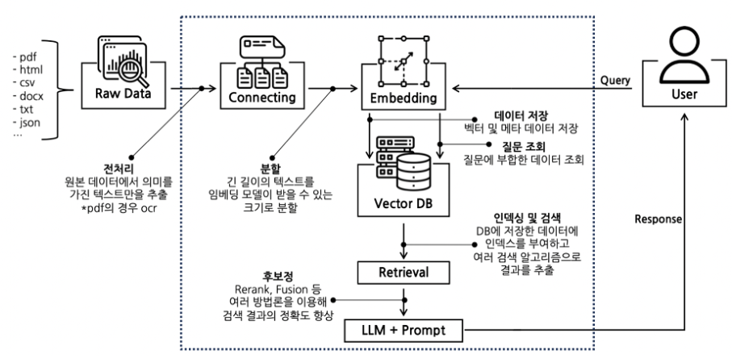
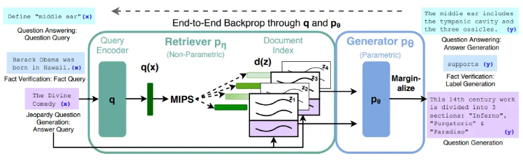
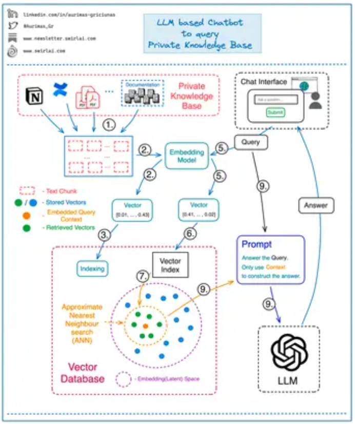
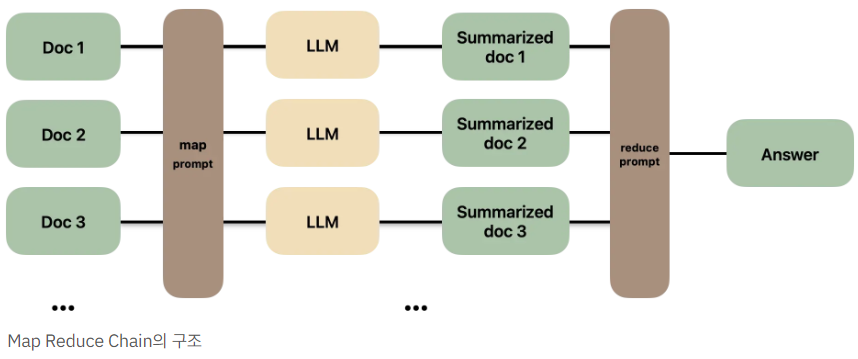

# 검색 증강 생성 RAG (Retrieval-Augmented Generation)

참고 - [(1부) RAG란 무엇인가 - ncloud forums](https://www.ncloud-forums.com/topic/277/)

## 1. 개요

Fine tuning은 시간과 비용이 많이 소요되고 모델의 범용성이 저하될 수 있음.
RAG는 **외부 지식 소스와 연계**하여 모델의 범용성과 적응력을 유지.

### 작동방식

1. 사용자가 질문 입력
2. RAG는 외부 데이터베이스에서 질문과 관련된 정보 검색
3. 검색된 정보를 기반으로 LLM이 답변 생성

### 장점

1. Fine tuning에 비해 시간·비용 소모 적음
2. 모델의 일반성 유지 가능
3. 답변의 근거 제시 가능
4. 할루시네이션 가능성 감소 (모델 자체의 편향·오류 줄일 수 있음)

## 2. RAG 상세

1. **데이터 임베딩 및 벡터 DB 구축**
   - 자체 데이터를 임베딩 모델에 통합
   - 텍스트 데이터를 벡터 형식으로 변환하여 벡터 DB 구축
   - 벡터화된 정보가 풍부한 DB는 Retriever 부분에서 사용자의 쿼리와 관련된 정보 찾는 데 활용

2. **쿼리 벡터화 및 관련 정보 추출**
   - 사용자의 질문을 벡터화
   - 벡터 DB를 대상으로 다양한 검색 기법으로 가장 관련성 높은 부분 또는 상위 K개 추출
   - 추출된 관련 정보는 쿼리 텍스트와 함께 LLM에 제공

3. **LLM을 통한 답변 생성**
   - 쿼리 텍스트와 추출된 관련 정보를 바탕으로 최종 답변 생성
   - 정확한 출처에 기반한 답변 가능



**상세 구조**



RAG 모델은 크게 **Retriever**와 **Generator**로 구분됨.

- **Retriever**: 주어진 질문과 관련된 Passages 검색
- **Generator**: 질문 + Passages 바탕으로 답변 생성. 두 가지 병합 방법:
  - **RAG-Sequence Model**: 질문 벡터와 유사한 문서들을 먼저 선택 → 각 문서와 질문 벡터 결합 → 결합된 데이터로 여러 응답 생성 → 문서·질문의 유사도 기반 응답들의 가중 평균으로 최종 응답
  - **RAG-Token Model**: 최종 응답에 대해 각 토큰을 생성할 때마다 다른 문서를 검색 → 문서들과 질문 벡터 결합 → 각각의 출력 토큰 확률 계산 → 문서·질문의 유사도 기반 토큰 출력 확률을 가중 평균하여 응답 생성

## 3. RAG 구현 (LangChain 사용)

참고 - [https://inblog.ai/moondb/13538](https://inblog.ai/moondb/13538)

### 3.1 PDF에서 텍스트 추출

```python
import requests
import fitz  # PyMuPDF

# Step 1: PDF 파일 다운로드
url = "https://arxiv.org/pdf/2005.11401"
response = requests.get(url)
pdf_filename = "file.pdf"

if response.status_code == 200:
    with open(pdf_filename, "wb") as f:
        f.write(response.content)
    print(f"PDF 파일이 '{pdf_filename}'로 저장되었습니다.")
else:
    print("PDF 다운로드 오류")
    exit()

# Step 2: PDF 파일에서 텍스트 추출 후 저장
txt_filename = "./files/wiki.txt"
with fitz.open(pdf_filename) as pdf_file:
    with open(txt_filename, "w", encoding="utf-8") as txt_file:
        for page_num in range(pdf_file.page_count):
            page = pdf_file[page_num]
            text = page.get_text()
            txt_file.write(text)
            txt_file.write("\n\n")

print(f"텍스트 파일이 '{txt_filename}'로 저장되었습니다.")
```

> RAG 논문(2005.11401) 자체를 자료로 사용. 개인 프로젝트라 API key는 .env에 따로 분리하지 않음. ChatOpenAI는 기본적으로 **gpt-3.5-turbo** 사용.

### 3.2 임베딩 캐싱 + Vector Store 구성

```python
from langchain.chat_models import ChatOpenAI
from langchain.document_loaders import UnstructuredFileLoader
from langchain.text_splitter import CharacterTextSplitter
from langchain.embeddings import OpenAIEmbeddings, CacheBackedEmbeddings
from langchain.vectorstores import Chroma
from langchain.storage import LocalFileStore
from langchain.chains import RetrievalQA

API_KEY = "..."
model = ChatOpenAI(openai_api_key=API_KEY)
data_loader = UnstructuredFileLoader("./files/wiki.txt")
cache_dir = LocalFileStore("./.cache/")
```

학습 시키기 위해서는 자연어를 벡터로 변환하는 **임베딩** 과정이 필요. 매번 임베딩을 반복하지 않도록 캐싱 폴더를 함께 지정.

```python
splitter = CharacterTextSplitter.from_tiktoken_encoder(
    separator="\n",
    chunk_size=500,
    chunk_overlap=50,
)

docs = data_loader.load_and_split(text_splitter=splitter)
embeddings = OpenAIEmbeddings(api_key=API_KEY)
cached_embeddings = CacheBackedEmbeddings.from_bytes_store(embeddings, cache_dir)
```

긴 텍스트 분할 옵션:

- **chunk_size = 500** — 한 덩어리에 500자 할당
- **chunk_overlap = 50** — 문장이 중간에서 잘릴 경우 의미 없는 벡터들이 학습되는 것 방지 (앞 덩어리의 끝 50자가 겹침)
- **separator = "\n"** — 줄바꿈이 적절히 들어간 정제된 텍스트라면 줄바꿈 기준으로 자름. 단 정확히 chunk_size에 맞지 않을 수 있음
- **from_tiktoken_encoder** — 글자가 아닌 **토큰**을 기준으로 분할
- **OpenAIEmbeddings** — 각 토큰을 표현하는 벡터 생성
- **CacheBackedEmbeddings** — 임베딩 결과 캐싱으로 추가 과금 방지

```python
vectorstore = Chroma.from_documents(docs, cached_embeddings)
retriever = vectorstore.as_retriever()
```

### 3.3 RetrievalQA Chain

```python
chain = RetrievalQA.from_chain_type(
    llm=model,
    chain_type="map_reduce",
    retriever=retriever,
)
chain.run("tell me about Retrieval-Augmented Generation for Knowledge-Intensive NLP Tasks result")
```

#### 결과

```
The Retrieval-Augmented Generation (RAG) models have been shown to
achieve state-of-the-art results on open-domain Question Answering (QA) tasks.
RAG combines pre-trained parametric and non-parametric memory
for language generation and has outperformed other models on various knowledge-intensive
NLP tasks. ...
```

LangChain이 제공하는 LCEL Chain 중 하나인 RetrievalQA로 chain을 정의한 후, 질문을 넣어주면 RAG 만들기 튜토리얼 끝. 단, **chain 내의 프롬프트 변경**이나 **세세한 커스터마이징** 위해서는 직접 chain을 구현해야 한다.



## 4. LCEL을 통한 Map-Reduce Chain 직접 구현

### 4.1 LCEL이란

LangChain의 Chain은 LLM이 최종 답변을 출력하기까지 필요한 기능들을 파이프처럼 이은 일련의 과정.
**Prompt → LLM**이 가장 작은 체인.

**LCEL (LangChain Expression Language)**: LangChain에서 제공하는 기능들을 조합한 Chain을 마치 블록처럼 쉽게 분해·조립할 수 있도록 설계한 프레임워크 (LLM 분야의 scikit-learn?).

```python
prompt = ...
model = ...
output_parser = ...

chain = prompt | model | output_parser
```

### 4.2 chain_type 옵션

`map_reduce` 외에 아래 옵션들도 가능:

- `stuff`: 프롬프트에 모든 텍스트를 한 번에 사용
- `map_reduce`: 텍스트를 분할해 LLM에 입력, 각 출력값들을 모아 다시 LLM에 입력
- `refine`: 텍스트를 분할하고 n번째 텍스트의 결과 + n+1번째 텍스트를 함께 LLM에 입력
- `map-rerank`: 텍스트를 분할해 LLM에 입력, 각 답변들의 정확도에 점수를 매겨 가장 높은 점수의 답변 기반으로 최종 답변 생성



### 4.3 Map 단계 구현

먼저 입력 텍스트를 분할해 Map Prompt를 생성하고 모델에 넘기는 부분.
**프롬프트는 구체적 지시를 system에, 질문은 human에 입력**.

```python
from langchain.chat_models import ChatOpenAI
from langchain.document_loaders import UnstructuredFileLoader
from langchain.text_splitter import CharacterTextSplitter
from langchain.embeddings import OpenAIEmbeddings, CacheBackedEmbeddings
from langchain.vectorstores import Chroma
from langchain.storage import LocalFileStore
from langchain.prompts import ChatPromptTemplate

API_KEY = "..."
model = ChatOpenAI(openai_api_key=API_KEY)
data_loader = UnstructuredFileLoader("./files/wiki.txt")
cache_dir = LocalFileStore("./.cache/")

map_prompt = ChatPromptTemplate.from_messages(
    [
        (
            "system",
            """
            질문에 답하기 위해 필요한 내용이 제시된 문장들 내에 포함되어 있는지 확인하세요.
            만약 포함되어있다면, 요약본을 반환해주세요.
            만약 관련된 내용이 없다면 다음 문장들을 그대로 반환해주세요 : ''
            -------
            {context}
            """,
        ),
        ("human", "{question}"),
    ]
)

map_chain = map_prompt | model
```

### 4.4 map_docs 함수와 RunnableLambda

요약할 문서들과 질문을 입력으로 받는 `map_docs` 함수 정의 → `map_chain`의 결과를 두 줄 간격으로 이어 붙여 리턴.

`invoke`로 chain을 중간에서 실행. `RunnablePassthrough`는 입력값 그대로 전달, `RunnableLambda`는 함수를 lambda처럼 실행.

```python
splitter = CharacterTextSplitter.from_tiktoken_encoder(
    separator="\n", chunk_size=500, chunk_overlap=50,
)
docs = data_loader.load_and_split(text_splitter=splitter)
embeddings = OpenAIEmbeddings(api_key=API_KEY)
cached_embeddings = CacheBackedEmbeddings.from_bytes_store(embeddings, cache_dir)
vectorstore = Chroma.from_documents(docs, cached_embeddings)
retriever = vectorstore.as_retriever()

from langchain.schema.runnable import RunnablePassthrough, RunnableLambda

def map_docs(inputs):
    documents, question = inputs["documents"], inputs["question"]
    return "\n\n".join(
        map_chain.invoke({"context": doc.page_content, "question": question}).page_content
        for doc in documents
    )

map_results = {
    "documents": retriever,
    "question": RunnablePassthrough(),
} | RunnableLambda(map_docs)
```

### 4.5 Reduce 단계

`reduce_prompt`는 `map_results`를 종합해 최종 답변을 작성하도록 함.
`reduce_chain`은 안에 `map_chain`이 포함된 구조 — `map_results`를 context로, 사용자 질문을 question으로 받아 `reduce_prompt`에 전달해 LLM에 입력.

```python
reduce_prompt = ChatPromptTemplate.from_messages(
    [
        (
            "system",
            """
            주어진 문장들을 이용해 최종 답변을 작성해주세요.
            만약 주어진 문장들 내에 답변을 위한 내용이 포함되어있지 않다면,
            답변을 꾸며내지 말고, 모른다고 답해주세요.
            ------
            {context}
            """,
        ),
        ("human", "{question}"),
    ]
)

reduce_chain = (
    {"context": map_results, "question": RunnablePassthrough()}
    | reduce_prompt
    | model
)

reduce_chain.invoke("한국의 집단주의에 대해 설명해줘")
```

이렇게 Map Reduce Chain을 직접 구현하면 프롬프트를 변경하면서 테스트하거나 Chain 중간에 자잘한 기능·동작을 추가할 수 있다.

## Reference

- Lewis, P., Perez, E., Piktus, A., Petroni, F., Karpukhin, V., Goyal, N., ... & Kiela, D. (2020). Retrieval-augmented generation for knowledge-intensive nlp tasks. *NeurIPS*, *33*, 9459-9474.
- Xu, P., Ping, W., Wu, X., et al. (2023). Retrieval meets long context large language models. *arXiv:2310.03025*.
- [Retrieval-Augmented Generation: keeping LLMs relevant and current — Stack Overflow Blog](https://stackoverflow.blog/2023/10/18/retrieval-augmented-generation-keeping-llms-relevant-and-current/)
- [Optimizing RAG for LLM apps — Medium](https://medium.com/@bijit211987/optimizing-rag-for-llms-apps-53f6056d8118)
- [Embeddings & Knowledge Graphs: ultimate tools for RAG systems](https://towardsdatascience.com/embeddings-knowledge-graphs-the-ultimate-tools-for-rag-systems-cbbcca29f0fd)
- [https://bea.stollnitz.com/blog/rag/](https://bea.stollnitz.com/blog/rag/)
- [LangChain RetrievalQA API docs](https://api.python.langchain.com/en/latest/chains/langchain.chains.retrieval_qa.base.RetrievalQA.html)
