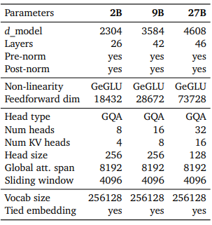
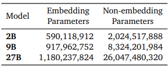
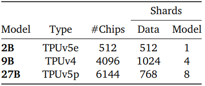
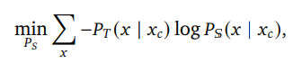
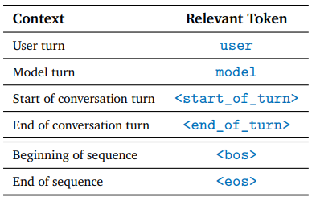
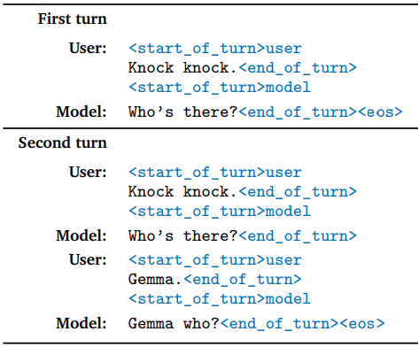
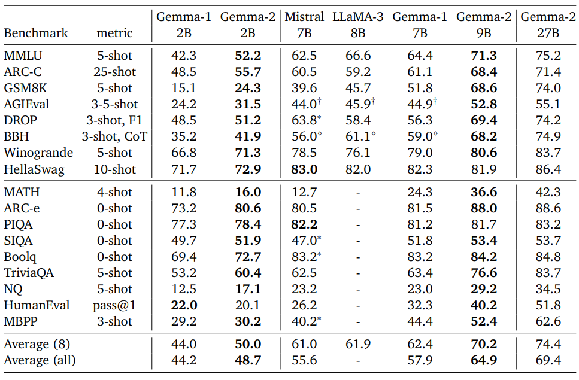

# Gemma 2: Improving Open Language Models at a Practical Size

- 논문 - [arxiv 2408.00118](https://arxiv.org/pdf/2408.00118)
- 모델 - [google/gemma-2-2b-it](https://huggingface.co/google/gemma-2-2b-it)
- Keras에서 fine-tuning - [Google Developers Blog](https://developers.googleblog.com/ko/introducing-gemma-models-in-keras/)

## 1. Model Architecture

Gemma 모델은 **decoder-only Transformer 아키텍처** ([Vaswani et al., 2017](https://arxiv.org/pdf/1706.03762)) 사용.

메인 파라미터 수

Gemma 모델의 매개 변수

- 8192 길이의 토큰 수
- **Rotary Position Embeddings (RoPE)** (Su et al., 2021)
- the **approximated GeGLU** non-linearity (Shazeer, 2020)

### Gemma 1 → Gemma 2 차이점

- **Logit soft-capping**: 각 attention layer와 final layer에서 로짓(log-odds) 제한 (Bello et al., 2016). 로짓 값을 `-soft_cap`과 `+soft_cap` 사이에 유지:
  - `logits ← soft_cap × tanh(logits / soft_cap)`
- **Post-norm and pre-norm with RMSNorm**: 학습 안정화를 위해 RMSNorm 사용 (Zhang & Sennrich, 2019)
- **Grouped-Query Attention (GQA)** (Ainslie et al., 2023): 추론 속도 향상, `num_groups = 2`

## 2. Pre-training

Gemma 1과는 다른 사전훈련 제공.

### 2.1 Training Data

- **27B**: 13조 토큰 (primarily-English)
- **9B**: 8조 토큰
- **2B**: 2조 토큰

데이터 종류: web documents, code, science articles.

**Tokenizer.** Gemma1·Gemini와 같은 SentencePiece tokenizer (split digits, preserved whitespace, byte-level encodings — Kudo & Richardson, 2018). 어휘 크기 **256k**.

**Filtering.** Gemma1과 동일한 데이터 필터링 기술 사용.

### 2.2 Knowledge Distillation

큰 모델을 교사 모델로 사용. 각 토큰 𝑥가 그 문맥 𝑥𝑐에서 주어진 확률 P_T(x | x_c)을 기반으로 작은 모델 학습. 음의 로그 가능도(negative log-likelihood) 최소화:

- P_S는 학생 모델의 파라미터된 확률

### 2.3 Compute Infrastructure

TPUv4, TPUv5e, TPUv5p 사용:

- **2B 모델**: TPUv5e 2x16x16, 총 512 칩, 데이터 복제 512-way / 모델 샤딩 1-way
- **9B 모델**: TPUv4 8x16x32, 총 4096 칩, 데이터 복제 1024-way / 모델 샤딩 4-way
- **27B 모델**: TPUv5p 8x24x32, 총 6144 칩, 데이터 복제 768-way / 모델 샤딩 8-way

- 옵티마이저 상태는 ZeRO-3(Ren et al., 2021) 유사 기술로 샤딩
- 단일 팟 초과 스케일은 데이터 센터 네트워크로 데이터 복제 축소 (Pathways, Barham et al., 2022)
- Jax + Pathways의 'single controller' 패러다임
- GSPMD 파티셔너(Xu et al., 2021) + MegaScale XLA 컴파일러

## 3. Post-Training

훈련 후 사전 훈련된 모델을 지침 조정 모델로 미세 조정:

- **Supervised Fine-Tuning (SFT)**: 텍스트/영어 전용, 합성 + 인간 생성 프롬프트-응답 쌍
- **RLHF**: 동일 프롬프트 기반 영어 전용 선호 데이터로 적용
- **모델 평균화**: 각 단계 후 모델을 평균화하여 전체 성능 향상

최종 데이터 혼합 + 후훈련 레시피는 유용성 향상 + 안전성·허위정보 관련 해 최소화에 중점.

## 4. Evaluate

