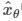
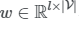
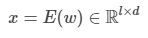
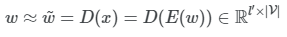
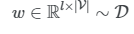

# Latent Diffusion for Language Generation

리뷰 참고 - [kimjy99 블로그](https://kimjy99.github.io/%EB%85%BC%EB%AC%B8%EB%A6%AC%EB%B7%B0/ldlg/)

NeurIPS 2023. [[Paper](https://arxiv.org/abs/2212.09462)]
Justin Lovelace, Varsha Kishore, Chao Wan, Eliot Shekhtman, Kilian Weinberger
**Cornell University** · 19 Dec 2022

## Introduction

Diffusion model은 가우시안 분포에서 추출한 랜덤한 noise를 알 수 없는 데이터 분포의 샘플로 점진적으로 변환하는 방법을 학습하는 잠재 변수 모델. 최근 이미지·오디오·비디오와 같은 연속적인 데이터 형식에 광범위한 성공. 제어 가능한 생성과 SOTA text-to-image 시스템에서도 큰 성공.

반면 언어 생성 모델은 규모가 큰 autoregressive (AR) Transformer가 주를 이룬다. 다양한 언어 생성 task에서 인상적인 성능을 보이지만, 원하는 동작을 이끌어내기는 어렵고 종종 신중하고 즉각적인 엔지니어링이 필요하다.

제어 가능한 생성에 대한 diffusion model의 성공은 언어 생성 분야에 매력적이다. 그러나 지금까지는 **불연속적인 상태에서 가우시안 noise로의 점진적인 전환이 이미지와 같은 연속 도메인에서만큼 자연스럽지 않았기 때문에** 불연속적인 도메인에서는 제한적이었다.

이전 연구들에서는 이산 데이터를 직접 모델링하려는 시도로 불연속적 상태 space에 대한 diffusion process를 정의했지만 이러한 접근은 연속적인 diffusion model보다 뒤처졌다.

다른 연구에서는 연속적인 diffusion model을 단어 임베딩의 space에서 직접 학습시키고 반올림한 step으로 연속적인 생성을 디코딩. 이런 연구들은 diffusion model을 AR 언어 모델의 잠재적인 대안으로 제안했다.

**본 논문은 diffusion model을 AR 생성의 대안이 아닌 필수 도구로 제안한다.** 저자들은 연속적인 diffusion model이 사전 학습된 인코더-디코더 언어 모델의 latent space를 학습할 수 있다고 설명한다. Diffusion model에서 샘플링된 연속적인 벡터들은 사전 학습된 디코더를 사용하여 자연어로 디코딩될 수 있다.

저자들은 latent diffusion model이 다양한 데이터셋에서 unconditional·conditional 언어 생성 모두에 효과적임을 확인. 특히, 본 논문의 접근은 사전 학습된 GPT2 model보다 데이터 분포에서 새로운 텍스트를 생성하는 데에 효과적.

## Methods

### 1. Latent Diffusion for Language

저자들은 denoising autoencoder로 사전 학습된 encoder-decoder 언어 모델인 **BART**의 latent space에서 latent diffusion model을 학습.

> - **AutoEncoder**란 representation learning 작업에 신경망을 활용하도록 하는 비지도 학습 방법.
> - 입력 데이터를 최대한 압축한 후, 데이터의 특징을 추출하여 다시 본래의 입력 형태로 복원시키는 신경망.
> - **Denoising Autoencoder** — 입력층에서 Hidden layer로 갈 때 Noise를 추가. 사람의 인식으로는 같은 데이터로 느끼지만 실제로는 성능 향상 효과.
> - **Latent Vector**는 한 이미지가 가지고 있는 잠재적인 벡터 형태의 변수.

일부 토큰이 마스킹된 발화가 주어지면 BART는 손상되지 않은 언어를 생성하도록 사전 학습된다. 기본적으로 인코더 layer와 디코더 layer가 6개, hidden size가 768인 **BART-base** 사용. BART의 인코더와 디코더를 고정시키며, 프레임워크에서 denoising network만이 학습 가능한 파라미터를 가짐.

> **BART(Bidirectional Auto-Regressive Transformer)**

Vocabulary V에 대하여 l개의 one-hot vector들의 시퀀스로 표현되는 자연어:

가 주어지면, BART 인코더 E는 w를 어떤 연속적인 latent space로 매핑한다:

> **one-hot encoding/vector**은 데이터를 쉽게 중복 없이 표현할 때 사용하는 형식 (== 변수 변환 str → int).

그런 다음 BART 디코더 D가 근사적으로 원래 입력을 재구성:

자연어 데이터셋 D가 주어지면, 연속적인 diffusion model을 학습시키기 위해서는 **연속적인 데이터를 샘플링** 해야 함:

이는 denoising network가 x를 복구하도록 학습 가능해진다.
