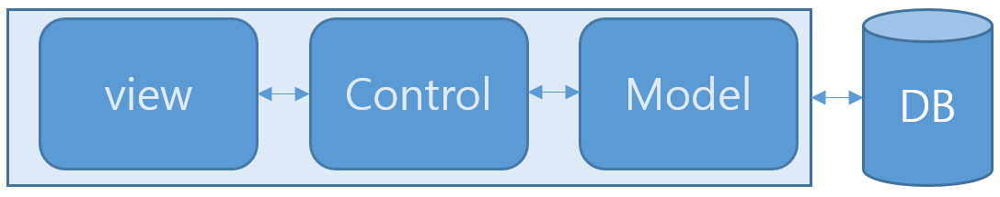
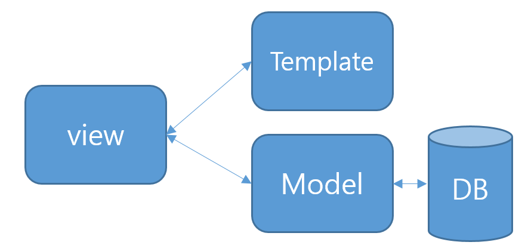
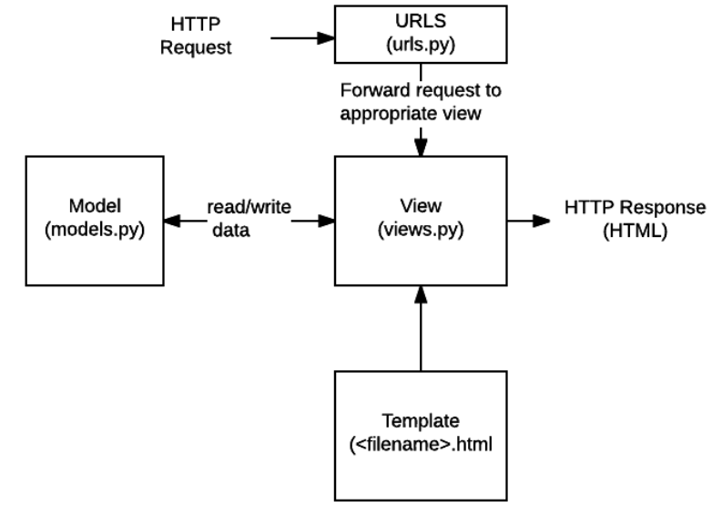

# 1. MVC vs MVT

Spring은 MVC 구조, Django는 MVT 구조를 가진다.

## 1.1 MVC 구조

- **View**: 화면에 보여주는 부분
- **Control**: 프레임워크 명령구조
- **Model**: 관리하는 데이터 또는 control 및 view에 대한 통보를 담당

## 1.2 MVT 구조

- **View**: MVC의 Control과 비슷한 역할 (명령어 하달 구간)
- **Template**: MVC의 View에 해당
- **Model**: 데이터 관리 구간 (MVC와 동일)

# 2. Django 구성 매핑

| MVT 구성 | Django 파일 |
|---------|-------------|
| Model | `models.py` |
| Template | `templates/` 폴더의 html / static 파일들 |
| View | `views.py` / `settings.py` / `urls.py` |

