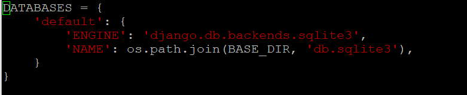

# 1. 환경

- Debian 11 (Google Cloud VM)
- Django
- Apache
- gunicorn
- sqlite3

# 2. Install

Django 설치

```bash
sudo pip install django
```

버전 확인

```bash
sudo python3 -m django --version
```

# 3. Django project

## 3.1 실행

**프로젝트 생성**

```bash
sudo django-admin startproject {project_name}
```

`manage.py`와 `{project_name}` 디렉토리 생성 확인.

**서버 실행**

```bash
sudo python3 manage.py runserver {ip:port}
```

**호스트 허용**

`settings.py`에서 `ALLOWED_HOSTS` 설정.

```python
ALLOWED_HOSTS = ['*']
```

**DB 설정**

`settings.py`의 `DATABASES` 부분이 default로 `db.sqlite3`로 잡혀 있다.



**sqlite3 설치**

```bash
sudo apt-get install sqlite3
```

SQLite는 서버형이 아니라 application에 임베드되어 사용하는 DB이다. `db.sqlite3` 파일 하나에 모두 저장하여 관리한다.

**Django 기본 데이터 생성**

```bash
sudo python3 manage.py migrate
```

Django의 기본 data를 생성해준다.

**dbshell 접근**

```bash
sudo python3 manage.py dbshell
```

`.tables`로 db 테이블 확인.

**Django 기본 앱 생성**

```bash
sudo python3 manage.py startapp {app_name}
```

App 생성 후 `settings.py`의 `INSTALLED_APPS`에 추가.

```python
INSTALLED_APPS = [
    'django.contrib.admin',
    'django.contrib.auth',
    'django.contrib.contenttypes',
    'django.contrib.sessions',
    'django.contrib.messages',
    'django.contrib.staticfiles',
    'home',
]
```
