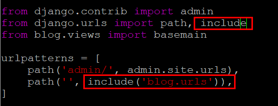

# 1. templates 디렉토리 생성

App 디렉토리 안에 `templates` 디렉토리를 생성한다.

# 2. settings.py 수정

`TEMPLATES` 부분의 `'DIRS'`를 수정.

```python
# 변경 전
'DIRS': []

# 변경 후
'DIRS': [os.path.join(BASE_DIR, 'blog', 'templates')]
```

# 3. urls.py 수정

각 라우트와 view 함수를 매핑한다.



```python
from django.urls import path
from . import views

urlpatterns = [
    path('', views.main, name='basemain'),
]
```

# 4. name 사용법

`urls.py`에서 `name="basemain"`을 추가하면, 템플릿에서 변수처럼 사용 가능하다.

**main.html**

```html
<a href="">baseGogo</a>
```
