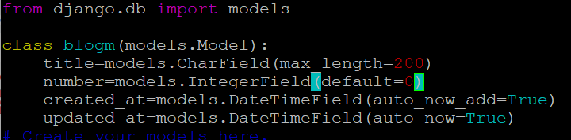

Django는 쿼리를 객체화하여 DB와 소통하는 방식 → **ORM** (Object-Relational Mapping).

# 1. models.py에 클래스 생성



```python
from django.db import models

class blogm(models.Model):
    title = models.CharField(max_length=100)
    content = models.TextField()
    created_at = models.DateTimeField(auto_now_add=True)
```

자세한 필드 종류 참고: [Django Model Fields](https://docs.djangoproject.com/en/3.0/ref/models/fields/)

# 2. 변경사항 저장

models의 변경사항 commit (마이그레이션 파일 생성).

```bash
sudo python3 manage.py makemigrations
```

DB에 변경사항 적용.

```bash
sudo python3 manage.py migrate
```

# 3. DB 확인

```bash
sudo python3 manage.py dbshell
```

- 이후 DB 쿼리문은 표준 SQL과 동일.
- 실제 데이터 입력은 ORM을 통해 하기 때문에 SQL과 입력 방식이 다름.

# 4. ORM으로 데이터 입력

```bash
sudo python3 manage.py shell
```

```python
from blog.models import blogm
blogm.objects.create(title="test")
```
