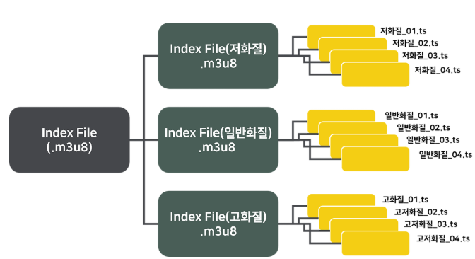

# 1. 개요

최근에 회사 프로젝트를 진행하면서 cctv 영상 스트리밍 서비스를 제공해야 하는 상황이 왔다.
단순히 영상을 송출하는 것처럼 보였지만, 실제로는 안정적인 재생 환경과 네트워크 대응, 그리고 다양한 디바이스 지원까지 고려해야 했다.
이 과정에서 영상 스트리밍 방식에 대해 다시 정리할 필요가 있었고, 그중 HLS에 대해 자세히 살펴보게 되었다.

서비스 특성과 요구사항에 맞는 방식을 찾기 위해 RTSP, WebRTC, HLS 같은 여러 선택지를 함께 비교했고,
각 방식마다 장단점이 꽤 뚜렷하다는 점을 알게 됐다.

특히 CCTV 영상이라는 특성상 단순한 VOD 재생과는 다르게
실시간성, 안정성, 그리고 실제 서비스 환경에서의 운영 편의성까지 함께 고려해야 했다.

우선 CCTV 영상의 특성부터 먼저 봐야 했다.
대상 장비는 RTSP 프로토콜로 영상을 송출하고 있었고, 내가 구현해야 했던 것은 이 영상을 웹 브라우저 환경에서 실시간에 가깝게 제공하는 스트리밍 서비스였다.
RTSP로 들어오는 CCTV 영상을 브라우저에서 직접 재생할 수는 없었기 때문에, 웹에서 재생 가능한 형태로 변환해야 했고, 그 과정에서도 최대한 낮은 지연 시간을 유지하는 것이 핵심 목표였다.

## 1.1 스트리밍 비교

최근 회사 프로젝트를 진행하면서 브라우저 환경에서 CCTV 영상 스트리밍 서비스를 제공해야 하는 상황이 있었다.
처음에는 단순히 영상을 재생하면 되는 문제처럼 보였지만, 실제로는 안정적인 재생 환경과 네트워크 대응, 그리고 다양한 디바이스 지원까지 함께 고려해야 했다.

사용자가 보고 있는 화면과 실제 시점 사이의 차이를 최대한 줄이면서도, 브라우저에서 무리 없이 재생할 수 있는 방식을 찾아야 했다.

그래서 HLS, WebRTC 등 여러 스트리밍 방식을 비교하게 됐고, 각 방식이 지닌 특성과 한계를 하나씩 정리해보게 되었다.
참고로 영상 소스는 RTSP 기반이었지만, 이 글에서 더 중요했던 건 입력 프로토콜 자체보다 이를 브라우저에서 어떻게 보여줄 것인가에 대한 문제였다.

브라우저에서 CCTV 영상을 재생하기 위해서는 RTSP로 들어오는 원본 영상을 웹에서 재생 가능한 형태로 변환해야 했다.
이 과정에서 RTSP, WebRTC, HLS를 주요 선택지로 두고 비교했다.

| 방식 | 장점 | 단점 | 브라우저 재생 적합성 | 실시간성 |
|------|------|------|----------------------|----------|
| RTSP | CCTV/IP 카메라 환경에서 많이 사용됨, 원본 영상 수신에 적합함 | 브라우저에서 직접 재생 불가 | 낮음 | 높음 |
| WebRTC | 지연 시간이 매우 짧아 실시간 스트리밍에 유리함 | 구현 복잡도가 높고 운영 난이도가 있음 | 높음 | 매우 높음 |
| HLS | 브라우저 호환성이 좋고 재생 안정성이 높음 | 세그먼트 기반이라 구조적으로 지연이 발생함 | 높음 | 상대적으로 낮음 |

정리하면 RTSP는 원본 영상을 받아오는 단계에서는 적절했지만, 브라우저에 바로 보여주기 위한 방식으로는 한계가 있었다.
WebRTC는 실시간성이 가장 뛰어나 CCTV 특성과 잘 맞았지만, 구현과 운영 측면에서 고려할 점이 많았다.
반면 HLS는 지연 시간에서는 불리했지만, 개발 마감 시간과 브라우저 환경에서 비교적 안정적으로 재생할 수 있다는 점에서 현실적인 선택지였다.

## 2. HLS

** HLS는 HTTP Live Streaming의 약자 **로, 영상을 잘게 나눈 세그먼트 단위로 전송하고 이를 플레이리스트를 통해 관리하는 방식이다.
브라우저나 플레이어는 하나의 큰 영상 파일을 통째로 받는 대신, 짧은 길이로 분할된 조각들을 순서대로 요청해 재생한다. 또한 네트워크 속도에 따라 화질을 다르게 내보낼 수 있는 "Adaptive Streaming"을 지원하는 프로토콜이다. 인터넷 느리면 저화질, 빠르면 고화질로 볼 수 있다는 의미이다.
 
구조를 조금 더 단순하게 보면, 먼저 원본 영상을 일정 길이의 작은 파일로 나누고, 각 조각의 목록을 담은 m3u8 플레이리스트를 함께 제공한다.
플레이어는 이 m3u8 파일을 읽은 뒤 필요한 세그먼트를 순서대로 받아오며 영상을 재생한다.

### ** HSL 구조 **
HLS의 최종파일은 m3u8이다. m3u8은 재생자가 재생할 비디오 url의 경로가 담긴 파일로, 일반 텍스트 파일과 동일하다. m3u8안에는 화질별 영상에 대한 경로가 있고, 그 화질별 m3u8 파일에는 개별 영상 조각에 대한 경로 정보가 담겨있다.

추가 hls에 대한 정보(https://brunch.co.kr/@musicman/3)

이 다음에는 python 구현에 대해 보겠다.