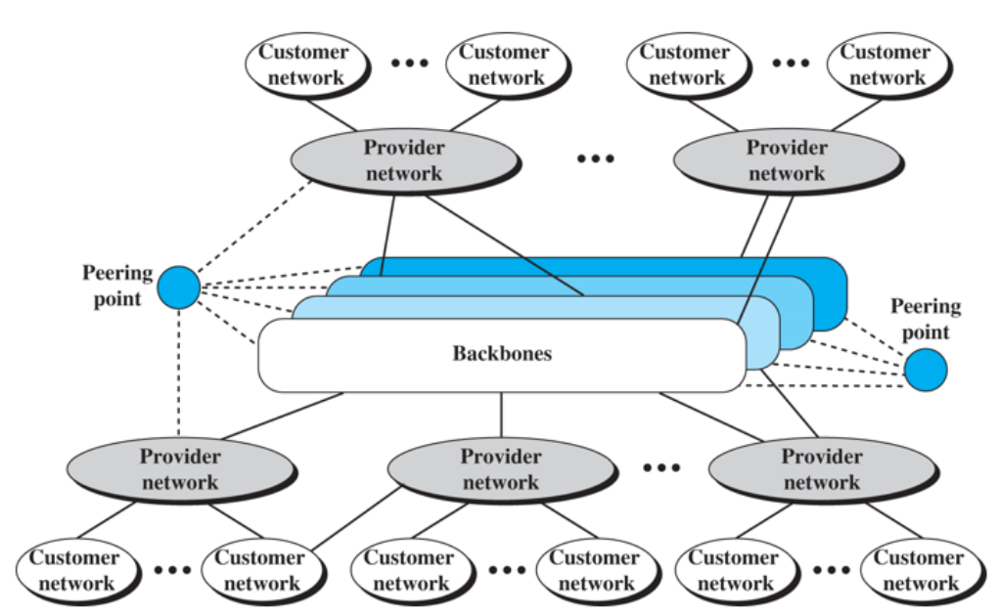
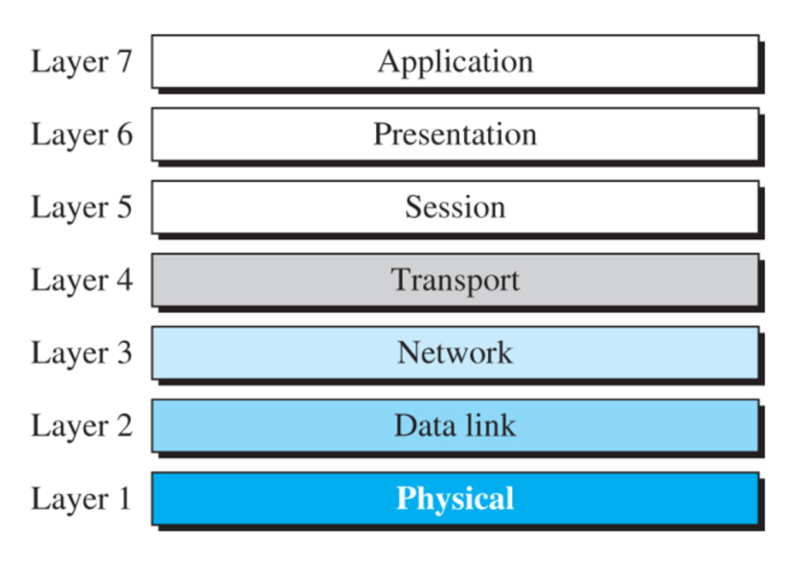

# 1. Network 개요

## 1.2 Network

### 1.2.2 물리적 구조: 연결 유형

- point-to-point connection
- multipoint: 3개 이상의 특정 기기가 하나의 링크를 공유

물리적 접속 형태(topology)

- mesh
- bus
  - 중추 케이블 결함 시 다수의 장치에 영향
- star
  - hub로 연결
  - hub 내부는 버스임
  - 트리방식: hub 밑에 hub를 계속 물리는 구조, 많이 물릴수록 속도 저하
- ring
  - 듀얼링 구조 가능: 하나가 끊어져도 다른 경로로 연결 가능

## 1.3 네트워크 유형

### 1.3.1 LAN (근거리 통신망)

- 버스형, 링형, 성형 사용
- IEEE 802 확인

### 1.3.2 WAN (광역통신망)

- 국가/대륙/전 세계를 포괄하는 광대역 영역 장거리 전송
- 거리 제한 없음

point-to-point WAN -> Unicast

one-to-group -> Multicast

internet -> n/w와 n/w 사이 연동 방법

Internet -> internet 중에서 TCP/IP로 연결하는 것

- backbone은 SKT, KT 같은 통신사 소유
- backbone은 peering point(대등점)라는 교환 시스템으로 연결
- provider network(national or regional ISP)는 요금 지불하고 백본 이용
- 백본과 제공자 네트워크를 인터넷 서비스 제공자(ISP)로 봄

### 1.3.4 인터넷 접속

- 전화망
  - 디지털 가입자 회선(DSL) 서비스
- 케이블망
  - 케이블 TV망 업그레이드해서 인터넷 연결
- 무선망
  - 무선 WAN을 통해 인터넷 연결
- 인터넷에 직접 연결
  - local or regional ISP를 통해 인터넷 연결

## 1.4 프로토콜 계층화

### 1.4.2 프로토콜 계층화 원칙

1. 양방향 통신을 원한다면 각 계층은 한 가지씩 상반되는 두 가지 작업을 수행할 수 있어야 한다.
2. 각 계층의 객체는 동일.

| 계층 | 데이터 단위 | protocol | address | 역할 | 전송범위 |
| --- | --- | --- | --- | --- | --- |
| 1계층(물리층) | bit | encoding | X | encoding(bit -> 전기신호) | 기기 하나 |
| 2계층(데이터 링크층) | frame | ethernet, bluetooth | MAC(48bit) | frame 생성, 에러/흐름제어 | node to node (switch는 같은 범위) |
| 3계층(네트워크 층) | datagram, packet | IP | IP address | routing | user to webserver -> end to end |
| 4계층(전송층) | segment, user datagram | TCP, UDP | port | 에러/흐름제어, 다중화(Mux) | process to process |
| 5계층(응용층) | message | HTTP | domain | service | No way |

## 1.6 OSI 모델

ISO에서 제정한 개방시스템 상호연결 모델

실패 이유

- TCP/IP 프로토콜이 시간과 비용을 들여 완전히 자리잡은 후에 OSI 모델이 완성됨
- 일부 계층이 완전히 정의되지 않음
- OSI 모델로 전환하기 위한 충분히 높은 수준의 완성도 부족
