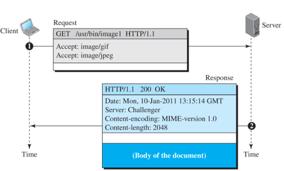
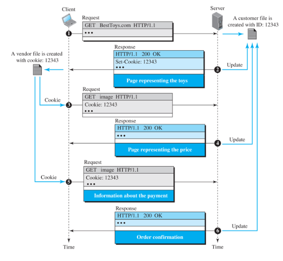
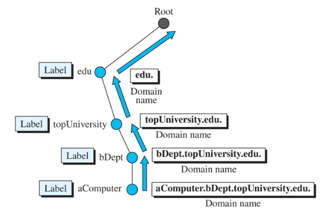

# 10. 응용층

### 10.3.1 World-Wide Web and Http

- www
- 클라이언트 - 서버 응용 프로그램
- 웹 클라이언트
    - 제어기
        - 1)키보드나 마우스로부터 입력을 받아 클라이언트 프로그램을 사용하여 문서에 접속
    - 클라이언트 프로토콜
        - 3) FTP, HTTP와 같은 프로토콜 중 하나
    - 해석기
        - 2)해석기 중 하나를 사용하여 문서를 화면에 표현
        - 4)해석기는 문서의 유형에 따라 HTML, JAVA . . .
- HTTP
    - 80포트 사용
    - TCP 사용
    - 연결형의 신뢰성 있는 프로토콜
    - 1.0버전있고 1.1버전 있음 -> 영속성이냐 비영속성이냐 1.0이 영속성
- 자원 위치 지정자
    - 웹 페이지 지정자 : host, port path
    - 웹 페이지 정의 전 브라우저에게 프로토콜 알려야 함.
- URL
    - HTTP, FTP
    - host
    - port
    - path
- 비영속적 && 영속적 연결
    - 웹 페이지들이 서로 다른 서버에 존재한다면 각각을 가져오기 위해 새로운 TCP 연결을 생성하는 것.
    - 같은 서버에 각각 존재해도 각각 새로운 TCP 연결 사용
    - 비영속적 연결
        - client가 TCP 연결을 열고 요청 보냄
        - 서버는 응답을 보내고 연결 닫음
        - client는 end-of-file 표시가 나타날 때까지 데이터 읽고, 연결 닫음
- 비영속적연결은 n개의 다른 그림링크라면 n+1번 열고 닫아야함
- 서버에 큰 오버헤드 부과 -> 서버가 연결을 열때마다 다른 버퍼들을 필요로 하기 때문
- 비영속성은 파일 하나 받고 연결끊고 다시연결해서 하나받고 연결끊고…
- 영속적 연결
    - 서버는 응답 전송 후 차후 요청을 위해 연결을 열어놓음 listen?
    - 

메시지 형식

- 요청 메시지
    - method, url, version
    - 요청 라인 이후 0개 이상의 request header라인을 가질 수 있음.
        - user-agent, accept, accept-charset, accept-encoding . . .
- 응답 메시지 -> 응답은 오류메시지가 아니라면 존재
    - 상태라인
        - http protocol version
        - 요청의 상태에 대해 정의, 숫자 3개 (200,404)
        - 상태 문구는 텍스트 형태로 상태 코드를 설명
    - 헤더라인
        - 상태라인 이후 0 이상의 응답 헤더라인 가능
    - 공백 / 본문
        - 서버로부터 client로 보내지는 문서 포함

쿠키

- 서버가 요구 받았을 때, cli에 관한 정보 파일이나 문자열로 저장 -.> cli domail, 수집한 정보 client name, number, timestamp -> client에게 보내는 응답에 쿠키 포함

캐시 업데이트

- 응답은 삭제 또는 교체되기 전에 proxy server에 얼마나 오래 유지되어야하는가?
- 사이트 목록 저장 -> 그 정보를 일정 기간 동안 동일하게 유지
- 마지막 변경 시간을 볼 수 있도록 헤더에 추가 정보를 더함
1. proxy server는 로컬 네트워크에 설치
2. client 중 하나에서 http 요청 생성 -> proxy server로 먼저 전달됨
3. proxy server에 해당 웹 페이지가 이미 있는 경우 client로 응답보냄
4. 없으면 proxy server가 client역할을 하여 웹 서버에 요청
5. 반환되면 proxy server는 복사본을 만들어 client에게 전달하기 전에 cache에 저장

SMTP

- 메일 전용프로그램
- 초창기 방식: 서버에서 메일 가지고 와서 local에 저장
- 메시지 전송 에이전트
    - 세 가지 클라이언트-서버 응용을 보여줌
    - 1과 2는 전자우편 전송에이전트(MTA) -> SMTP
    - 3은 메시지 접속 에이전트(MAA) -> POP or IMAP
- STMP는 명령과 응답을 사용하여 MTA client 와 MTA server 사이에 메시지 전송
    - 연결 설정 -> 메시지 전송 -> 연결 종료
- 메일 확인: POP, IMAP
    - POP
        - 삭제와 유지 모드
    - IMAP4
        - 받기 전에 헤더 검사 가능
        - 받기 전에 특정 문자열로 내용 검색 가능
- MIME
    - 문자는 7bit ASCII이지만 비디오 이미지는 x
    - None ASCII를 ASCII로 변환시켜주는게 MIME
- base64로 변환
    - RGB는 각각 8bit임 합쳐서 24bit
    - .4개로 쪼개로 Base64 converter에 숫자 4개로 들어감
    - 이후 ASCII로 변환

웹 기반의 전자우편

- 사용자는 웹 http로 가지고 오지만 서버끼리는 smtp사용

전자우편 보안

- PGP와 S/MIME

### 10.3.6 도메인 이름 시스템(DNS)

domain address -> ip address로 변환시키는 protocol

- 다른 응용 프로그램 도와주기 위해 만들어짐
- 이름을 주소로, 주소를 이름으로 대응시켜 주는 디렉토리 시스템 필요
- 많은 양의 정보를 작게 나누어서 전 세계의 서로 다른 컴퓨터에 저장
- local server(1차서버), remote server(2차서버)존재
- 1차서버는 무조건 local -> 외부로하면 traffic이 너무 많아짐

도메인 이름공간

- 계층적 이름 공간을 갖기 위해 도메인 이름 공간 만들음
- tree이며 root(0) 에서 level 127까지 128의 레벨만을 가짐
- label
    - 트리의 각 노드는 label을 가진다, 이것은 최대 63문자로 구성되는 String
    - root label은 null string
    - 도메인 이름의 유일성을 보장
- 도메인 이름
    - 트리의 각 노드는 도메인 이름을 가짐
    - label이 null string으로 끝나면 -> 완전도메인 이름( FQDN, fully qualified domain name)이라고 함.
- 
    
    
    
    - 위로 갈 수록 큰단위

domain

- 도메인 이름 공간의 부분트리
- 많은 양의 정보를 하나의 컴퓨터에만 저장하는 것은 비효휼적
- 이름 서버들의 계층
    - DNS server라는 많은 컴퓨터에 분산시킴
    - root는 독립적으로 두고 첫 번째 레벨의 노드만큼 많은 도메인을 생성하는 것

DNS server

- root server
    - 전체 트리로 구성되는 영역의 서버
    - 자신의 권한을 다른 서버들에게 위임하고 자신은 이러한 서버들에 대한 참조만을 유지하게 됨.
- 1차 2차 서버
    - 1차 서버
        - 자신이 권한을 갖는 영역에 대한 파일을 저장한 서버
        - 영역 파일의 생성,관리,갱신에 대한 책임을 가짐
    - 2차 서버
        - 다른 서버로부터 영역에 관한 완정한 정보를 받아서 로컬 디스크에 파일을 저장하는 server
        - 갱신 필요하면 1차 -> 2차서버로 갱신된 버전을 보내게 됨.

인터넷에서 DNS

- DNS는 서로 다른 플랫폼에서 사용될 수 있는 protocol
- 일반도메인, 국가도메인, 역도메인(안씀 안함)
- 일반도메인
    - com, net, edu
- 국가 도메인
    - fr, us, kr

Caching

- 서버가 다른 서버에게 매핑 정보를 요청하고 응답을 수신하면 이 정보를 **클라이언트에게 전달하기 전에 캐시 메모리에 저장**
- 서버는 응답에 ‘인증할 수 없다’ 라는 표시를 하여 보냄.

Resource record

- 서버와 관련된 영역 정보는 resource record의 집합으로 구현
- (Domain Name, Type, Class, TTL, Value)
    - AAAA -> An IPv6 address

DNS 메시지

- 질의(query)와 응답(response) 메시지 사용
- 식별 필드(identification)는 client가 응답과 질의를 매칭시키는데 사용
- 플래그(flag) 필드는 메시지가 질의인지 응답인지의 여부를 정의

캡슐화

- DNS는 UDP or TCP 사용 port = 53
- 응답 메시지의 크기 512byte 이하는 UDP, 512byte 이상은 TCP 사용

Registrar

- 새로운 도메인을 어떻게 DNS에 등록하는가