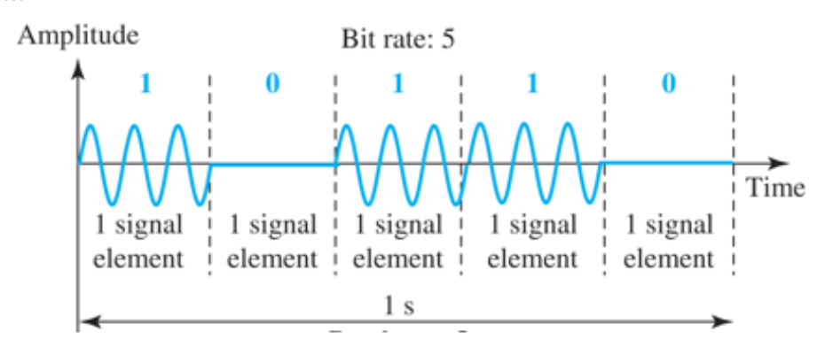
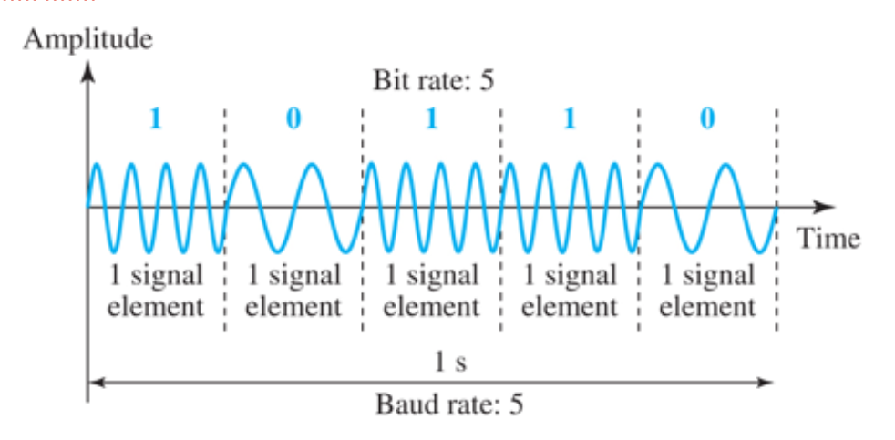
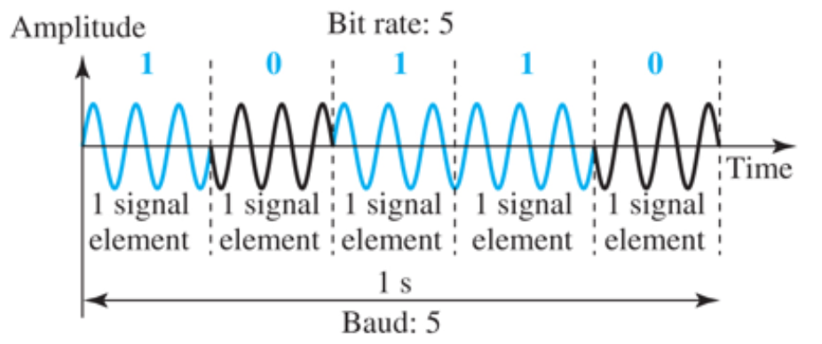
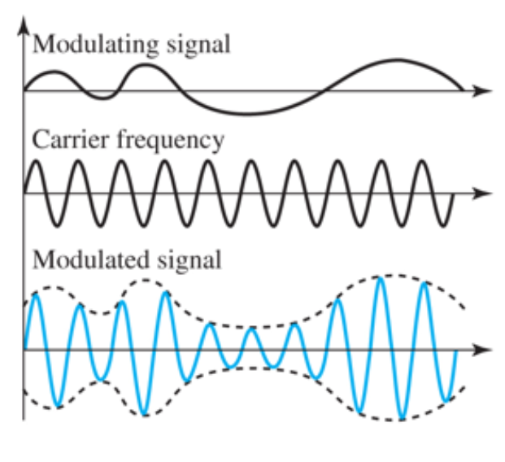
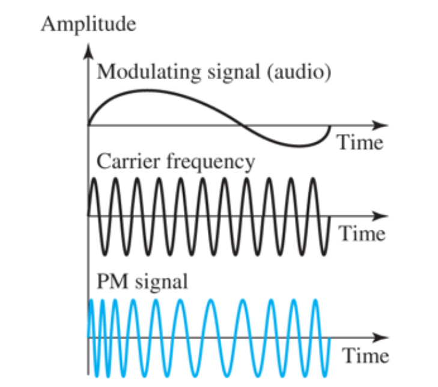
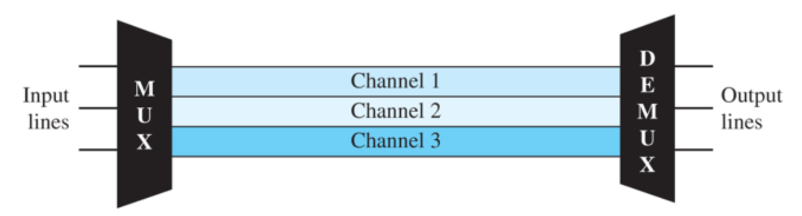
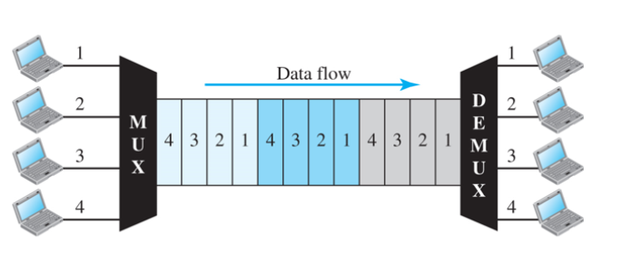

## 2.1 데이터와 신호

### 2.1.1 아날로그 신호

- 아날로그 주기 신호
    - 주기라는 연속적으로 반복된 패턴으로 구성
- 아날로그 비주기 신호
    - 시간에 따라 반복된 패턴이나 사이클 없음
- 데이터 통신에는 보통 주기 신호 사용.
- simple과 composite(복합) 신호로 나뉜다.

아날로그 신호

- sin wave는 주기 아날로그 신호의 가장 기본적인 형태
- 진폭, 주파수, 위상이라는 3가지 특성으로 표현
    - 위상
        - 시간 0시에 대한 파형의 상대적인 위치
        - 시간 축을 따라 앞뒤로 이동될 수 있는 파형에서 그 이동된 양
        - 첫 사이클 상태 표시
    - 파장
        - lambda = cT = c/f

복합신호와 대역폭

- 여러개의 단순 정현파로 만들어진 복합 신호 필요
- 복합신호의 대역폭(bandwidth)은 신호에 포함된 최고 주파수와 최저 주파수의 차이 -> 성능은 대역폭이다

### 2.1.2 디지털 신호

비트율

- 디지털 신호 표현하는데 사용
- 1초 동안 전송된 비트의 수
- bps(bit per second)
- 텍스트 자료 분당 100페이지 의 비트율 = 100*24*80*8

디지털 신호의 전송

- 기저대역 전송(Baseband Transmission)
    - baseband라고도 함.
    - 디지털 신호를 아날로그 신호로 바꾸지 않고 있는 그대로 채널을 통해 전송
- 광대역 전송(wideband Transmission)
    - 디지털 신호를 전송하기 위해 아날로그 신호로 변경해서 사용

## 2.2 신호 장애

- Attenuation(거리비례 감소)
    - energy loss
    - 이동 시 저항에 의한 에너지 손실
    - 데시벨(dB): 신호의 손실된 강도나 획득한 강도 표시
    - dB = 10log10(p2/p1) /p1, p2는 신호의 전력
- Distortion(일그러짐)
    - 왜곡, 찌그러짐이라고도 함
    - 신호의 모양이나 형태가 변하는 것
    - 반대되는 신호나 다른 주파수 신호로 만듬
    - 마지막 목적지에 도착할 때 지연 생길 수 있음.
    - 지연이 주기 기간과 정확히 같지 않은 경우 지연 차이가 위상 차이를 만들 수 있음.
- Noise
    - 열 잡음, 유도된 잡음, 혼선, 충격 잡음
    - SNR : signal to noise ratio
    - 잡음과 신호 전력의 비율
    - SNR은 dB로 표시
- SNR = average signal power / average noise power
- SNRdB = 10log10(SNR)

### 2.2.3 데이터 전송률의 한계

- 데이터 전송률의 세 요소
    - 가용 대역폭(available bandwidth)
    - 사용 가능한 신호 준위
    - 채널의 품질(잡음의 정도)
    - 
- 데이터 전송률을 계산하는 두 가지 이론적 수식
    - 나이퀴스트 수식(Nyquist bit rate): 잡음이 없는 채널에서 사용
    - 섀넌 수식(Shannon capacity): 잡음이 있는 채널에서 사용
- 잡음이 없는 채널: 나이퀴스트 비트율
    - 나이퀴스트 전송률
        - 대역폭은 채널의 대역폭(B), L=.준위 개수. 전송률=bps
        - Bit Rate = 2Blog2(L)
        - 준위의 수를 늘리면 임의의 비트율 달성 가능하지만, 준위 수 늘리면 수신자에게 부담.
    - 잡음이 있는 채널: 섀넌 용량
        - 잡음 있는 채널에서의 최대 전송률 결정하는 수식
        - B=대역폭, SNR=잡음 비율, 채널용량(capacity)는 bps단위
        - C = Blog2(1+SNR)
    - 둘 다 최대 전송률이니 equal이 성립한다.(예제 2.9 시험에 나옴.)
    - 섀넌은 최대이기 때문에 나이퀴스트와 equal하려면 보다 작은 2^n승을 취해주자

### 2.2.4 성능

- 대역폭
    - Hz: 신호에 포함된 주파수 범위
    - 비트율 단위: 채널을 통과할 수 있는 초당 비트 수
- 처리율(throughput)
    - 어떤 지점을 데이터가 얼마나 빨리 지나가는가
    - data link가 Bbps를 전송할 수 있는 대역폭을 갖는다고 할 때 이보다 적은 Tbps만큼만 전송할 수도 있다.
    - 대역폭은 링크의 잠재 성능 측정치 의미
- 대역폭 - 지연 곱
    - 링크를 두 지점을 연결하는 파이프로
    - 단면: 대역폭, 길이: 지연 -> 곱하면 지연 시간
- 파형 난조(jitter)
    - 서로 다른 데이터 패킷이 서로 다른 지연 시간을 갖게 되어 생기는 현상, 음성과 영상이네

## 2.3 디지털 전송

### 2.3.1 digital to digital

- 회선 부호화(line encoding)
    - NRZ
    - Manchester
- 블록 부호화(block encoding)
    - 4B/5B mapping codes -> use in PC, 4bit to 5bit so pc에서 100mb 보내면 실제로는 125mb 보내짐
- scrambling

2.3.2 analog to digital

- 펄스 코드 변조(PCM) use in CD
1. sampling - 아날로그 신호를 매 Ts마다 채집
- 이후 자르기
- sampling >= 2*최대주파수
1. quantizing - 채집된 신호는 계수화하여 모든 표본이 펄스로 간주 / 실수를 가장 가까운 정수로 ex)
2. encoding - pulse 는 bit stream으로 부호화 / 10진법 to 2진법
- 디지털 신호의 최소 대역폭 = nb * 아날로그 신호의 대역폭
- 델타 변조(DM)
    - 기울기 양수면 1 음수면 0

## 2.4 아날로그 전송

### 2.4.1 digital to analog

디지털 데이터의 정보를 기반으로 아날로그 신호의 특성 중 하나를 변경하는 처리

- 진폭 편이 변조(ASK)
    - 2진 진폭 변조 or on-off

- 주파수 편이 변조(FSK)

- 위상 편이 변조(PSK)

- 직교 진폭 변조(QAM)
    - 진폭과 위상이 같이 변함
    - 위상개수 3, 진폭 2 -> 총 6개라서 3bit로 표현 가능

### 2.4.2 analog to analog

전송매체가 띠대역 통과 특성을 갖고 있거나 띠대역만이 사용 가능한 경우에 변조 필요

- 진폭 변조(AM)
    - 신호의 진폭에 따라 반송파의 **진폭 변화**
    - 신호의 대역폭은 변조되는 신호 대역폭의 두배와 같다.

- 주파수 변조(FM)
    - 변조신호의 전압 준위 변화에 따라 반송 **주파수가 변화**한다.
    - 신호의 대역폭은 B(FM) = 2(1+ beta)B, beta는 보통 4
- 위상 변조(PM)
    - 정보 신호의 진폭에 따라 반송파의 위상이 비례하여 변화.

## 2.5 다중화

다중화기(MUX)

- 전송 스트림을 단일 스트림으로 결합(many to one)

다중복구기(DEMUX)

- 스트림을 각각의 요소로 분리(one to many)
- 전송 스트림을 해당 수신 장치에 전달

link

- 물리적인 경로

channel

- 한 쌍의 장치간에 전송을 위한 하나의 경로

### 2.5.1 주파수 분할 다중화

- FDM: frequency-division multiplexing
- 링크의 대역폭이 전송되는 조합 신호의 대역폭 보다 클 때 적용할 수 있는 아날로그 기술
- 신호가 겹치지 않도록 보호대역(guard band)만큼 떨어져 있음
- 사용자 5채널, 각 사용자 15Hz, guard band 5Hz, Min 25Hz -> Max=120Hz, 대역폭=95Hz

### 2.5.2 시분할 다중화

- 송신과 수신장치에 의해 요구되는 데이터 전송률 보다 전송 매체의 데이터 전송률이 클 때 적용되는 디지털 처리 기술
- 보내는 시간대에 따라서 묶어서 보냄, 각 시간을 slot이라 부름.
- T1/E1(1.544Mbps / 2.048Mbps)

(24*8bit/byte)+1

- > 1개의frame, 1은 동기화 비트
- > T1 -> 8000 frame/s -> 24명이 쓸 수 있음
- > E1 -> 30명이 쓸 수 있음.

Appendix - 파장(광파장) 분할 다중화(광케이블에서만 씀)

- 코드분할 다중화(mobile)

## 2.6 전송 매체

- 두 가지 형태로 분류: 유도매체, 비유도매체

### 2.6.1 유도매체

꼬임쌍선(twisted cable)

- 비차폐(unshielded)와 차폐(shielded)가 있음
- 비차폐선(UTP) = RJ45
    - 비용 때문에 주로 사용
    - star, tree 방식은 utp 사용
    - 10BaseT(10Mbps, Baseband(Digital), Twisted-Pair) = cat.3(category three)
    - 100BaseT = cat.5
- 차폐선(STP)
    - 절연된 전도체쌍을 감싸는 금속 그물덮게를 가지고 있다.

동축케이블(Coaxial Cable)

- BNC-T
- 꼬임쌍선보다 높은 주파수 범위의 반송 신호
- 10Base2(10Mbps, baseband, 2*100m**(185m)**) -> thin cable
- 10Base5(10Mbps, baseband, 5*100m) -> thick cable
- 중계기로 거리 연장할 수 있음 **(max=4)**
- **안테나 케이블로 많이 씀**
- 버스방식에서 사용

광케이블(Fiber-optic cable)

- MT-RJ
- 광섬유 중심부=core, 피복=cladding
- 케이블의 감쇠는 twisted cable보다 훨씬 더 적다.
- single mode 광케이블 - 적외선, 하나의 빛
- multi mode 광케이블 - LED 쓴다는데?, 여러개의 빛

### 2.6.2 비유도 매체: 무선

Radio, Microwave는 FCC허가 받아야함.

Radiowave

- 3KHz ~ 1GHz
- 전방향성 - 안테나가 모든 방향으로 전파 방사
- 같은 주파수 사용하여 전송하는 안테나에 방해 받음
- 공중 전파 방식은 원거리 가능(AM)
- 벽 통과 가능

Microwave

- 1 ~ 300GHz
- 단방향 전파
- 가시선 전파
- 벽 통과 못함
- unicast 통신임. 휴대전화에 사용

Infrared(적외선)

- 300GHz ~ 400THz
- 단거리 통신
- 벽 통과 못함
- 다른 시스템에 방해 안줌
- 외부에서 사용 불가
- 넓은 대역폭
