### 3.1.1 노드와 링크

- 데이터 링크층의 통신은node to node
- 인터넷에서 한 지점의 데이터 단위는 다른 지점에 도달하기 위해 LAN과 WLAN과 같은 많은 네트워크를 통해 전달
- LAN과 WAN은 router를 통해 연결

3.1.2링크의 두 가지 유형

- point to point
- broadcast: link to link

3.1.3 두 개의 부계층

- 데이터 링크 제어(DLC): point to point와 broadcast link에 연관된 모든 사항을 다룸
- 매체 접근 제어(MAC): 브로드 캐스트와 관련된 특별한 사항을 다룸

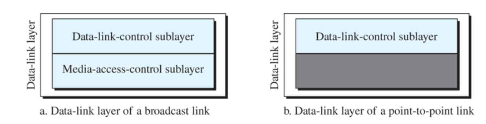

## 3.2 데이터 링크 제어

- 두 인접한 노드 사이의 통신을 위한 절차를 다룸
- 데이터 링크 제어(DLC)기능
1. 프레임 짜기
2. 흐름과 오류 제어

### 3.2.1 프레임 짜기

- 데이터 링크층은 비트들을 프레임 안에 넣어 각 프레임이 다른 프레임과 구분
- 송신자와 수신자의 주소를 넣어 발신지에서 목적지로 가는 메시지 분리
- 목적지 주소는 패킷이 가야할 곳을 규정, 송신자는 수신자로 하여금 받았다는 것을 응답할 수 있도록 도와줌
- 프레임 짜기
1. 고정길이 프레임: 고정 길이 또는 가변 길이
2. 가변길이 프레임: 프레임이 끝나는 곳과 다음 프레임이 시작하는 곳 지정
    1. 문자 중심 프로토콜

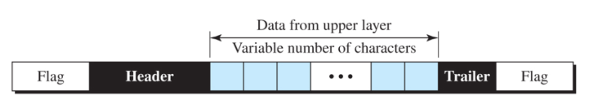

- 전달되는 데이터는 부호화 시스템의 8비트 문자
- 시작과 마지막에 플래그(문자열 “”)역할
- 문자 중심 프로토콜 프레임
- ESC(문자열 /역할)
1. 비트 중심 프로토콜

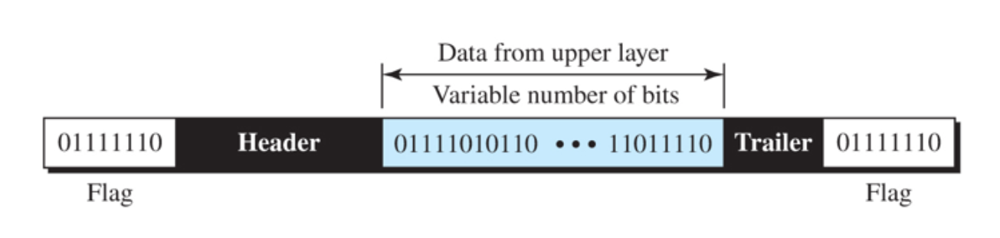

- 5번 연속 1이면 뒤에 0을 넣음 - 구분자?
- 데이터 무결성 보장(integrity)

### 3.2.2 오류제어

- single bit error: 하나의 비트가 변경되는 오류
- burst error: 2개 이상의 연속적인 비트가 바뀌는 오류

에러 검출

1. parity bit
- 저속이라서 안씀
- 7bit 중 맨 앞을 parity bit를 추가하여 8bit로 사용함.

종류

1. odd(홀수) parity bit
- 1의 개수를 홀수로
- 수신자가 짝수로 받으면 error
- 2bit가 바뀌면 error탐지가 안됨.
1. even parity bit
- 1의 개수를 짝수로
1. 개선 parity bit
- 세로로는 짝수 parity, 가로로는 홀수 parity

P/B

A	1 100 0001

B	1 100 0010

C	0 100 0011

P/B	0 100 0000

1. CRC(순환 중복 검사, cyclic redundancy check)
- layer2(LANcard)
- 송, 수신자 모두 같은 생성다항식 G(x)를 가지고 있음.

ALGORITHM

1. G(x) = 1011 = X^3 + X + 1
2. data = 1001
3. data*g(x)의 최고차항 = 1001000
4. CRC = 1001000 mod 1011 = 110
5. so 송신 bit = 1001110
6. 수신자는 1001110 mod G(x) = 0이면 error없음.
- 오류 검출된 데이터는 **최소 해밍 거리**로 수정 가능 -> 경제성이 떨어짐.
- 현재는 CRC32 사용 - CRC 32bit
1. checksum
- layer3,4
- 3bit씩 끊어서 더함
- 맨 앞 bit는 맨 뒤에 더함
- {data} + {ckecksum} 송신
- 수신자는 3bit씩 끊어서 더한 값이 0이면 no error (맨 앞 올림수 제외)

## 점대점 프로토콜(PPP)

- point to point 접근을 위한 가장 널리 사용되는 프로토콜
- 데이터 전송을 제어하고 관리하기 위해서는 데이터 링크층에서 point to point 프로토콜이 필요

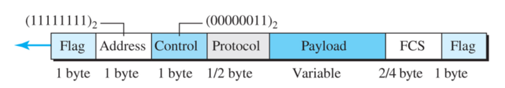

- Flag: 01111110값을 가진 1바이트 필드
- Address: 상수값 11111111(브로드캐스트 주소)로 설정
- Control: HDLC의 U-프레임을 본뜬 상수 값 00000011로 설정
- Protocol: 데이터 필드에 사용자 데이터 또는 다른 정보가 들어 있는 것을 정의
- Payload: 사용자 데이터
- FCS: CRC

천이 단계

Dead

- > Carrier detected(케이블 잘 연결되어있는지)
- > Establish(1계층은 문제 없음)

-> Authnticate(인증)

- > 실패 시 Terminate
- > 성공 시 Network
- > Open

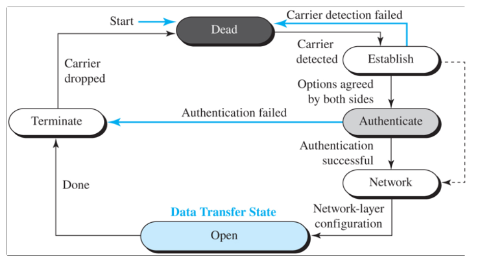

다중화

- PPP는 링크를 설정하고 관련된 당사자를 인증하며 네트워크층 데이터를 전달하는 등 일련의 다른 프로토콜도 사용
1. LCP(링크 제어 프로토콜): 링크 설정, 유지, 구성과 해제를 담당
2. AP(인증 프로토콜): 자원들에 접근하기를 원하는 사용자의 신원을 증명
    1. PAP(패스워드 인증 프로토콜): 잘 안씀
    2. CHAP(챌린지 핸드셰이크 인증 프로토콜)
- client → server
- 각자 값 가지고 있고, 송신 시 mod값이 같으면 인증 → hash 값, 아 그 보안플에서 그
1. NCP(네트워크 제어 프로토콜): 협상 하고자 하는 네트워크 프로토콜과 링크 설정, 유지, 종료를 수행
    1. IPCP

## 3.3 매체 접근 프로토콜

- 다중 접근(multiple access): 노드나 지국이 다중점 또는 브로드캐스트 링크라는 공유 링크라는 공유 링크를 사용할 때 링크에 접근하는 것을 조율하기 위한 다중 접근 프로토콜이 필요

### 3.3.1 임의 접근

Channelization protocols → 동적할당 안됨(fixed) → 사용자 너무 한정적

- FDMA(주파수 분할 다중화) → radio, tv
- TDMA(시간 분할 다중화) → Internet
- CDMA(코드 분할 다중화)

Controlled-access protocols → Demand → supervisor가 있어야함, 시스템 복잡, 비쌈

- Reservation
- Polling
- Token passing → ring방식

Random-access protocols → 충돌생김

- ALOHA → 인류최초 무선 라디오파 통신
1. 순수 ALOHA

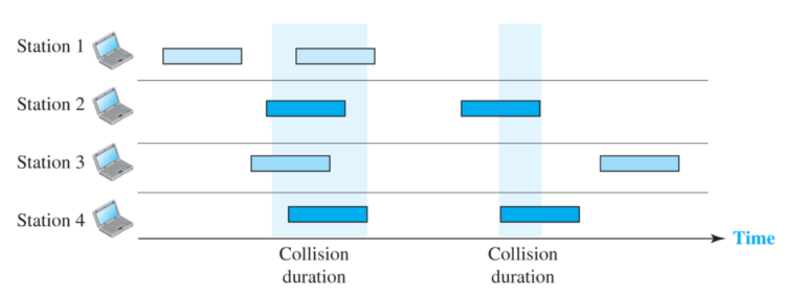

- 각 지국은 전송할 프레임이 있으면 언제든지 전송
- 오직 하나의 채널이므로 충돌생김
- 프레임 전송 후 확인응답을 기다리고 시간 내에 못받으면 프레임을 잃어버렸다고 간주, 이후 재전송 시도
- 처리율 18.4%
1. 틈새 ALOHA

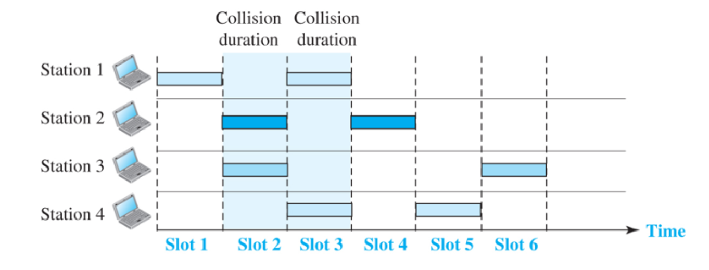

- 보내는 시간에 구간을 지정해 부분 충돌을 없앰
- 처리율 36%
1. CSMA(반송파 감지 다중 접근)
- Listen Before Talk(LBT)
- bus 방식
- 보내기 전에 다른사람이 보내고 있으면 기다려라
- 보내는 사람이 끝나고 동시에 보내면 충돌 → CSMA/CD 사용 이유
1. CSMA/CD
- Listen While Talk(LWT)
- 기존 CSMA방식 + 내가 이야기 하는 동안 충돌 확인
- Ethernet
- 충돌 검출 반송파 감지 다중접근 → 시간을 두고 확인, 점점 충돌을 줄이기 위해 보내는 시간 텀 늘림
- CSMA/CD에서 지국은 프레임을 전송한 뒤에 전송이 성공적인지 매체를 관찰

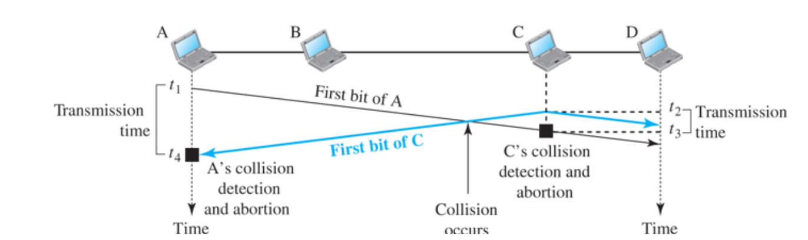

10 base5

2500m

A	B	C	D

10Mbps, 25.Ms →

← 25.6M/s * 10Mb/s = 51.2*10^(-6) * 10^6 * 10 = 512bit = 64byte(충돌감지를 위한 최소길이)	1500

- CSMA/CA → CA=충돌회피 → 무선 ethernet

### 3.3.2 제어 접근

예약

1. 지국은 데이터 송신하기 전에 예약 필요로 함
2. N개의 지국이 존재하면 N개의 예약된 mini slot들이 예약 프레임 안에 존재
3. 예약을 한 지국은 데이터 프레임을 예약 프레임 뒤에 전송
- mini slot 세팅을 함 01101 → 2,3,5번째 데이터만 보낸다는 뜻

Polling(폴링)

1. 지국 중 하나가 주국(primary station)이 되고 다른 지국들은 종국(secondary station)이 되는 접속 형태
2. 종국으로 가는 데이터는 모두 주국을 통해서 전달
3. 주국이 링크 제어 종국은 그 지시에 따름
4. poll
- 주국이 종국으로부터 전송을 요청하는데 사용
1. select
- 주국이 언제든지 송신할 것이 있을 때 사용
- 예정된 전송을 위해 주국은 종국의 준비 상태에 대한 확인 응답을 대기
- 주국은 전송 예정된 장치의 주소를 한 필드에 포함하고 선택 프레임(SEL)을 만들어 전송

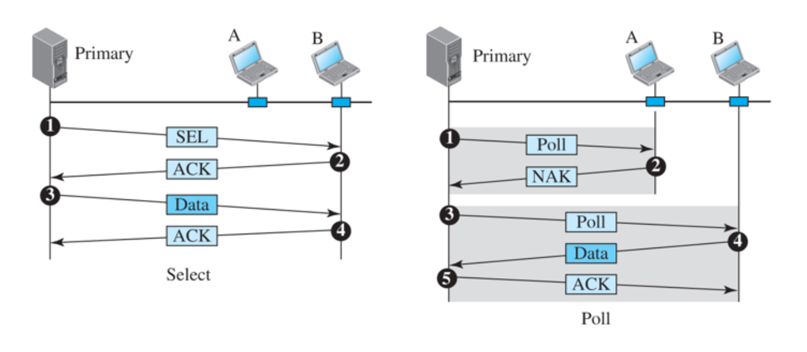

NAK 시 보낼 거 없다는 뜻

토큰전달

- 지국들이 논리 링 형태로 구성
1. Physical ring
    1. monitoring이 필요 → 비용이 비쌈.
    2. 한 사람이 네트워크 장악하는지 감시
    3. 토큰 사라졌는지 확인
    4. 위조 확인
    5. 일반적인 방식
2. Dual ring
    1. 한 곳에 문제 생기면 기기와의 링(master)의 연결 끊은 후 다른 링이랑 연결
    2. FDDI ← DUAL
3. Bus ring
4. Star ring

## 3.4 링크 계층 주소지정

- 발신지와 목적지 IP주소는 두 종단을 정의하지만 패킷이 경유하는 경로에 대해서는 정의 못함

L → MAC addr

N → IP addr

check

- 2계층은 node to node

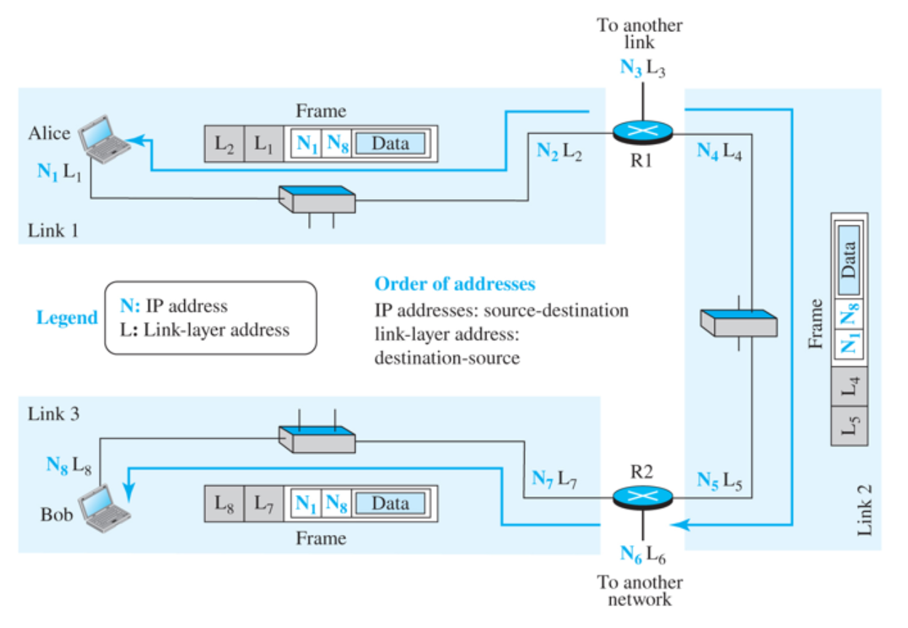

### 3.4.1 세 가지 유형의 주소

1. unicast

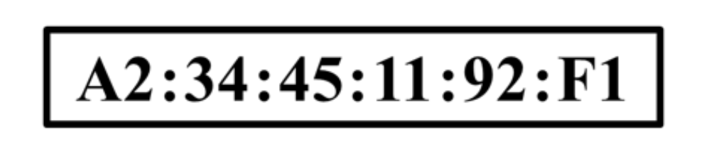

- 두 번째가 짝수여야 unicast
- 앞 6개는 vender id, serial id
1. multicast
- 두 번째가 홀수여야 multicasat
- 01:00:5e 가 multicast 표준
1. broadcast
- 12자리 가 다 F이면 broadcast FF:FF:FF:FF:FF:FF

### 3.4.2 ARP(주소 변환 프로토콜)

3계층과 2계층의 연결

ip to MAC, MAC to ip

Ethernet frame 안에 data로 들어감 [Ethernet packet정보](https://docs.google.com/document/d/1sffSJXkMv3lxN4MHQLxGz5zEMD2oeYN9lUp4Q3uCLWo/edit#heading=h.ndu9rahlf7xb)

- ARP request는 broadcast (FF FF FF FF FF FF)
- request에 대한 응답은 unicast

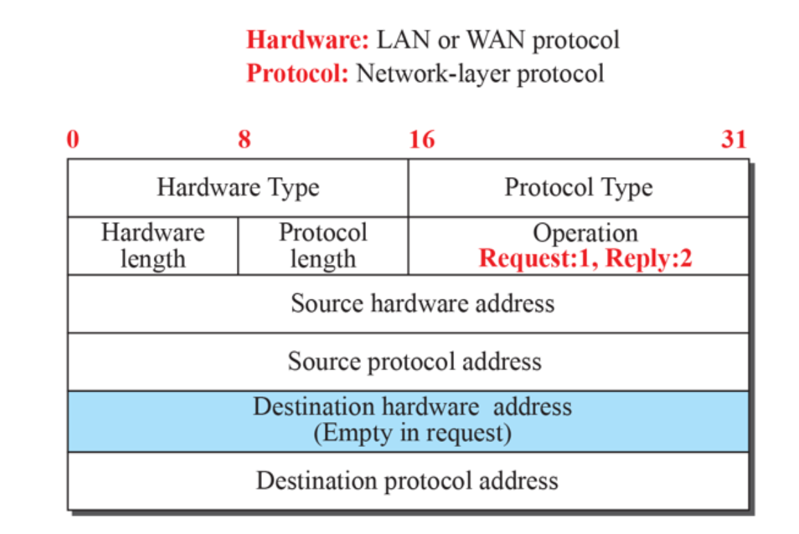

Hardware Type

- 1=ethernet

Protocol Type:

- 3계층의 프로토콜
- 0x0800 = ip protocol

Hardware length

- 2계층 주소의 길이는 얼마니 ethernet = 6byte

Protocol length

- 3계층 주소의 길이 4byte

Operation

- Request=1, Reply=2, RARP request=3, RARP reply=4 (MAC알고 IP 모를 시 RARP사용)

Destination hardware address

- request 시 모르니 0으로 채워서 보냄

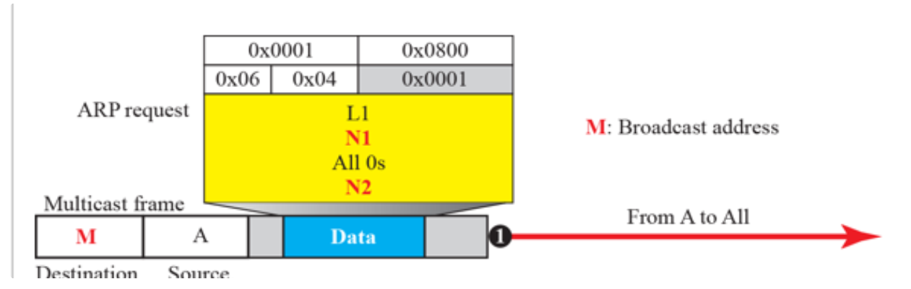

- broadcast가 M에 들어감 all F

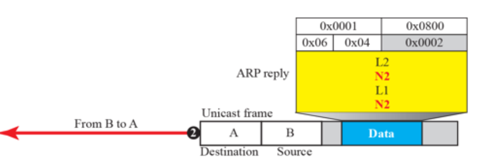

- Destination이 N2가 아니라 N1

ARP cache

- 아는 주소면 forwarding table 정보 사용

hub

pc1 pc2 pc3 pc4

10   20   30   40

AA  BB  CC  DD

20 CC 라고 보내면 20 CC라고 forwarding table에 저장됨 so pc2에 가는게 pc3로 감

→ arp spooping
