# 4. 근거리 통신망 LAN

10M(DOS)

1. Ethernet(10M)
- IEEE, 802.3(CSMA/CD)
- 제품화 =DIX2.0(LANCard)
- Cat.3
1. Token Ring(16M)
- IEEE, 802.5(Token Passing)
- IBM
- Cat.4(20BaseT)

100M(Window3.1)

1. Fast Ethernet(FEN)
- 802.3u(CSMA/CD)
- 100BaseT(Cat.5), 100M부터는 동축케이블 안씀
1. FDDI(Fiber ~ )
- 802.6
- Token Passing / Fiber
- Duel Ring
1. 100BaseVGAny
- 802.12
- 802.3 + 802.5
- Hp

802.15: bluetooth

802.11: CSMA/CA(무선 LAN)

802.16: Wibro(WiMax) → 휴대폰 인터넷

1G(www)

1. Gigabit Ethernet(GEN)
- 802.3z(CSMA/CD)
- 1000BaseT(Cat.6) / Fiber
- CISCO, Oracle(DBMS)
- AutoNegotiation(자동협상) → 100M, 1G 둘 다 동작하는 LANCard

10G

1. 10G
- 802.3ae(CSMA/CD)
- Fiber
- 40km(거리가 확장)
- S(short) / L(long) / E(extra long) (파장 길이)

## 4.1 이더넷

LAN은 제한된 지역 즉, 빌딩, 캠퍼스 등에 사용하기 위해 설계된 네트워크

- IEEE 802.3
- LLC(logical link control)
- MAC(media access control)

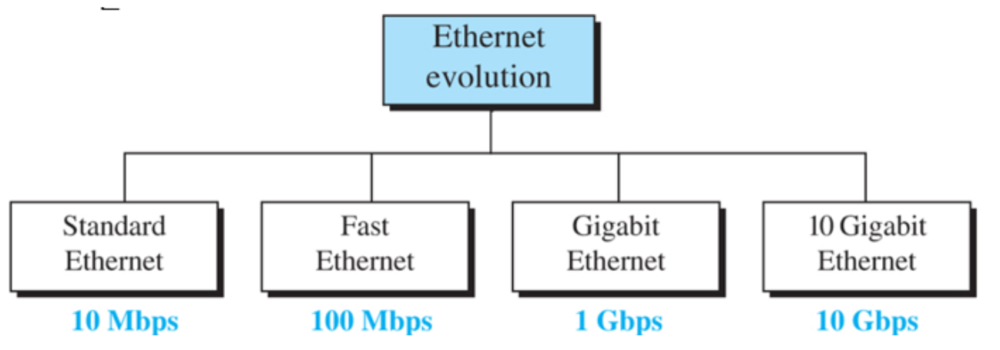

4개 세대 있음.

### 4.1.1 표준 이더넷(10Mbps)

- 10Mbps
- CSMA/CD 방식
- 매체는 모든 지국들 사이에서 서로 공유

MAC 부계층

- 접속 방식의 동작을 관장
- 상위 계층으로부터 수신한 데이터를 프레임으로 만들고 부호화를 위한 PLS(Physical Layer Signaling) 부계층으로 전달

비연결형과 신뢰성 없는 서비스

- 이더넷은 비연결형 프로토콜, 프레임간 독립적으로 동작
- 프레임이 전달이 안되는 경우, 상위층 프로토콜에서 재전송 등의 방식 갖는 프로토콜을 사용

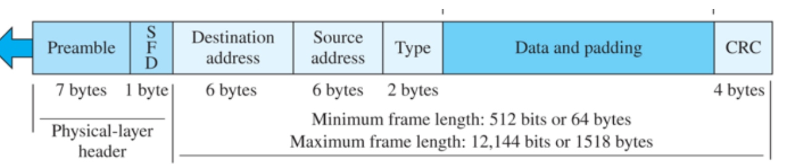

1. Preamble - 수신자 시스템에게 프레임이 도착하는 것과 동기화할 수 있게 만들어주는 0과 1을 반복하는 7byte 필드
2. SFD - 1바이트(10101011), 프레임의 시작을 알리고 이 다음 필드가 목적이 주소임을 알림
3. Source address - 패킷을 보내는 송신자의 링크층 주소
4. Type - 프레임 내에 캡슐화된 패킷에 대한 상위 계층 프로토콜을 정의
- 뒤에 오는 data가 ip면 0800
- arp면 0806
1. Data - 상위층의 프로토콜로부터 캡슐화된 데이터 전달
2. CRC - CRC-32형태

data and padding

- min = 46bytes
- max = 1500bytes == MTU(Maximum Transmission Unit)
- max보다 큰 데이터는 frame을 쪼갬
- 최소는 충돌 감지를 위해 == CSMA/CD의 원활한 동작을 위함 → 46byte보다 작으면 padding으로 min값 맞춤
- LLC때문에 실제로는 max값 살짝 낮음

주소지정

- 이더넷 네트워크에 있는 각 지국은 자신의 네트워크 인터페이스 카드(NIC)를 가지고 있음
- 각 NIC는 지국 내부에 설치되어 있고 6byte의 링크층 주소를 지국에게 제공
- 이더넷 주소는 48bit

케이블

- 10Base5, 10Base2, 10BaseT

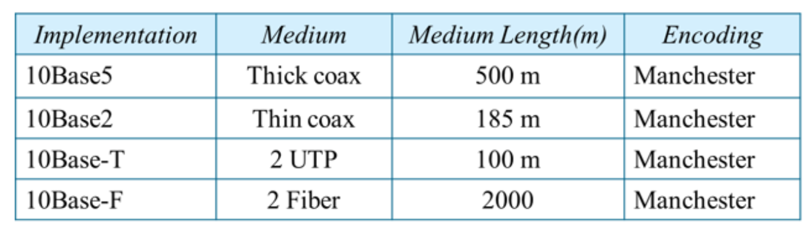

### 4.1.2 고속 이더넷(100Mbps)

- Fast Ethernet
- 표준 이더넷과 호환성 구축
- 동일한 48bits 주소체계 유지
- 동일한 프레임 형식 유지
- MAC 부계층은 동일

접근 방법

- CSMA/CD
- 프레임 최소 크기를 유지하려면 네트워크의 최대 길이를 변경해야함.
- 주소체계 48bit

속도 빠르게하려면… 10 → 100

1,2계층만 뽑아라

1. LAN cable: cat.3 → cat.5
2. NIC: 10M → 100M
3. switch

자동 협상

- 고속 이더넷에 추가된 새로운 기능은 자동 협상임
- 두 지국이 전송 모드 또는 데이터 속도를 협상할 수 있도록 함

물리층

- 100Mbps 데이터 속도를 처리할 수 있으려면 물리층에서 몇 가지 변경 필요

케이블

- 100Base-TX: 차폐 꼬임쌍선 4쌍중 2개만 씀
- 100Base-FX: 광섬유 케이블
- 100Base-T4: 4쌍중 4개 다 씀 UTP
    - 3개는 A to B로 data전송(반이중 방식)에, 나머지 하나는 error검출용으로 씀

### 4.1.3 기가비트 이더넷 (1Gbps)

- 표준 또는 고속 이더넷과 호환성
- 48bit 주소
- 동일한 프레임 형식
- 최소/최대 프레임 길이 유지
- 자동 협상 기능

MAC 부계층

- MAC 하위 계층 그대로 유지 불가능
- 매체 접근에 대해 반이중과 전이중 방식 제공
- 거의 전이중 방식, 대부분 반이중 무시
- 전이중 모드는 모든 컴퓨터에 연결된 중앙 스위치 존재, 충돌 없음
- 반이중 모드는 스위치가 허브에 의해 대체 가능

케이블

1000Base 시리즈

### 4.1.4 10기가비트 이더넷

- 802.3ae
- 전이중 모드(CSMA/CA)만 작동, 따라서 반이중(CSMA/CD) 작동 안함

케이블

64B66B

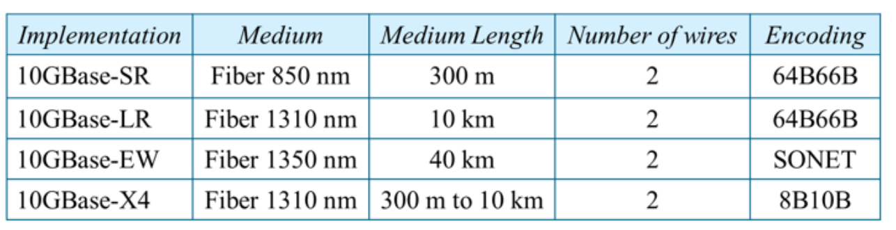

## 4.2 WIFI, IEEE 802.11

- IEEE 802.11이라는 무선 LAN 사양을 정의

### 4.2.1 IEEE 802.11 구조

기본 서비스 집합(BSS)

- 고정/이동하는 무선국과 접근점(AP, Access Point)으로 구성됨
- 애드 혹 네트워크(ad goc Network): AP없이 네트워크 구성
- 기반구조(Infrastructure Network) BSS: AP를 가진 BSS
- 확장 서비스 집합(ESS, Extended Service Set)
    - AP를 가진 2개 이상의 BSS로 구성됨
- 분산 시스템: BSS의 AP들을 연결

### 4.2.2 MAC 부계층

- 분산 조정 함수(DCF)
- 점 조정 함수(PCF)
- 네트워크 할당 벡터(NAV)
    - 채널 사용여부를 확인하기 전 대기해야 하는 시간 → 충돌 회피

CSMA/CA 와 NAV

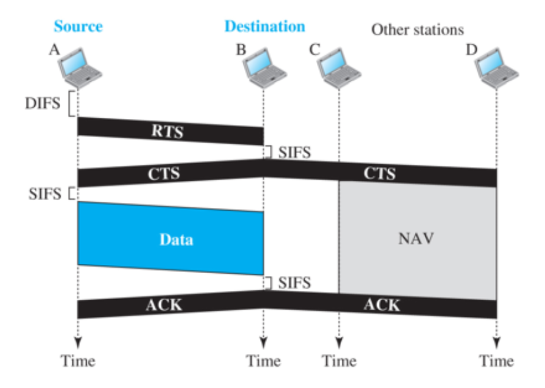

- /a: 54M
- /b: 11M
- /g: 54M
- /s: 무선 mesh 250M
- 점 조정 함수(PCF)
    - 기반구조 네트워크에 구현되어 있는 선택적 접근방법
    - DCF 상위에 구현 시간에 민감한 전송에 사용

주소

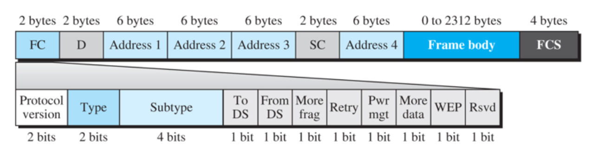

주소 4개 [why?](https://docs.google.com/document/d/1L8hRy25r39dZvWIDcFE6-cv5zwKW7RwfsrijcuMM9K4/edit#heading=h.gu4x4xm5qc1d)

- DS: DS에 따라서 case가 나뉨 00 ~ 11
- More frag: 내 뒤에 frame 더 있다. 더 있으면 1, 마지막이면 0
- Retry: 다시시도
- Pwr mgt: 배터리 불안정 시 발생, 1이면 연결이 끊어질 수 있다.
- More data: 뒤에 데이터 더 있음
- WEP: 데이터 암호화 할 시 1
- Subtype: RTS, CTS, ACK 구분

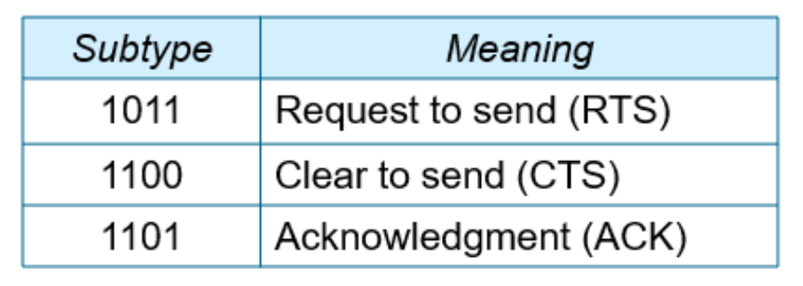

### 4.2.3 주소 체계

B,C가 통신하는 중 C,D가 통신이 가능함에도 못하는 경우가 생김

노출된 지국 문제hidden node problem → 해결 불가능

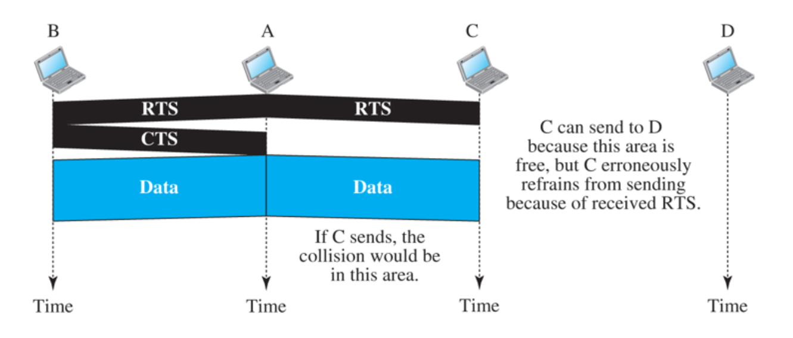

### 주소

DS: 00 ~ 11

case1

순서: A의 주소, B의 주소, BSS-ID

case2: 보내는사람이 AP가 가까이 있는경우

받는사람 주소, AP, 보내는 사람 주소

case3: case2와 반대경우

AP, 보내는 사람, 받는사람

case4

받는사람AP, 보내는사람AP, 받는사람 주소, 보내는사람 주소

### 4.2.4 물리층

FHSS

시간대에 따라서 주파수 흔들기

- 초당 1600번 도약

ex)

0 - 200Hz

1 - 400Hz

2 - 300Hz

## 4.3 블루투스

- IEEE 802.15
- 서로 짧은 거리에 있을 때, 서로 다른 기능을 가진 장치를 연결하기 위해 설계된 무선 LAN 기술
- 애드 혹 네트워크
- 장비를 서로 발견하여 피코넷이라는 네트워크를 만듦

### 4.3.1 구조

피코넷

- 7개까지의 지국 가질 수 있음
- 하나의 주국(Primary)과 그 밖의 종국(Secondary)으로 구성
- 모든 종국은 클록과 도약 주파수를 종국과 동기화
- 머무르는 상태(Parked State: 주국과 종국간 Synchronization) → 활성화 상태(Active State: in Communication)

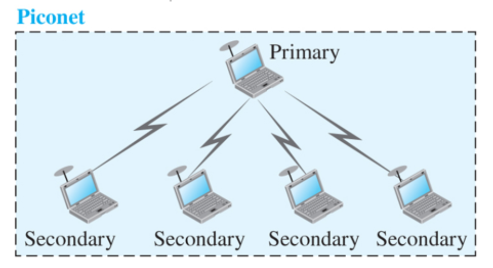

스캐터넷

- 한 피코넷 안에 종국은 다른 피코넷에서 주국이 될 수 있다.

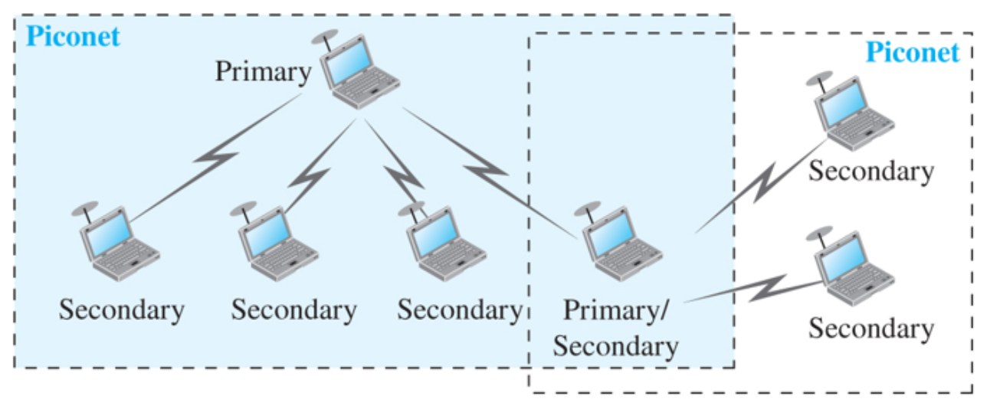

### 4.3.2 블루투스 계층

OSI 계층과 정확하게 일치하지는 않는 여러 계층 사용함

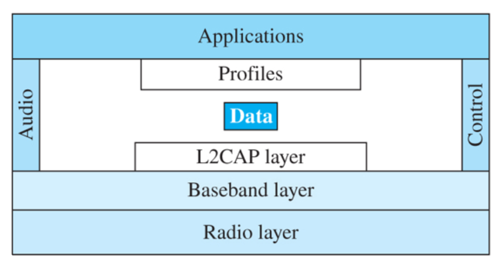

논리 링크 제어 및 적응 프로토콜 (L2CAP)

- L2CAP(Logical Link Control and Adaptation Protocol)
- LAN에서 LLC 부계층과 유사
- ACL(Asynchronous Connection-Less)링크에서 데이터를 교환하는데 사용됨.
- 다중화, 분할 및 재조립, 서비스 품질과 그룹관리 등의 기능

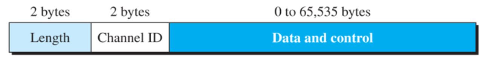

TDMA(Time division multiple acess)

- 블루투스는 TDD-TDMA 사용
- 종국에서 반이중 양방향 통신을 지원(동시에 통신이 이루어지지는 않음)

단일 종국 통신

- 시간을 623us의 틈새로 나누어 주/종국은 각각 짝/홀수 틈새 사용

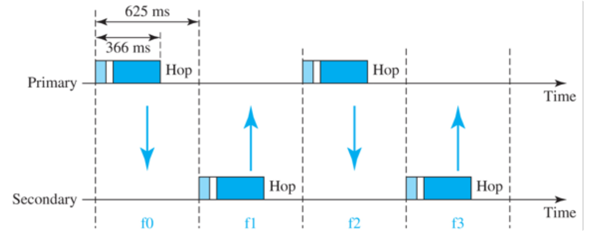

다중 종국 통신

- 피코넷에 하나 이상의 종국이 있는 경우
- 한 종국이 이전 틈새의 패킷에 의해 지정되면 그 종국이 다음 틈새에 전송

무선계층 (Radio Layer)

- 인터넷 모델의 물리층과 비슷
- 적은 전력을 사용하여 10m의 반경 범위
- 79개의 채널의 2.4GHz ISM 대역 사용, 채널당 1MHz씩 할당

주파수 도약 대역 확산

- FHSS
- 다른 장치나 네트워크로부터 간섭을 피하기 위함
- 초당 1699번 도약
