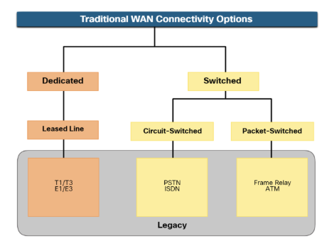
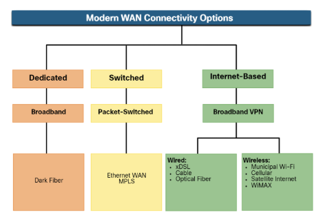
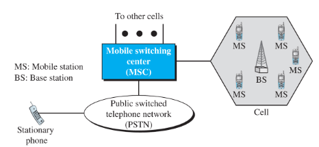
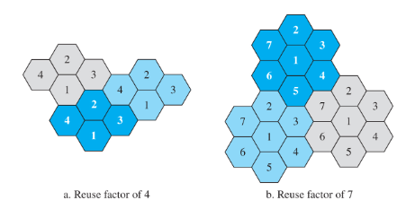
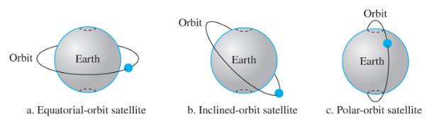
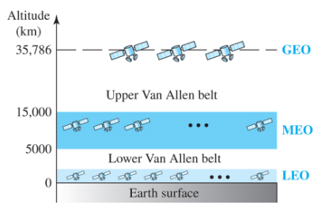

# 5. 광역 통신망 WAN

T1/T3, E1/E3: 인터넷 속도(도시와 도시를 연결하는 큰 망)

xDSL: 가정용?

## 5.3 셀 방식 이동전화(Cellular Telephony)

1. 이동국(MS)으로 부르는 두 이동 단위 사이
2. 하나의 이동 단위와 육상 단위(land unit)로 부르는 고정 단위 사이

로밍 → 다른 이동통신망 사용 후 내 통신망에서 정산

셀

- 호출자를 추적하기 위해 서비스 영역을 셀이라는 작은 지역으로 나뉜다.
- 작은 기지국(BS)
- 이동 교환 센터(MSC)

왜 6각형인가 → 제일 안정적인 도형

BS, MS

PSTN

### 5.3.1 동작

주파수 재사용 원칙

- 이웃하는 셀들은 같은 주파수를 통신에 사용할 수 없다.

Handoff / Handover → 옆 기지국에 사용자 데이터 전송

- 통화 중에 이동국이 다른 셀로 이동 가능
- Hard H/Off → 하나의 기지국 당 한가지 신호만 소유(하나의 기지국과만 통신)
    - 다른 셀로 이동하면 이전 기지국과 통신이 끊어짐
    - 이동국은 하나의 기지국과만 통신하기 때문에 다른 셀로 이동하면 이전 기지국과 통신이 끊어진다
- soft H/Off → 2개 이상의 기지국이 신호를 가지고 있는 방식
    - 다른 셀로 이동할 때 단절없이 새 기지국 계속 통신 가능

### 5.3.2 1세대(1G)

Voice

AMPS - 한 채널당 25MHz

- 011 / 015
- 북미에서 선도하는 아날로그 셀 방식 시스템

### 5.3.3 2세대(2G)

SMS

- D-AMPS: 디지털화된 AMPS
- GSM: 유럽 표준안
    - 한 채널당 200MHz
- IS-95: 북미잠정 표준
- PCSf

016 / 017 / 018 / 019

### 5.3.4 3세대

영상통화

IMT-2000

(Internet Mobile Communication for year 2000)

### 5.3.5 4세대

휴대 internet

패킷 기반, IPv6 제공

LTE

5G

## 5.4 위성망

위성 궤도

케플러 법칙

Period = C*distance^1.5

Uplink(earth to satellite), Downlink(satellite to earth)

### 5.4.1 동작

위성 궤도의 고도

1. GEO
- 정지위성(equal speed with earth)
- 한 위성이 120도 정도의 범위를 가짐. so 3개 필요, 하나의 범위=footprint
- 기상위성, 군사위성
1. MEO
- GPS
    - 6궤도 24개 위성
    - 지구상 어느 점에서도 4개의 위성 보임
    - 삼변측량법 → 최소 3개
- 시간정보, gps
- 한바퀴에 6 ~ 8시간
1. LEO
- 전화기, 방송위성
- 저 지구궤도 위성
- 극궤도를 가진다
- starlink project by SpaceX
- 고도는 500 ~ 2000km, 회전 주기 90 ~ 120분