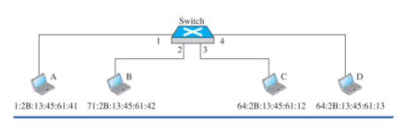
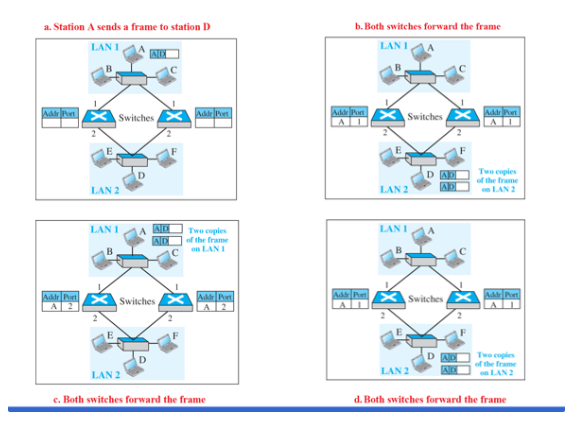
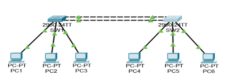
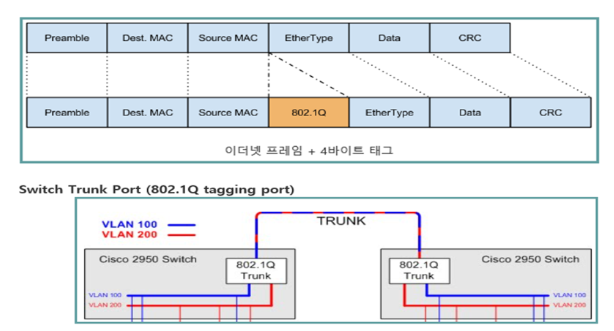
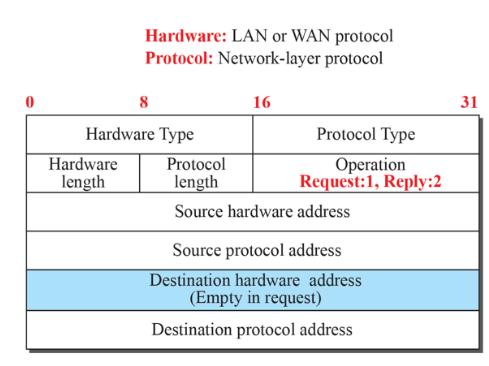
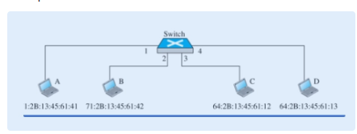

# 6. 연결 장치와 가상 LAN

## 6.1 연결장치

- 네트워크 만드는 장치
- 호스트 연결하거나 인터넷을 구성하기 위해 네트워크를 서로 연결
- 연결 장치는 인터넷 모델의 서로 다른 계층에서 동작
- 계층에 따라: 허브, 링크 계층 교환기, 라우터

### 6.1.1 허브

허브: 물리층에서만 동작

중계기(repeater): 신호가 너무 약하게 되거나 훼손되기 전에 신호 수신하여 원래의 비트 형태를 재생하고 증폭

### 6.1.2 링크 계층 교환기

물리층: 수신한 신호 재생성

투명(학습) 교환기

- 동적 테이블을 이용하여 주소를 포트로 자동적으로 변환
- destination addr: 프레임 전달 방향 결정
- 발신지 주소: 테이블에 새 항목 추가하거나 변경하는데 사용

루프문제

- 신호가 ring이 아닌데 한바퀴를 도는 loop가 생성됨 → 두 스위치에 S1(A, 1) S2(A, 2) 이런식의 테이블이 만들어짐
- loop 생성 방지 필요 → STP(Spanning Tree Protocol) → 프림?

1. S1 == Root bridge
2. 가중치는 전부 1이며 최단거리를 찾는다.
3. 각 switch → Root bridge
4. if equal
    1. left first
    2. upper second
5. 각 LAN → Root bridge

\\

PORT 종류

Root와 Bridge MAC 다름 → root node가 아님

S1 → S2 = G0/2(root port)

- root bridge로 가는 포트

Root port 제외한 나머지 포트 = Designated Port(지정포트)

- root bridge의 포트는 다 Designated 포트임

alternative port

- 아무것도 못보내는 포트
- 끊어지면 대체품으로 씀

cost19 Fastethernet

cost4 Gigabitethernet

so 케이블에 따라 루트노드가 바뀔 수 있음.

ROOT 지정 방식

1. Priority 작은거
2. MAC 작은거
3. cost 같을 경우 포트번호가 낮은 쪽을 선택할 가능성 있음.

모든 주소는 root bridge로 향해야 함.

# switch Vlans

논리적으로 PC1, PC4가 같은 가상공간에 놓이게 하는 것

속도 빨라지고, 보안성 좋아짐.

grouping 방법

1. port
2. ip
3. MAC address
4. 위 3개로 조합하는 방법

명령어

sh vlan brie

vlan setup

1. vlan 생성 #vlan 10	#no vlan 10
2. vlan 이름 설정 #name GroupA
3. vlan을 interface에 할당

#inte f0/1

#switchport mode access           (접근 가능한 모드)

#switchport access vlan10

이런 방법도 있음

#inte range f0/3, f0/12

#inte range f0/4-f0/20

switch끼리는 포트 하나로만 연결되어 있을 시

trunk 설정

1. inte 선택
2. switch mode trunk
3. switchport trunk allowed vlan 10,20,30

확인

# do sh inte trunk

######

(cisco가 수용하지 못하는 장비인 경우)

#switchport trunk native vlan 99

######

####

(VLAN Configuration)

(ip전화, ping까지 확인해봐라)

#mls qos trust cos

#switchport voice vlan 150

####

802.1q

이더넷프레임 + 4byte

tagging frame

appendix

ARP

받는사람주소, 보내는 사람주소 이후 2byte=type

이후부터 ARP

ip 10진수 변환 문제같은거 나올 수 있음.

1c 1b b5 d3 bf ad 1c 1b b5 aa bb cc 08 06

00 01

/08 00

/06

/04

/00 02

/1c 1b b5 aa bb cc

/c0 a8 00 1a

/1c 1b b5 d3 bf ad

/c0 a8 00 1c

00 00 00 00 00 00 00 00 00 00 00 00 00 00 00 00 00 00

46  28? → 20

Switch(config)# interface GigabitEthernet0/1

Switch(config-if)# switchport mode trunk

Switch(config-if)# switchport trunk allowed vlan 10,20,30