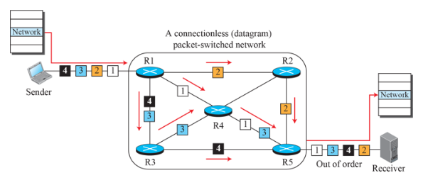
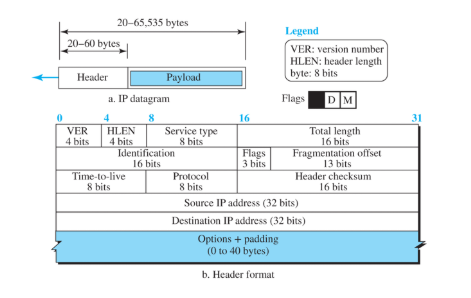
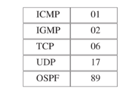
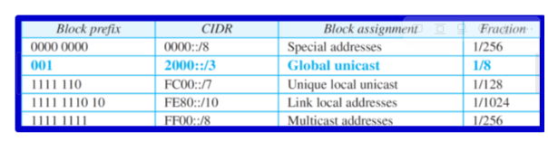
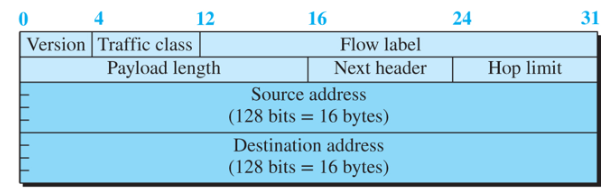

# 7. 네트워크층: 데이터 전송

## 7.1 네트워크층 서비스

인터넷의 네트워크층을 다루기 전 일반적으로 네트워크층 프로토콜에서 기대되는 네트워크층 서비스

### 7.1.1 패킷화

- 네트워크층의 첫 번째 의무는 패킷화
- 다른말로 발신지로부터 목적지까지 페이로드 운반

### 7.1.2 라우팅

- 네트워크층에서 발신지에서의 목적지까지의 네트워크층 패킷을 라우팅이 책임
- 물리적 네트워크는 네트워크(LAN 및 WAN)와 라우터의 조합. 라우터들은 서로 연결됨.
- 네트워크층은 여러 경로들 중에서 가장 좋은 것을 찾는 책임

### 7.1.3 오류제어

- 네트워크층에서 구현 가능하지만 안함
- 이유는 네트워크층의 패킷이 각 라우터에서 단편화되어 오류검사가 비효율적

-> 라우터마다 오류검사하면 비효율적이라는 소리인듯.

### 7.1.4 흐름제어

- 소스가 수신자의 능력을 초과하지 않고 보낼 수 있는 데이터의 양 조절
- 수신자의 능력을 초과하는 데이터를 수신하게 될 때
- 수신자는 발신자에게 데이터가 너무 많다는 것을 알리기 위해 피드백

### 7.1.5 혼잡제어

- 계층의 혼잡은 인터넷에 너무 많은 데이터그램이 존재하는 상황에서 발생
- 송신 컴퓨터에서 보낸 데이터그램 수가 네트워크 또는 라우터의 용량을 초과하면 혼잡이 발생

### 7.1.6 인터넷 서비스 품질

- Qos라고 하며 대부분상위 계층에서 구현

### 7.1.7 보안

- 네트워크층은 보안조항 없이 설계됨. 비연결형 서비스를 연결형 서비스로 변경하는 또 다른 가상 수준이 필요. 이같은 가상계층을 IPSec이라 부름.

## 7.2 패킷교환

### 7.2.1 데이터그램 방식: 비연결형 서비스

- 메시지의 패킷들이 목적지까지 같은 경로나 다른 경로로 전달될 수 있다.

### 7.2.2 가상 회선 방식: 연결형 서비스

- 데이터그램이 전송되기 전에 데이터그램을 위한 가상 경로 설정
- 데이터그램을 모두 같은 경로로 전송 가능
- 패킷은 발신지와 목적지 주소뿐만 아니라 지나가야 하는 가상 경로를 정의하는 가상회선 식별자와 같은 흐름 레이블을 포함해야함.
- 데이터그램과 달리 순서가 바뀌지 않음

## 7.3 성능

- 네트워크의 성능은 지연, 처리량, 패킷 손실률로 측정 가능
- 혼잡제어는 성능을 향상시킬 수 있는 이슈

### 7.3.1 지연

- 전송지연 - 발신자는 패킷의 비트를 전송선에 하나씩 넣어야 한다. delay = (Packet length) / (transmission rate)
- 전파지연 - 전송 매체의 A 지점에서 B 지점으로 비트가 이동하는데 걸리는 시간 .delay = distance / propagation speed
- 처리지연 - 라우터 또는 목적지 호스트가 입력 포트에서 패킷을 수신하고 헤더를 제거하고 오류 탐지 절차를 수행하고 패킷을 출력포트로 전달하는데 필요한 시간 delay = time required to process a packet
- 큐잉 지연 - 대기열 지연은 일반적으로 라우터에서 발생. 각 포트에 연결된 출력 큐가 있고 전송을 기다림. delay = time a packet waits in input and output queues in a router
- 총 지연은 다 합한것

### 7.3.2처리량

- 초당 한 지점을 지나는 비트 수. 해당 지점의 실질적인 전송률

ex) link1 TR: 200kbps, link2 TR: 100kbps

- TR: Transmission rate

### 7.3.3 패킷 손실

- 라우터가 다른 패킷을 처리하는 동한 수신되는 패킷은 입력버퍼에서 대기해야함
- 그러나 라우터는 한정된 버퍼를 가지고 있기 때문에 가득 찰 경우 폐기해야됨.
- 패킷 손실이 발생하면 해당 패킷을 재전송하는데 오버플로우와 패킷손실 발생

## 7.4 IPv4주소

- 각 장치의 연결을 식별하기 위해 TCP/IP 프로토콜 그룹의 IP 계층에서 사용되는 식별자
- 32비트
- 라우터나 호스트가 아닌 연결의 주소
- ICANN에서 관리

### 7.4.1 ipv4 주소지정

- 32bit = prefix+suffix
- 3가지의 고정된 접두사로 설계 n=8, 16, 24
- 전체 주소 공간은 5개의 클래스로 구분
- 이 기술을 클래스 기반 주소지정이라 한다.
- 클래스 없는 주소지정
    - 서브네팅과 수퍼네팅은 주소 고갈 문제 해결 못함
    - 주소고갈 해결위해 클래스 권한 제거됨.
    - 클래스 없는 주소지정: 슬래시 표기법
- 서브네팅
    - 일정 범위의 주소를 가진 기관은 범위를 부 범위로, 이를 서브 네트워크에 할당 가능
- 서브넷 설계
    - 각 서브 네트워크의 첫 주소는 서브네트워크의 주소 수로 나눌 수 있어야 한다. **더 큰 서브네트워크에 주소를 먼저 할당**
- 주소 집단화

### 7.4.2 네가지 프로토콜

- IPv4 프로토콜
    - packetizing 패킷화
    - forwarding 포워딩
    - delivery of a packet 패킷 전달
- ICMPv4(Internet Control Message Protocol Version 4)
    - IPv4를 도와 네트워크층의 전송 중 발생할 수 있는 오류 제어
- IGMP(Internet Group Management Protocol)
    - IPv4의 멀티캐스트를 도와줌
- ARP(Address Resolution Protocol)
    - 네트워크층 주소와 링크 계층 주소를 매핑

### 7.4.3 데이터그램 형식

- IP가 사용하는 패킷을 datagram이라 한다.
- datagram은 가변 길이의 패킷으로 헤더와 페이로드로 이루어져 있다.
- 헤더는 20~60바이트 -> default는 20byte임
- TCP/IP에서는 헤더를 4바이트 부분으로 표현하는 것이 일반적

- 헤더필드
1. VER: 4bit - 버전 version 4 = 4
2. HLEN : 4bit - 헤더길이 / including options / header가 bit*4의 의미를 가짐
3. Service type: 8bit - 서비스 유형 의미없음
4. Total length: 16bit - 전체 길이 IP 데이터그램의 전체 바이트 수를 정의 65535byte까지 정의 가능
5. Identification: 16bit - 식별자: ip주소와 함께쓰이고 개별 식별 가능한 숫자를 줌 IP Adress + Sequence number
6. Flags: 3bit - 플래그: 3개로 나누어짐 맨 앞은 안쓰고 D: Do not fragment M: More fragement
- D: Do not fragment (1)
    - datagram 통과시킬 수 없다면 datagram 버리고 호스트에게 ICMP 에러 메시지 보냄
- M: More fragment (0)
    - 더이상 쪼개지 마시오
    - 0: 마지막 fragment 거나 단일 fragment
1. Fragmentation **offset**: 13bit - 단편화 오프셋 /
- first,mid frag를 구분시켜주는 구분자
- 보내는 data의 크기로 구분함
1. Time-to-live(TTL): 8bit - 수명 데이터그램이 통과할 수 있는 라우터 갯수(hops) 자기 자신 포함임. 3개의 라우터 거쳐갔다면 4
2. Protocol: 8bit - 프로토콜 : 대상에서 데이터필드를 수신하는 다음 수신계층(TCP, SMTP, UDP 등)

1. Header checksum: 16bit - 헤더 검사합
- 네트워크를 통해 전달된 값이 변경되었는지 검사하는 값
- 모든 값 더하고 wrapped sum 한다. 4비트로 표현해야한다면 상위비트 잘라서 하위비트에 더해줌
- 이후 보수 취해주면 checksum값
1. Source address: 32bit - 발신지 주소
2. Destination address: 32bit - 목적지 주소
3. Options: - 네트워크 테스팅 디버깅에 사용
- header+option = hlen*4
1. Padding: 32bit길이의 배수로 채움?
- 페이로드(Payload):
    - 상위 계층의 사용자 데이터 전달
    - 8비트 길이의 정수 배
    - 데이터그램의 최대 길이(헤더+데이터) = 65535 octets

### 7.4.5 단편화

- 데이터그램은 다른 네트워크를 통해 전달 가능
- 각 라우터는 수신한 프레임에서 데이터그램 역캡슐화 하고 처리한 후 다른 프레임으로 캡슐화
- 수신 프레임의 형식과 크기는 프레임이 막 통과한 물리 네트워크에서 사용되는 프로토콜 사용
- MTU(최대전송단위) - 자르지 않고 보낼 수 있는 최소 사이즈
- 각 링크층 프로토콜은 고유의 프레임 형식을 가짐
- 캡슐화 가능한 페이로드의 최대 크기 정해짐
- offset
- offset*8 = byte첫번째

### 7.4.3 옵션

- ipv4 데이터그램 헤더는 고정부분과 가변부분 두 가지로 구성
- 고정부분 20바이트
- 가변 부분은 최대 40바이트(4바이트의 배수)

데이터그램의 보안

- 무선은 보안항목이 없지만 유선은 있음. ipv4는 보안항목 없음 - 이내용은 없는데???
- 세 가지 보안 이슈 - 패킷 도청, 변조, ip 스푸핑
    - 패킷 도청(sniffing) - IP패킷을 intercept하고 이에 대한 copy를 만들음.
    - 패킷 변조(modification) - Packet을 변경한 후 수신자에게 전송
    - IP 스푸핑: 다른 컴퓨터의 IP주소를 가장한 후 패킷 전송
- IPSec
    - 알고리즘과 키 정의: 2개의 개체간 사용할 암호화 알고리즘과 암호와 키 정의
    - 패킷 암호화
    - 데이터 무결성
    - 발신처 인증

### 7.4.4 ICMPv4

- IPv4 프로토콜은 오류보고와 오류 정정 기능이 없다.
- ICMPv4 메시지는 오류보고와 질의 메시지로 나눌 수 있다.
    - 오류보고(error reporting) 메시지: 라우터나 호스트가 IP패킷을 처리하는 도중 탐지하는 문제 보고
    - 질의(query) 메시지: 쌍으로 생성되며 호스트나 네트워크 관리자가 라우터나 다른 호스트로부터 특정 정보를 획득하기 위해 사용.
- 호스트는 같은 네트워크 상의 라우터를 발견, 라우터는 노드가 메시지를 다른 곳으로 보내는 것을 도움
- Echo request and reply ==ping 유형
    - 03 - 요청시간 만료(0~15로 유형 표시)
    - 04 - 전송속도 조절(0~3으로 유형 표시)
    - 05 - 비효율적인 통신 시 경로 추천
    - 11 - TTL값이 0이면 Time exeeded(0~1로 표시)
    - 12 - 매개변수 문제 -> 헤더 부분의 모호성으로 인한 메시지, 호스트에 의해 생성될 수 있음(0~1)
- 디버깅 도구 = ping tracert

### 7.4.5 이동 IP

- 어디서나 인터넷 활용 가능한 이동IP기술, 가장 중요한 문제는 주소 지정
- 호스트는 홈 주소인 원주소와 의탁주소인 임시주소를 가짐.
- 주소가 변경되는 것을 외부 인터넷에 알게 하기 위해 홈 에이전트와 외지 에이전트 필요.
- 원격 호스트와 통신하기위해 이동 호스트는 3단계
1. 에이전트 발견
2. 등록
3. 데이터 전송
- 에이전트 광고
    - 이동 IP는 에이전트 광고 위해 ICMP의 라우터 광고 패킷을 사용
- 에이전트 등록
    - 등록 - 외지 네트워크로 이동하여 외지 에이전트 발견 후 이동호스트는 등록을 함.
1. 이동 호스트는 외지 호스트에 자신 등록
2. 이동호스트는 홈 에이전트에 자신을 등록. 이 과정은 외지에이전트가 수행
3. 만료 후 이동 호스트 다시 등록
4. 홈 네트워크로 돌아온 후 이동 호스트는 자신의 등록을 취소
- 등록 요청
- 등록 응답
- 데이터 전달
    - 더블 크로싱 - 원격지 호스트가 자신과 같은 네트워크로 이동한 이동 호스트와 통신할 때 발생
    - 삼각형 라우팅 - 이동 호스트가 원격지 호스트와 같은 네트워크에 연결되어있지 않은 경우

### 7.4.6 IP 패킷의 포워딩

- 패킷을 다음 홉으로 전달하는 것
1. 패킷 들어옴
2. 찾고자 하는 네트워크 계산
3. 대조하여 감
4. 목록에 없으면 default로 감
- 주소 집단화
    - 분류 주소 지정을 사용할 때 조직 외부의 각 사이트에 대한 전달 테이블에는 엔트리가 하나만 있음
    - 엔트리는 해당 사이트가 서브넷인 경우에도 사이트 정의
    - 클래스 없는 주소 지정을 사용할 때 전달 테이블 엔트리의 수가 증가할 가능성
    - 이 문제를 완화하기위해 주소 집단화
- 레이블 기반 포워딩
    - 라우팅은 탐색 작업이 필요하지만 교환은 지정된 인덱스에 따라 테이블의 내용을 접근하여 읽어 오는 방식

## 7.5 IPv6

- 부족한 주소 공간 때문에 생김
- 128비트 IPv4의 4배

### 7.5.1 표현법

- 2진수 표기법
- 16진수 콜론 표기법
- IPv6은 2^128개의 주소공간
- 주소 유형
    - 유니캐스트 - 단일 인터페이스를 정의함. 의도된 수신자에게 라우팅됨
    - 애니캐스트 - 단일 주소를 공유하는 컴퓨터 그룹을 정의, 가장 접근하기 쉬운 그룹의 한 구성원에게만 전달됨. 조회에 응답할 수 있는 서버 여러개인 경우 사용
    - 멀티캐스트 - 애니캐스팅은 단 하나 패킷 사본이 그룹 구성원 중 한명에게 전송됨. but 멀티캐스팅에서는 각각의 그룹 구성원이 사본을 받음.
    - broadcast는 ipv6에서는 없는 개념
    - ipv6 축약 - ex) 1234:0000:0000:0078:0000:0000:9A00:120B

1234:0:0:78:0:0:9A00:120B

- 주소 공간 할당
    - 할당된 ipv6을 위한 접두사

- 특별주소
    - unspecified: 컴퓨터 주소 할당받기 전에 할당받는 주소 0000::/128
    - Loopback: 네트워크 연결되지 않은 the network card의 소프트웨어 루프백 인터페이스 주소로 사용 0000::1/128
    - Compatible: 앞자리 다 0 뒤에 ipv4 adress -> ipv6 to ipv6에서 쓰임
    - Mapped: ::FFFF{ipv4 adress} / ipv6 to ipv4
- 자동 구성(auto-config)
    - 대한민국 KT (Global Routing)
        - 12345
    - 한신대학교 18424 (subnet)
        - ABCDE18424
    - 강사용 pc (Interface)
        - MAC address(가정 11-22-33-AA-BB-CC)
    - ipv6 = 12345:ABCDE18424:1122:33AA:BBCC -> Global unicast
    - Link-local: fe80::1122:33AA:BBCC == fe이후 MAC address

### 7.5.2 IPv6 프로토콜

- Version 4bit
- Traffic class 8bit: 트래픽 분류
- Flow lable 24bit: 흐름표지 - 호스트에 의해 사용됨 special handling을 요청하기위해?
- Payload length: 16bit: 페이로드 길이 - header + user data
- Next header 8bit: 다음 헤더 - 헤더의 타입 독립성
- Hop limit 8bit: TTL 필드와 동일
- 확장 헤더( Extension header)
    - ipv6은 기본헤더(40byte) + 확장헤더로 구성되어있음.
- 기본헤더 뒤에 6개까지의 확장 헤더들 . ipv4의 options와 같다.

### 7.5.3 ICMPv6 프로토콜

- 기본역할은 같지만 v4와 다르게 ARP와 IGMP가 없다.
- 오류보고 메시지 - 목적지 도달 불가, 패킷 너무 큼, 시간초과, 파라미터-문제
- 정보 메시지 - 에코 요청과 에코 응답 메시지(2개의 장치들이 서로 각각 통신 가능한가?)
- 이웃-발견 메시지(ND, neighbor-discovery)(IND, inverse - neighbor-discovery) - 새로운 단말기가 들어오면 router를 찾아가는 방식

## 7.6 IPv4에서 IPv6 변환

- 이중 스택 - 말 그대로 이중스택 upper layers에 ipv4 ipv6 둘 다 들어가있음
- 터널링 - ipv6끼리 통신 시 ipv4 region 있으면 ipv4에 ipv6 넣어서 보냄
    - VPN
- 헤더 변환 - ipv6 to ipv4 라우터에서 헤더변환시켜서 수신자에게 보냄