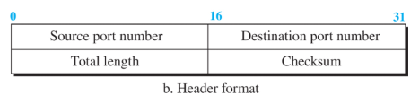
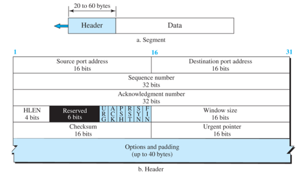
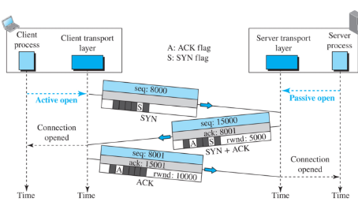
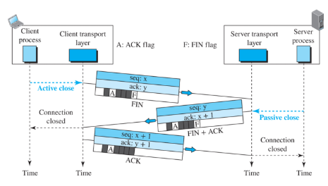
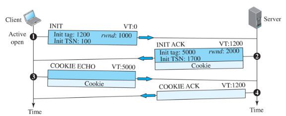
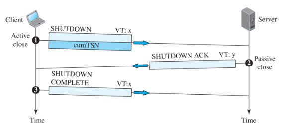
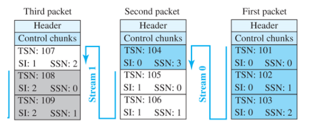
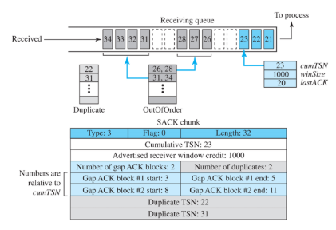

# 9.1 전송층 서비스

- 전송층은 응용층과 네트워크 층 사이에 위치
- 두 응용층 사이, process to process 통신

### 9.1.2 port number

- 클라이언트- 서버 패러다임 사용

### 9.1.3 캡슐화와 역캡슐화

- 메시지를 캡슐화하고 캡슐화를 제거
- 보내는 애가 캡슐화 받는애가 제거

### 9.1.4 다중화 및 역다중화

- 개체가 둘 이상의 발신지에서 item을 받을 때 many to one -> 다중화
- one to many -> 역다중화
- 발신지의 전송층은 다중화, 목적지의 전송층은 역다중화 수행

### 9.1.5 흐름 제어

- 생산율과 소비율 시이의 균형?
- 품목이 소비보다 빨라지면 소비자 압도되어 품목 폐기해야함.
- 소비자 사이트에서 데이터 항목이 손실되는 것을 방지해야 한다.
- 흐름제어 처리
    - 전송층 통신에서 4개의 개체를 처리 -> 발신자 프로세스, 발신자 전송층, 수신자 전송층, 수신자 프로세스
    - 응용층의 전송 프로세스는 생산자일 뿐이다. 청크 생성하여 전송층으로 푸시
    - 송신 전송층은 소비자이자 생산자
    - 메시지를 패킷으로 캡슐화하여 수신 전송층으로 푸시
    - 수신 전송층도 이중 역할
    - 메시지 캡슐 제거하고 응용층에 전달하는 것은 소비자

### 9.1.6 오류 제어

- 전송층에서 오류제어
    - 손상된 패킷을 검출하고 폐기
    - 손실되거나 폐기된 패킷 추적하고 재 전송
    - 중복 전송 패킷 폐기
    - Missing 패킷 도착할 때까지 out-of-order 패킷들을 버퍼링

### 9.1.7 흐름제어 오류제어 결합

- 흐름제어는 두 개의 버퍼사용
- 오류 제어를 위해 양쪽에서 순서 및 확인응답 번호를 사용해야함.
- 위 두개는 두 개의 번호가 매겨진 버퍼를 사용하는 경우 결합 가능

### 9.1.9 비연결형 연결형 프로토콜

- 비연결형 서비스는 동일한 메시지에 속하는 서로 다른 데이터그램이 서로 다른 경로 거칠 수 있다는 것을 의미
- 전송층에서는 패킷의 물리 경로에 대해서는 관여x(두 전송층 사이에 논리 연결이 있다고 가정)
- 전송층에서 비연결형은 패킷 간의 독립성(TCP), 연결 지향은 종속성(UDP)

## 9.3 UDP

- 신뢰성 없는 비연결형 서비스
- 비연결형이고 신뢰성이 없는 전송 프로토콜이다.
- 데이터그램
    - UDP 패킷 -> 각각 2바이트인 4개의 필드로 만들어진 고정된 크기의 8byte의 헤더를 가짐

- ㅇ
    - Total length = 헤더를 더한 데이터그램의 전체 길이

### 9.3.1 UDP 서비스

- process to process: IP주소: 포트번호 -> 소켓 주소
- 비연결형 서비스: UDP에 의해 전송된 데이터그램이 독립적인 데이터그램임을 의미 데이터그램에는 순서번호가 없다
- 흐름제어: 없다
- 오류제어: checksum밖에 없다.

## 9.4TCP

- 전송 제어 프로토콜
- 연결성, 신뢰성 있는 프로토콜
- 연결 설정, 데이터 전송, 연결 해제 단계가 있다.

### 9.4.1 TCP 서비스

- process to process: ip: port
- stream: 송신 및 수신 버퍼, segment
- 전이중 통신: 동시에 양방향 통신
- 다중화와 역다중화: 송신자 Multiplexing, 수신자 Demultiplexing
- 연결형 서비스: 전송 전에 연결 설정
- 신뢰성 있는 서비스: 확인응답 메커니즘 사용

### 9.4.3 세그먼트

- TCP의 패킷을 segment라고 부름
- header default 20byte\
- hlen 헤더 길이, ip와 똑같음 default 20byte
- window size==rwind(receive window size) 흐름제어, 완!급!조~절!
    - cli가 서버한테 보내는건 이만큼 받을 수 있다
    - 서버가 cli한테는 최대 이만큼 보낼 수 있다.
    - rwind=0이면 연결 안함, 1로주면 연결 유지만 한다는 …
    - 컸다가 작을 수 있는듯
    - header가 data보다 커질 수 있음 = silly syndrom
- checksum 똑같음
- reserved제어필드
    - urgent -> 긴급data
    - ack -> 수신받음 응답
    - push -> buffer가 다 차지 않아도 처리해달라. 다 p로처리해서 서버가 무시해버림ㅋㅋ
    - reset -> 연결 끊고 다시시작
    - syn -> 통신 시작할 때 사용
    - fin -> 종료

### 9.4.4 TCP 연결

- 발신지와 목적지 사이에 가상 경로 설정
- 한 메시지에 속하는 모든 세그먼트는 이 가상 경로를 통해 전송
- 훼손 손실된 프레임의 확인응답 프로세스 가능
- **비연결형 프로토콜인 IP 서비스를 사용하는 TCP가 왜 연결형인가?**
- 물리적 연결이 아니라 가상 연결이라는 점을 알아야한다.

### 9.4.5 TCP연결: 캡슐화

- TCP 세그먼트는 응용 프로그램 계층에서 데이터 캡슐화
- TCP segment는 IP 데이터그램으로 캡슐화, 다음으로 데이터 링크 계층의 프레임에 캡슐화
- 세-방향 핸드셰이크 연결

8000받을 수 있어요 15000줄 수 있어요 8001받을 수 있어요

### 9.4.4 TCP 연결: 데이터 전송

- 연결 설정되면 양방향 데이터 전송 가능
- 확인응답(ack)과 동일한 방향으로 이동하는 데이터가 동일한 세그먼트에 전달된다는 것을 아는 것
- 승인은 데이터와 함께 피기백(piggyback) -> 송신, 수신을 같이 넣어서 보내는 기법
- 연결 종료도 세- 방향 핸드쉐이킹

- 절반 - 연결 폐쇄

### 9.4.5 상태 전이도

- 연결 설정, 연결 종료, 그리고 데이터 전송 동안 발생하는 모든 다른 이벤트를 추적하기 위해, 유한 상태 기기를 규정
- client = active open, server = passive open
- establish -> data 주고받는 관계

### 9.4.9 TCP 혼잡 제어

- 느린 시작: 지수증가
    - 순서대로 하나씩? 1부터
    - window사이즈 2^n승으로 증가

점점 한번에 많이 받으려고함.

한계값에 도달하면 ca단계(혼잡회피)로 감.

- ca단계에서는 window사이즈 하니씩 증가 - threshold라고함
- 혼잡 회피: 가산 증가
    - 하나씩 증가 임의의 i부터
- 빠른 회복

혼잡제어 정책 전환

- Taho TCP
    - ACK cwnd = cwnd+1 -> 2의 n승임
    - ca단계로 갈 때 ssthresh(한계값) = cwnd/2, cwnd=1
    - 이후 cwnd = cwnd + (1/cwnd)
- Reno TCP
    - 3dupACK
        - cwnd = ssthresh + 3
        - ssthresh = cwnd / 2
    - New ACK
        - cwnd = ssthresh
    - Time out
        - ssthresh = ssthresh/2
        - cwnd = 1
- New Reno TCP
    - 가산증가 지수감ㅗ

## 9.5 SCTP

- 스트림 제어 전송 프로토콜 UDP와 TCP의 일부 장점을 결합

### 9.5.1 SCTP 서비스

- process to process
- multi stream
    - Association, 스트림 중 1개가 블로킹되더라도 다른 스트림들이 데이터 전송
- multi homing
    - 주소 2개 이상 지원 하나는 active 나머지는 standby
- 전이중 통신
- 연결형 서비스
- 신뢰성 있는 서비스

### 9.5.2 SCTP 특징

- TSN(Transmission Sequence Number)
    - chunk 전체 순서
- SI(Stream Identifier)
    - chunk구분자 -> 이거 비디오?, 사진?
- SSN(Stream sequence Number)
    - 미디어 별 순서번호
- 데이터 단위 = chunk

### 9.5.4 SCTP결합

- 네 - 방향 핸드쉐이킹]
- 
    
    
    
    - VT 난 0번 클라이언트야 넌 VT:1200서버야
    - 쿠키 받으면 다시 돌려줌 -> 받은INIT tag를 VT로 보내줌
- 결합 종료는 세 방향
- 
    
    
    
- shutdown(cumTSN 내가 몇번째 chunk까지 받았다.) -> shutdown ack -> shutdown complete

### 9.5.5 흐름제어

- 데이터 단위 바이트와 청크를 다룬다. rwnd와 cwnd값은 byte로 표현, TSN과 확인응답 값은 chunk로 표현
- 하나의 버퍼에
    - cumTSN: 수신된 TSN
    - winSize: 사용 가능한 버퍼 크기
    - lastACK: 누적 확인응답

### 9.5.6 오류제어

- SACK(Selective ACK) 청크 사용
- 
    
    
    
- 3 ~ 5번째 없음(3은 있음), 8~10번째 없음(8은 있음)