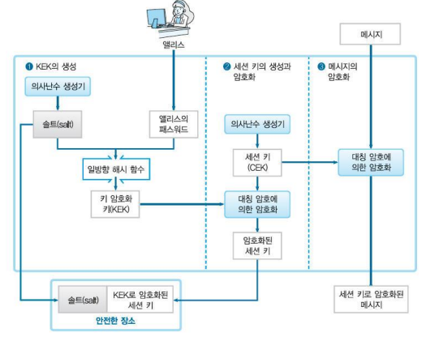

# 1.정보보호 리뷰

## 1.1 정수론(mod, 완전/기약잉여류, 역원/항등원, 페르마/오일러 정리)

완전잉여계 -> 임의의 정수 n로 나눈 나머지 들을 원소로 갖는 집합

기약잉여계 -> 완전잉여계 원소 중 n과 서로소인 원소들의 집합

덧셈암호(Caesar cipher)

- C = (P + key) mod 26

곱셈암호(Multiplicative Cipher)

- C = (P*k) mod 26

아핀암호(Affine Cipher)

- C = (P*k1 + k2) mod 26

오일러 함수: 기약잉여계 집합의 원소 개수

페르마 정리

- a^(p-1) mod p ~ 1

오일러 정리

- a^(오일러함수(n)) mod n ~ 1

## 1.2 대칭키 암호

DES - XOR?

AES(Advanced Encryption standard)

- 다수의 대칭 암호 알고리즘을 제안, Rijndael이라는 대칭 암호 알고리즘이 2000년에 AES로서 선정

스트림 암호

- 평문과 keystream에 대한 XOR연산 실행

블럭 암호 모드 mode 및 IV(Initialization Vector)

- 다양한 방식있음. (CBC, OFB, CFB, CTR, ECB)
- ECB

1. 평문을 N개의 n비트 블록으로 분할
2. 평문 크기가 블록 크기의 배수가 아니라면, 평문의 마지막 블록에는 다른 블록들과 동일한 크기로 만들기 위해 padding필요
3. 복호화 key는 동일함.

- CBC

1. 각각의 평문 블록은 암호화되기 전에 이전 암호문 블록과 XOR
2. 첫 번째 블록을 암호화 할 때는 이전의 암호문 블록이 존재하지 않으므로 IV라고 불리는 허구의 블록이 사용됨.
3. 여기서 IV(초기벡터)란 주어진 평문에 대하여 IV의 생성에 앞서 IV는 반드시 송수신 양자 모두가 알고 있어야 하며 제3자로부터의 예측이 불가능해야 한다.

- CFB

1. 이전 암호문 블록 또는 IV와 암호화 함수를 통해 생성된 시프트 레지스터의 출력과 XOR 연산을 수행하여 현재 블록 암호화

- OFB

1. 평문 블록이 동일하면 암호문이 같아지는 ECB 모드의 단점/ 오류 전파 발생하는 CBC, CFB 모드를 개선한 동작 모드
2. 암호기의 출력과 평문을 XOR하여 암호문 생성
3. 여기서도 IV 사용

- CTR

1. OFB와 마찬가지로 이전 암호문 블록과 독립적이 키 스트림을 생성하지만 피드백을 사용하지 않음
2. ECB처럼 서로 독립적인 n비트 암호문 블록 생성

NIST(National Institute of Standard and Technology)

- 경쟁방식에 의한 표준화

## 1.3 해시 SHA-1, SHA-512

일방향 해시 함수

SHA512

512비트 해시 값 생성하는 알고리즘

SHA-512는 512비트(64바이트) 해시 값을 생성하는데, 일반적으로 길이가 128자리인 16진수로 렌더링

1. padding

- 1024bit를 1개의 패딩 메시지로 형성

2. parsing

- 원시부호를 기계어로 번역

## 1.4 PBE(Password based Encryption)

- 패스워드를 기초로 해서 만든 키로 암호화를 수행하는 방법
- CEK(contents encrypting key): 정보가 암호화의 대상
- KEK(key encrypting key): 키가 암호화의 대상

