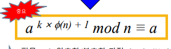
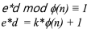
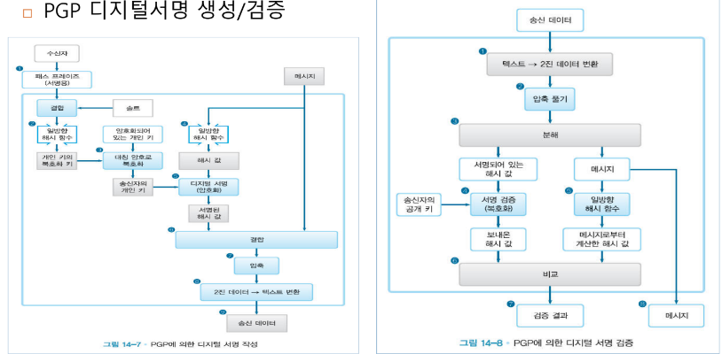

# 2. 구현

## 2.1 AES

- 사용법
  - 객체 생성 cipher1 = AES.new(key, AES.MODE_CFB, iv)
  - 사용 cipher1.encrypt(txt)

## 2.2 SHA

1. 객체 생성 h = SHA.new()
2. SHA 적용 h.update(b'attack at dawn')
3. 해시값 출력(2진) h.digest()
4. 해시값 출력(16진수) h.hexdigest()

## 2.3 AES + SHA

1. 해시 함수값 생성
2. AES 암호화 및 전송
3. AES 복호화
4. 해시 값 검증

## 2.4 PBE

1. random으로 salt, CEK, iv 생성
2. salt + pw를 SHA를 사용하여 KEK 생성
3. CEK로 plaintext 암호화
4. KEK로 CEK 암호화
5. salt, encCEK, iv, encMSG 저장
6. read
7. KEK 생성
8. CEK 복호화
9. plaintext 복호화

# RSA

오일러 정리 양변에 k승 곱셈

msg를 문자 하나씩 RSA(공개키 방식)로 encryption

특성

- e*d mod p(n) ~ 1

공개키 방식

큰 소수로 암호화

곱셈 역원

b = qc + t

t = b - qc

RSA key 만드는 법



공개키, 개인키가 만들어짐



공개키 e와 개인키 d의 조건

(p-1)(q-1) == eular(n)

- p와 q가 같으면 둘의 값이 달라짐

1. gcd, Phi, mod_inv function
2. prime num related function
3. RSA public/private key gen
4. RSA encrypt decrypt

절차

1. 두 소수 p, q를 준비한다.
2. p - 1, q - 1과 모두 서로소인 정수 e를 준비한다. 이때 e는 공개키가 된다.
3. ed를 (p - 1)(q - 1)로 나눈 나머지가 1인 d를 찾는다. 이때 d는 개인키가 된다.
4. N = pq를 계산하고 N과 e를 공개한다.

암호화: 암호문 = 평서문^e mod N

복호화: 평서문 = 암호문^d mod N

디지털 서명

디지털 인증 알고리즘 PKCS1_OAEP

이 서명은 암호화되지 않은 평문이나 해시 값과 함께 사용될 수 있으며, 이를 통해 데이터의 변조 여부를 확인

# PBE hybrid

enc

1. 세션 키 및 초기화 벡터 생성: AES 알고리즘을 위한 세션 키와 초기화 벡터를 생성
2. 평문 암호화 (AES): 생성된 세션 키와 초기화 벡터를 사용하여 평문을 AES로 암호화
3. 세션 키 암호화 (RSA): RSA 알고리즘을 사용하여 세션 키를 수신자의 공개 키로 암호화 → AES key RSA로 암호화
4. 디지털 서명 생성: SHA-512 해시 함수를 사용하여 평문에 대한 디지털 서명을 생성

→ 무결성 검정을 위해

5. 결과물 생성 및 저장: 생성된 IV, RSA 암호문, AES 암호문, 디지털 서명을 합쳐서 파일에 저장

# PGP(Pretty Good Privacy)



기본 암호화는 PBE hybrid와 동일하게 진행

- 블록체인 구조 바꾸기
- 블록체인 생성
- Flask 낼 생각 있음.
- Hybrid PGP using UDP
- PBE_Enc_Dec
- RSA

## RSA 예제

```python
from Crypto.PublicKey import RSA
from Crypto.Cipher import PKCS1_OAEP

def generate_keys():
    key = RSA.generate(2048)
    private_key = key.export_key()
    public_key = key.publickey().export_key()
    return private_key, public_key

def rsa_encrypt(public_key, msg):
    rsa_pubkey = RSA.import_key(public_key)
    cipher = PKCS1_OAEP.new(rsa_pubkey)
    encMsg = cipher.encrypt(msg.encode())
    return encMsg

def rsa_decrypt(private_key, encMsg):
    rsa_prikey = RSA.import_key(private_key)
    cipher = PKCS1_OAEP.new(rsa_prikey)
    decMsg = cipher.decrypt(encMsg)
    return decMsg.decode()

def main():
    # gen Key
    priKey, pubKey = generate_keys()
    msg = "what the..."
    # encrypt
    encMsg = rsa_encrypt(pubKey, msg)
    print(encMsg)
    # decrypt
    decMsg = rsa_decrypt(priKey, encMsg)
    print(decMsg)

if __name__ == "__main__":
    main()
```

## RSA hybrid(PGP)

```python
from Crypto.PublicKey import RSA
from Crypto.Signature import PKCS1_v1_5
from Crypto.Cipher import AES, PKCS1_OAEP
from Crypto.Hash import SHA512
from Crypto import Random
import base64

KEY_SIZE = 32
BLOCK_SIZE = 16

# AES
def enc_AES(iv, key, txt):
    AES_obj = AES.new(key, AES.MODE_CFB, iv)
    ciphertxt = AES_obj.encrypt(txt)
    return ciphertxt

def dec_AES(iv, key, ciphertxt):
    AES_obj = AES.new(key, AES.MODE_CFB, iv)
    msg = AES_obj.decrypt(ciphertxt)
    return msg

# RSA
def gen_RSAkey():
    key = RSA.generate(2048)
    private_key = key.export_key("PEM")
    public_key = key.publickey().export_key('PEM')
    return private_key, public_key

def enc_RSA(pubkey, msg):
    rsa_pubKey = RSA.import_key(pubkey)
    cipher = PKCS1_OAEP.new(rsa_pubKey)
    enc_msg = cipher.encrypt(msg)
    return enc_msg

def dec_RSA(prikey, encmsg):
    rsa_priKey = RSA.import_key(prikey)
    cipher = PKCS1_OAEP.new(rsa_priKey)
    dec_msg = cipher.decrypt(encmsg)
    return dec_msg

# hybrid
def B64Encoding(data):
    return base64.b64encode(data)

def B64Decoding(b64data):
    return base64.b64decode(b64data)

def enc_hybrid(alice_priKey, bob_pubKey, plaintxt, filename):
    # get session key
    sessionKey = Random.new().read(KEY_SIZE)
    iv = Random.new().read(BLOCK_SIZE)
    # enc plain text with AES
    encMSG = enc_AES(iv, sessionKey, plaintxt)
    # enc key with RSA
    enc_sessionKey = enc_RSA(bob_pubKey, sessionKey)
    # get sign plaintext with SHA-512
    hash = SHA512.new(plaintxt)
    priKey = RSA.importKey(alice_priKey)
    rsa = PKCS1_v1_5.new(priKey)
    sign = rsa.sign(hash)
    output = (iv + '$*****$'.encode('utf8') + enc_sessionKey
              + '$*****$'.encode('utf8') + encMSG
              + '$*****$'.encode('utf8') + sign)
    with open(filename, 'wb') as file:
        file.write(B64Encoding(output))
        file.close()
    return B64Encoding(output)

def dec_hybrid(alice_pubKey, bob_priKey, filename):
    # read file
    with open(filename, 'rb') as file:
        data = file.read()
    data = B64Decoding(data)
    print(data)
    # dec session key with RSA
    iv, enc_sessionKey, encMSG, sign = data.split('$*****$'.encode('utf-8'))
    sessionKey = dec_RSA(bob_priKey, enc_sessionKey)
    # dec msg with AES
    plaintxt = dec_AES(iv, sessionKey, encMSG)
    # validation sign
    hash = SHA512.new(plaintxt)
    alice_pubKey = RSA.importKey(alice_pubKey)
    rsa = PKCS1_v1_5.new(alice_pubKey)
    if rsa.verify(hash, sign):
        print(f"MSG is {plaintxt}")
    else:
        print("fuck why?")
    return plaintxt

def main():
    msg = b"Hello my friend."
    # gen Key
    bob_priKey, bob_pubKey = gen_RSAkey()
    alice_priKey, alice_pubKey = gen_RSAkey()
    # enc
    enc_hybrid(alice_priKey, bob_pubKey, msg, "./Hybrid.txt")
    # dec
    dec_hybrid(alice_pubKey, bob_priKey, "./Hybrid.txt")

if __name__ == "__main__":
    main()
```

## PGP UDP

```python
from Crypto.PublicKey import RSA
import socket
from Crypto.Signature import pkcs1_15
from Crypto.Hash import SHA256
import base64
from Crypto.Cipher import AES
from Crypto import Random
from Crypto.Cipher import PKCS1_OAEP
from Hybrid_RSA import *
import pickle

def receive_file_UDP(port_Num):
    udp_server_socket = socket.socket(family=socket.AF_INET, type=socket.SOCK_DGRAM)
    url = ("127.0.0.1", port_Num)
    udp_server_socket.bind(url)
    print("Listening...")
    buffer_size = 8192
    while True:
        data_bytes, sender_addr = udp_server_socket.recvfrom(buffer_size)
        # Deserialize the data using pickle
        received_data = pickle.loads(data_bytes)
        # Extract information from the received data
        file_path = received_data['file_path']
        cli_pubKey = received_data['pubKey']
        priKey = received_data['server_priKey']
        # Decryption process (modify this part according to your implementation)
        msg = dec_hybrid(cli_pubKey, priKey, file_path)
        print(f"Sender IP: {sender_addr[0]}")
        if msg == b"end":
            break

receive_file_UDP(5000)
```

client

```python
from Crypto.PublicKey import RSA
import socket
from Crypto.Signature import pkcs1_15
from Crypto.Hash import SHA256
import base64
from Crypto.Cipher import AES
from Crypto import Random
from Crypto.Cipher import PKCS1_OAEP
from Hybrid_RSA import *
import pickle

def send_file_UDP(host_name, port_Num, data):
    udp_client_socket = socket.socket(family=socket.AF_INET, type=socket.SOCK_DGRAM)
    data_bytes = pickle.dumps(data)
    udp_client_socket.sendto(data_bytes, (host_name, port_Num))
    print("send file . . . success")
    udp_client_socket.close()
    print("client socket closed . . .")

def main():
    # PGP enc
    msg = b"end"
    priKey, pubKey = gen_RSAkey()
    server_priKey, server_pubKey = gen_RSAkey()
    file_path = "./Hybrid.txt"
    data = enc_hybrid(priKey, server_pubKey, msg, file_path)
    send_file_UDP("127.0.0.1", 5000, {'file_path': file_path, 'pubKey': pubKey, 'server_priKey': server_priKey})

main()
```

## blockchain

```python
from Crypto.Hash import SHA512
import time
from multipledispatch import dispatch
import json
from Crypto.PublicKey import RSA
import base64
from Crypto.Cipher import PKCS1_OAEP

class Block:
    def __init__(self, index, previous_hash, timestamp, userName, data, nonce=0):
        self.index = index
        self.previous_hash = previous_hash
        self.timestamp = timestamp
        self.userName = userName
        self.data = data
        self.nonce = nonce
        self.hash = self.calculate_Hash()

    def calculate_Hash(self):
        value = f"{self.index}{self.previous_hash}{self.timestamp}{self.userName}{self.nonce}{self.data}"
        return SHA512.new(value.encode()).hexdigest()

    def get_Hash(self):
        return self.hash

    def get_value(self):
        return 0

    def set_Value(self, num):
        self.num = num

    def print_Block(self):
        print(f"""
Block # : {self.index}, Previous_Hash : {self.previous_hash}
TimeStamp : {self.timestamp},
Data : {self.data},
Hash : {self.hash}
""")

class Blockchain:
    def __init__(self):
        self.chain = [self.create_genesis_block()]

    def create_genesis_block(self):
        return Block(0, 0, int(time.time()), "MyBlock", "Genesis Block", 0)

    @dispatch(Block)
    def add_block(self, new_Block):
        new_Block.previous_hash = self.get_last_block().hash
        new_Block.hash = new_Block.calculate_Hash()
        self.chain.append(new_Block)

    @dispatch(str, str)
    def add_block(self, userName, data):
        index = self.get_last_block().index + 1
        previous_hash = self.get_last_block().hash
        timestamp = int(time.time())
        nonce = 0
        self.chain.append(Block(index, previous_hash, timestamp, userName, data, nonce))

    def get_last_block(self):
        return self.chain[-1]

    def save_to_file(self, filename):
        with open(filename, 'w') as file:
            data = []
            for block in self.chain:
                block_data = {
                    'index': block.index,
                    'timestamp': block.timestamp,
                    'userName': block.userName,
                    'data': block.data,
                    'nonce': block.nonce,
                    'previous_hash': block.previous_hash,
                    'hash': block.hash
                }
                data.append(block_data)
            json.dump(data, file, indent=4)
            file.close()

    def load_from_file(self, filename):
        with open(filename, 'r') as file:
            data = json.load(file)
        self.chain = []
        for block_data in data:
            new_block = Block(
                index=block_data['index'],
                timestamp=block_data['timestamp'],
                userName=block_data['userName'],
                data=block_data['data'],
                nonce=block_data['nonce'],
                previous_hash=block_data['previous_hash']
            )
            new_block.hash = block_data['hash']
            self.chain.append(new_block)
        file.close()

def genRSAKeys(length, userName):
    key = RSA.generate(2048)
    private_key = key.export_key("PEM")
    public_key = key.publickey().export_key('PEM')
    return private_key, public_key

def enc_RSA(msg, pubkey):
    rsa_pubKey = RSA.import_key(pubkey)
    cipher = PKCS1_OAEP.new(rsa_pubKey)
    enc_msg = cipher.encrypt(msg)
    return enc_msg

def dec_RSA(encmsg, prikey):
    rsa_priKey = RSA.import_key(prikey)
    cipher = PKCS1_OAEP.new(rsa_priKey)
    dec_msg = cipher.decrypt(encmsg)
    return dec_msg

def main():
    my_blockchain = Blockchain()
    userName = "Lee Kang In"
    privateKey, publicKey = genRSAKeys(2048, userName)
    publicKeyBase64 = base64.b64encode(publicKey)
    my_blockchain.add_block(userName, publicKeyBase64.decode())
    my_blockchain.save_to_file("./my_blockchain_test.json")
    for block in my_blockchain.chain:
        if block.userName == userName:
            print(f"Lee Kang In's Public Key : {block.data}")
            hgd_publicKey = block.data
            break
    plaintext = "Hello World".encode()
    publicKey = base64.b64decode(hgd_publicKey)
    ciphertext = enc_RSA(plaintext, publicKey)
    print(f"ciphertext : {ciphertext}")
    decMSG = dec_RSA(ciphertext, privateKey)
    print(f"decrypted message: {decMSG.decode()}")

if __name__ == "__main__":
    main()
```
