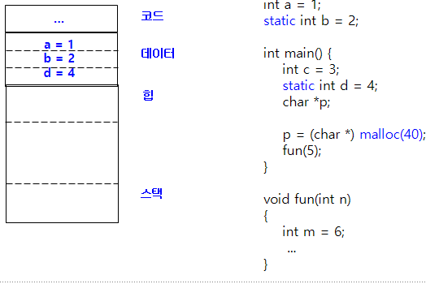
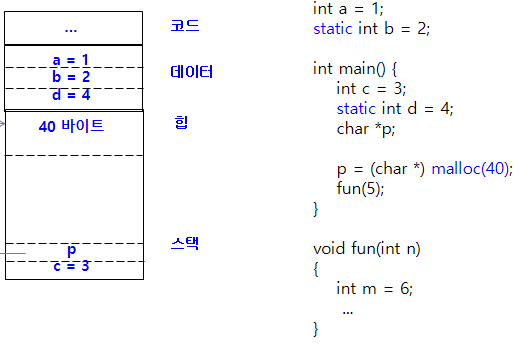
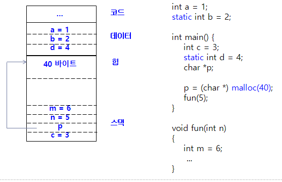
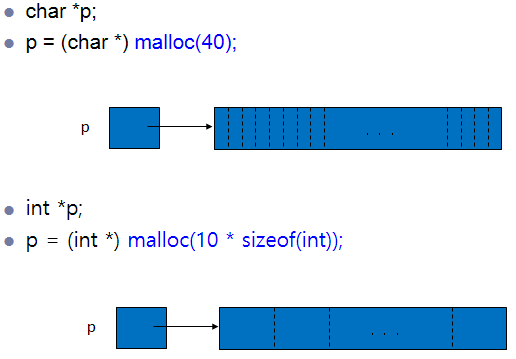

# 10장 메모리 관리

## 10.1 변수와 메모리

프로세스

- 프로세스는 실행중인 프로그램
- 프로그램 실행을 위해서
  - 코드, 데이터, 스택, 힙, U-영역 필요
- 프로세스 이미지는 메모리 내의 프로세스 레이아웃
- 프로그램 자체가 프로세스가 아님

### vars.c

```c
#include <stdio.h>
#include <stdlib.h>

int a = 1;
static int b = 2;

int main() {
    int c = 3;
    static int d = 4;
    char *p;
    p = (char *) malloc(40);
    fun(5);
}

void fun(int n) {
    int m = 6;
}
```

정적 변수와 데이터 영역



지역 변수와 실행시간 스택: main() 호출



지역변수와 실행시간 스택 fun 호출



할당 방법에 따른 변수들의 분류

- 정적 변수 → 전역변수, static 변수
- 자동 변수 → 지역변수, 매개변수
- 동적 변수 → 힙 할당 변수

## 10.2 동적 메모리 할당

메모리 할당

- void *malloc(size_t size)
- 힙에 동적 메모리 할당
- 라이브러리가 메모리 풀을 관리



### stud1.c

```c
#include <stdio.h>
#include <stdlib.h>

struct student {
    int id;
    char name[20];
};

// 입력받을 학생 수를 미리 입력받고
// 이어서 학생 정보를 입력받은 후, 이들 학생 정보를 역순으로 출력하는 프로그램
int main() {
    struct student *p;  // 동적 할당된 블록을 가리킬 포인터
    int n, i;
    printf("몇 명?");
    scanf("%d", &n);
    if (n <= 0) {
        fprintf(stderr, "오류");
        exit(1);
    }
    p = (struct student *) malloc(n * sizeof(struct student));
}
```

배열 할당 calloc()

- 같은 크기의 메모리를 여러 개 할당할 경우
- void *calloc(size_t n, size_t size) → size 크기의 메모리 n개 할당. 값을 모두 0으로 초기화. 실패 시 NULL 반환
- 이미 할당된 메모리의 크기 변경 → void realloc(void *p, size_t newsize)

## 10.3 동적 할당과 연결 리스트

동적 메모리 할당

- 필요할 때마다 동적으로 메모리 할당
- 연결리스트로 관리

### stud2.c
