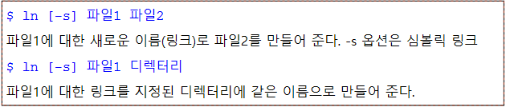
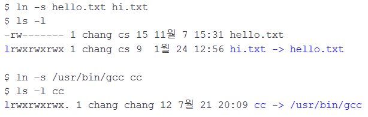
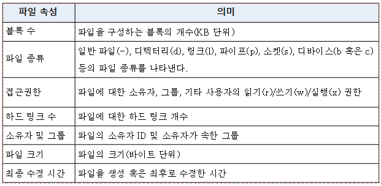
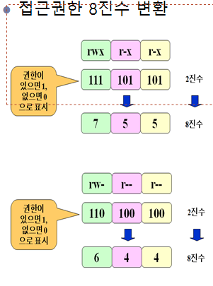
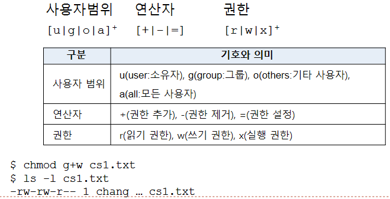
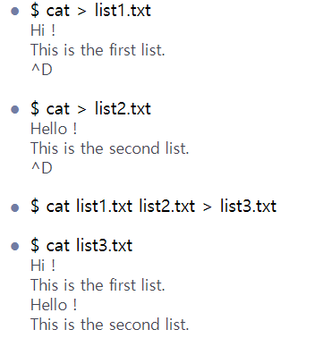
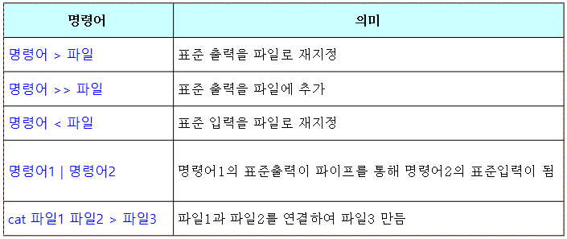

# 제 2장 리눅스 사용

## 2.1 기본 명령어

```bash
$ hostnamectl rename {}
$ date
$ hostname
$ uname
$ uname -a
$ whoami
$ who
$ ls
$ passwd    # 암호 변경..
$ clear
$ man date  # 온라인 매뉴얼
```

## 2.2 디렉터리

- 일반 파일(ordinary file)
  - 데이터를 가지고 있으면서 디스크에 저장됨.
- 디렉터리(폴더)
  - 디렉터리는 파일들을 계층적으로 조직화하는데 사용되는 특수 파일
  - 디렉터리 내에는 파일이나 서브 디렉터리들의 이름 있음
  - 부모 디렉터리는 다른 디렉터리들을 서브 디렉터리고 가짐
- 특수 파일
  - 물리적인 장치에 대한 내부적인 표현
  - 키보드(stdin), 모니터(stout), 프린터 등도 파일처럼 사용
- 심볼릭 링크 파일
  - 어떤 파일을 가리키는 또 하나의 경로명을 저장하는 파일

```bash
$ ls -s   # size
$ ls -a   # all
$ ls -l   # long
# -rw-r--r-- 1 pengejeen pengejeen 446 Apr 14 00:07 README.md
$ ls -asl
$ ls -F   # *: 실행파일 /: 디렉터리 @: 심볼릭 링크
$ ls -R   # R(Recursive) 옵션은 모든 하위 디렉터리 내용을 리스트
```

## 2.3 파일 관련 명령어

more 파일+

여러 개 파일에 대해서 명령어 적용

각 파일의 내용을 페이지 단위로 화면에 출력

head

tail

wc(word count)

- 파일에 저장된 줄, 단어, 문자의 개수를 세서 출력

링크

- 기존 파일에 대한 또 하나의 새로운 이름



하드 링크

- 기존 파일에 대한 새로운 이름
- 실제로 기존 파일을 대표하는 i-노드를 가리켜 구현
- 한 파일 내용 수정하면 다른쪽도 수정됨

심볼릭 링크

- 다른 파일을 가리키고 있는 별도의 파일.
- 실제 파일의 경로명을 저장하고 있는 일종의 특수 파일
- 이 경로명이 다른 파일에 대한 간접적인 포인터 역할.



```bash
$ wc 파일*   # 줄/단어/문자 수 세기
```

## 2.4 파일 속성

파일의 이름, 타입, 크기, 소유자, 접근권한, 수정 시간

```bash
$ ls -sl {file}
```



접근권한

- 읽기(r), 쓰기(w), 실행(x) 권한
- 파일의 접근권한은 소유자(owver)/그룹(group)/기타(others)로 구분
- ex) rw-  rw-  r--

접근권한 변경

chmod [-R] 접근권한 파일 혹은 디렉터리



- 기호를 이용한 접근권한 변경



소유자 및 그룹 변경: chown, chgrp

- chown → 파일이나 디렉터리의 소유자를 변경할 때 사용

```bash
$ chown {file}
$ chown -R {directory}
```

- chgrp → 파일이나 디렉터리의 그룹을 변경할 때 사용.

```bash
$ chgrp {file}
$ chgrp -R {directory}
```

파일 소유자 또한 슈퍼 유저만이 사용 가능

## 2.5 입출력 재지정 및 파이프

출력 재지정

- 명령어의 표준출력 내용을 모니터 대신에 파일에 저장

```bash
$ {명령어} > {file}
```



출력 추가

- 명령어의 표준출력을 모니터 대신에 파일에 추가

```bash
$ {명령어} >> {file}
```

입력 재지정

- 명령어의 표준입력을 키보드 대신에 파일에서 받는다.

```bash
$ 명령어 < 파일
$ wc < list1.txt
```

문서 내 입력

- 명령어의 표준입력을 키보드 대신에 단어와 단어 사이의 입력 내용으로 받는다.
- 보통 스크립트 내에서 입력 줄 때 사용

```bash
$ 명령어 << 단어
```

파이프

- 현재 디렉터리 내의 파일 이름들을 sort -r 명령어를 사용해서 내림차순으로 정렬해서 보여주기

```bash
ls | sort -r
```



## 2.6 텍스트 편집기

gedit

- GNOME이 제공하는 GUI편집기
