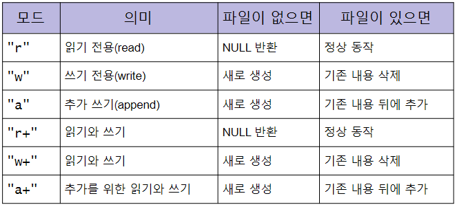
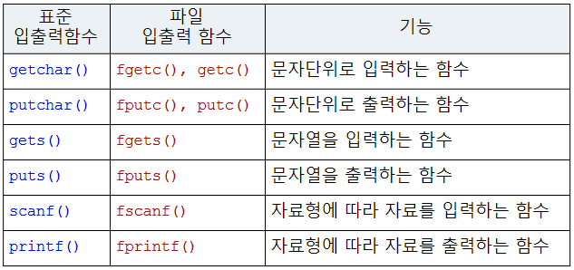
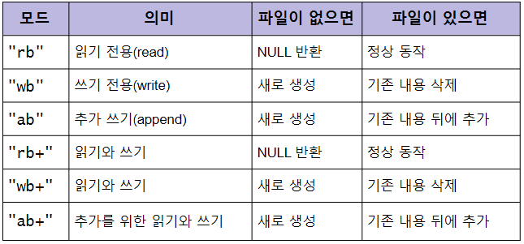
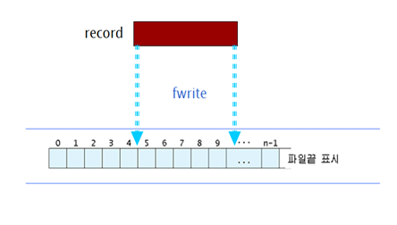

# 4장 C 표준 파일 입출력

## 4.1 파일 및 파일 포인터

파일 입출력

1. 파일 열기: fopen() → FILE 구조체에 대한 포인터 리턴

```c
FILE *fopen(const char *filename, const char *mode);
```

const char *filename: 파일명에 대한 포인터

const char *mode: 모드로 파일을 여는 방식 → r, w, a



2. 파일 입출력: 다양한 파일 입출력 함수 사용
3. 파일 닫기 fclose()

FILE 구조체

- 하나의 스트림에 대한 정보를 포함하는 구조체
- 버퍼에 대한 포인터, 버퍼 크기 …
- 파일 디스크립터
- 열린 파일의 현재 상태를 나타내는 필드 변수들. 특히 파일 입출력에 사용되는 버퍼 관련 변수들

```c
typedef struct {
    int cnt;              // 버퍼의 남은 문자 수
    unsigned char *base;  // 버퍼 시작
    unsigned char *ptr;   // 버퍼의 현재 포인터
    unsigned flag;        // 파일 입출력 모드
    int fd;               // 열린 파일 디스크립터
} FILE;
```

표준 입력/출력/오류

- 표준 I/O 스트림
  - 프로그램이 시작되면 자동으로 open되는 스트림


파일 닫기

- int fclose(FILE *fp)
- fp는 fopen함수에서 받았던 포인터
- fclose(fp)

## 4.2 텍스트 파일



- int fgetc(FILE *fp);
  - fp가 지정한 파일에서 한 문자를 읽어서 리턴
  - 파일 끝에 도달했을 경우 EOF(-1) 리턴
- int fputc(int c, FILE *fp)
  - fp가 가리키는 파일에 한 문자씩 출력
  - 출력하는 문차 리턴
  - 출력시 오류 발생하면 EOF(-1) 리턴

### cat.c

```c
#include <stdio.h>

int main(int argc, char *argv[]) {  // argc는 명령행 인수의 개수, argv[]는 명령행 인수 저장
    FILE *fp;
    int c;
    if (argc < 2) fp = stdin;  // stdin은 표준 입력
    else fp = fopen(argv[1], "r");
    c = getc(fp);
    while (c != EOF) {  // EOF는 파일의 끝 -1임
        putc(c, stdout);  // 한문자씩
        c = getc(fp);
    }
    fclose(fp);
    return 0;
}
```

### copy.c

```c
#include <stdio.h>

int main(int argc, char *argv[]) {
    char c;
    FILE *fp1, *fp2;
    if (argc != 3) {
        fprintf(stderr, "사용법: %s 파일1 파일2\n", argv[0]);
        return 1;
    } else {
        fp1 = fopen(argv[1], "r");
        // fp1 예외처리
        if (fp1 == NULL) {
            fprintf(stderr, "파일 열기 오류");
            return 2;
        }
        fp2 = fopen(argv[2], "w");
        while ((c = fgetc(fp1)) != EOF) {
            fputc(c, fp2);
        }
        fclose(fp1);
        fclose(fp2);
        return 0;
    }
}
```

기타 파일 관련 함수

- int feof(FILE *fp)
  - fp가 가리키는 파일의 끝에 도달하면 0이 아닌 값을 리턴, 아니면 0리턴
- int ungetc(int c, FILE *p)
  - c에 저장된 문자를 입력 스트림에 반납
  - 마치 문자를 읽지 않은 것처럼 파일 위치 지정자를 1 감소
- int fflush(FILE *fp)
  - 아직 기록되지 않고 버퍼에 남아 있는 데이터를 fp가 가리키는 출력 파일에 보냄. 버퍼 비우기 기능

### line.c

```c
#include <stdio.h>
#include <stdlib.h>
#define MAXLINE 80

int main(int argc, char *argv[]) {
    FILE *fp;
    int line = 0;
    char buffer[MAXLINE];
    if (argc != 2) {
        fprintf(stderr, "사용법: line 파일이름\n");
        exit(1);
    }
    if ((fp = fopen(argv[1], "r")) == NULL) {
        fprintf(stderr, "파일 없음");
        exit(2);
    }
    while (fgets(buffer, MAXLINE, fp) != NULL) {
        line++;
        printf("%3d %s", line, buffer);
    }
    exit(0);
}
```

포멧 입출력

- fprint(FILE *fp, const char *format)
- fscanf(FILE *fp, const char *format)

## 4.3 이진 파일

fopen: 이진 파일 열기



블록 단위 입출력

- fread()와 fwrite()
  - 한번에 일정한 크기의 데이터를 파일에 읽거나 쓰기 위한 입출력 함수
- int fread(void *buf, int size, int n, FILE *fp)
  - fp가 가리키는 파일에서 size크기의 블록을 n개 읽어서 버퍼 포인터 buf가 가리키는 곳에 저장
  - 읽어온 블록의 개수를 리턴
- int fwrite(const void *buf, int size, int n, FILE *fp)



블록 입출력

- 어떤 자료형의 데이터이던지 그 데이터를 **연속된 바이트로 해석**해서 파일에 저장
- 파일에 저장된 데이터를 **연속된 바이트 형태로 읽어**서 원래 변수에 순서대로 저장하여 원래 데이터를 그대로 복원

### stprint.c

```c
#include <stdio.h>
#include <stdlib.h>
#include "student.h"

int main(int argc, char *argv[]) {
    struct student rec;
    FILE *fp;
    if (argc != 2) {
        fprintf(stderr, "give me file");
        return 1;
    }
    if ((fp = fopen(argv[1], "rb")) == NULL) {
        fprintf(stderr, "NONE");
        return 2;
    }
    while (fread(&rec, sizeof(rec), 1, fp) > 0) {
        if (rec.id != 0)
            printf("%10d %6s %6d\n", rec.id, rec.name, rec.score);
    }
}
```

## 4.4 임의 접근

파일 위치 관련 함수

- fseek(FILE *fp, long offset, int mode)
  - 파일 위치 포인터를 임의로 설정할 수 있는 함수
  - fp가 가리카고 있는 파일의 파일 위치를 mode 기준으로 offset만큼 옮긴다.
- rewind(FILE *fp)
  - 현재 파일 위치를 파일 시작에 위치시킴.
- ftell(FILE *fp)
  - 파일의 현재 파일 위치를 나타내는 파일 위치 지정자 값 리턴


### stcreate2.c

```c
#include <stdio.h>
#include <stdlib.h>
#include "student.h"
#define START_ID 1001001

int main(int argc, char *argv[]) {
    FILE *fp;
    struct student rec;
    if (argc != 2) {
        fprintf(stderr, "give me file");
    }
    fp = fopen(argv[1], "wb");
    if (fp == NULL) {
        fprintf(stderr, "no file");
    }
    while (scanf("%d %s %d", &rec.id, rec.name, &rec.score) == 3) {
        fseek(fp, (rec.id - START_ID) * sizeof(rec), SEEK_SET);
        fwrite(&rec, sizeof(rec), 1, fp);
    }
    fclose(fp);
    exit(0);
}
```

### stquery.c

```c
#include <stdio.h>
#include <stdlib.h>
#include "student.h"
#define START_ID 1001001

int main(int argc, char *argv[]) {
    struct student rec;
    FILE *fp;
    int id;
    if (argc != 2) {
        fprintf(stderr, "error code 1");
        exit(1);
    }
    fp = fopen(argv[1], "rb");
    if (fp == NULL) {
        fprintf(stderr, "error code 2");
        exit(2);
    }
    printf("학번 입력");
    if (scanf("%d", &id) == 1) {
        fseek(fp, (id - START_ID) * sizeof(rec), SEEK_SET);
        if ((fread(&rec, sizeof(rec), 1, fp) > 0) && (rec.id != 0)) {
            printf("%10d %6s %6d\n", rec.id, rec.name, rec.score);
        } else printf("그런거 없음");
        fclose(fp);
        exit(0);
    }
}
```

레코드 수정 과정

1. 파일로부터 해당 레코드 읽음
2. 이 레코드를 수정 후
3. 수정된 레코드를 다시 파일 내의 원래 위치에 써야 함.

### stupdate.c

```c
#include <stdio.h>
#include <stdlib.h>
#include "student.h"
#define START_ID 1001001

int main(int argc, char *argv[]) {
    FILE *fp;
    struct student rec;
    int id;
    if (argc != 2) {
        fprintf(stderr, "z");
        exit(1);
    }
    fp = fopen(argv[1], "rb+");
    if (fp == NULL) {
        fprintf(stderr, "zzz");
        exit(2);
    }
    if (scanf("%d", &id) == 1) {
        fseek(fp, (id - START_ID) * sizeof(rec), SEEK_SET);
        if (fread(&rec, sizeof(rec), 1, fp) > 0 && (rec.id != 0)) {
            printf("%10d %6s %6d\n", rec.id, rec.name, rec.score);
            printf("새로운 점수");
            scanf("%d", &rec.score);
            fseek(fp, -sizeof(rec), SEEK_CUR);
            fwrite(&rec, sizeof(rec), 1, fp);
        } else printf("NONE");
    } else printf("input error");
    fclose(fp);
    exit(0);
}
```
