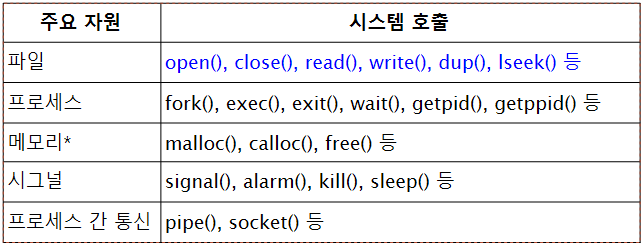

# 5장 파일 입출력

## 5.1 시스템 호출

유닉스 커널

- 하드웨어를 운영 관리하여 다음과 같은 서비스를 제공
- 파일 관리
- 프로세스 관리
- 메모리 관리
- 통신 관리
- 주변장치 관리

시스템 호출

- 시스템 호출은 커널에 서비스 요청을 위한 프로그래밍 인터페이스
- 응용 프로그램은 시스템 호출을 통해서 커널에 서비스를 요청



## 5.2 파일

- 연속된 바이트의 나열
- 특별한 다른 포맷을 정하지 않음
- 디스크 파일뿐만 아니라 외부 장치에 대한 인터페이스

open()

- open(const char *path, int oflag, [mode_t mode])
- oflag
  - O_RDONLY: 읽기모드
  - O_WRONLY: 쓰기
  - O_RDWR: 읽기/쓰기
  - O_APPEND: 데이터를 쓰면 파일끝에 첨부
  - O_CREAT: 파일이 없는경우 생성, mode는 생성할 파일의 접근권한
  - O_TRUNC: 파일이 이미 있는 경우 내용 지움
  - O_EXCL: O_CREAT와 함께 사용, 파일 이미 있으면 오류
  - O_NONBLOCK: 넌블로킹 모드로 입출력
  - O_SYNC: write() 시스템 호출을 하면 디스크에 물리적으로 쓴 후 반환

### fopen.c

```c
#include <stdio.h>
#include <stdlib.h>
#include <unistd.h>
#include <fcntl.h>

int main(int argc, char *argv[]) {
    int fd;
    if ((fd = open(argv[1], O_RDWR)) == -1)
        printf("error: Can't open file");
    else printf("success");
    close(fd);
    exit(0);
}
```

creat()

- open(path, WRONLY | O_CREAT | O_TRUNC, mode); → mode는 permision 정하는거임.
- 파일 생성 성공하면 디스크립터, 실패 시 -1 반환

read()

- fd가 나타내는 파일에서
- nbytes만큼의 데이터를 읽고
- 읽은 데이터는 buf에 저장
- ssize_t read(int fd, void *buf, size_t nbytes)
- 파일 끝을 만나면 0, 실패하면 -1 반환
- 호출의 반환값은 실제로 읽어온 바이트 수

### fsize.c

```c
#include <stdio.h>
#include <stdlib.h>
#include <unistd.h>
#include <fcntl.h>
#define BUFSIZE 1024

int main(int argc, char *argv[]) {
    char buffer[BUFSIZE];
    int fd;
    ssize_t nread;
    long total = 0;
    if ((fd = open(argv[1], O_RDONLY)) == -1)
        perror(argv[1]);
    while ((nread = read(fd, buffer, BUFSIZE)) > 0)
        total += nread;
    close(fd);
    printf("파일크기: %ld 바이트 \n", total);
    exit(0);
}
```

write

- buf에 있는 nbytes만큼의 데이터를 fd가 나타내는 파일에 쓴다.
- ssize_t write(int fd, void *buf, size_t nbytes);
- 파일에 쓰기를 성공하면 실제 쓰여진 바이트 수를 반환하고, 실패하면 -1을 반환.

파일 디스크립터 복제

- dup()/dup2() 호출은 기존의 파일 디스크립터를 복제
- int dup(int oldfd); → oldfd에 대한 복제본인 새로운 파일 디스크립터 생성하여 반환. 실패 시 -1 반환
- int dup(int oldfd, int newfd); → oldfd을 newfd에 복제하고 복제된 새로운 파일 디스크립터 반환. 실패 시 -1 반환

### dup.c

```c
#include <stdio.h>
#include <stdlib.h>
#include <unistd.h>
#include <fcntl.h>

int main() {
    int fd1, fd2, fd3;
    if ((fd1 = creat("dupfile", 0600)) == -1)
        perror("dupfile");
    write(fd1, "init file fd1", 13);
    fd2 = dup(fd1);
    write(fd2, "init file fd2", 13);
    dup2(fd2, fd3);
    write(fd3, "init file fd3", 13);
    exit(0);
}
```

## 5.3 임의 접근 파일

임의 접근과 파일 위치 포인터

- 파일 위치 포인터
  - 파일 내에 읽거나 쓸 위치인 현재 파일 위치(current file position)을 가리킴
- 임의 접근파일
  - 파일 내의 원하는 지점으로 바로 이동하여 그곳에서 데이터를 읽거나 쓸 수 있음.

임의 접근

- lseek() 시스템 호출
  - 임의의 위치로 파일 위치 포인터를 이동시킬 수 있음.
  - off_t lseek(int fd, off_t offset, int whence)
  - 이동에 성공하면 현재 위치 반환, 실패하면 -1 반환.
- 파일 위치 이동
  - lseek(fd, 0L, SEEK_SET) → 파일 시작으로 이동
  - lseek(fd, 100L, SEEK_SET) → 파일 시작에서 100바이트 위치로 이동
  - lseek(fd, 0L, SEEK_END) → 파일 끝으로 이동
- 레코드 단위로 이동
  - lseek(fd, n * sizeof(record), SEEK_SET) → n+1번째 레코드 시작위치로
  - lseek(fd, sizeof(record), SEEK_SET) → 다음 레코드 시작위치
- 파일끝 이후로 이동
  - lseek(fd, sizeof(record), SEEK_END) → 파일끝에서 한 레코드 다음 위치로

### dbcreate.c

```c
#include <stdio.h>
#include <stdlib.h>
#include <unistd.h>
#include <fcntl.h>
#include "student.h"
#define START_ID 1001001

int main(int argc, char *argv[]) {
    int fd;
    struct student record;
    if (argc < 2) {
        fprintf(stderr, "사용법 틀림");
        exit(1);
    }
    if ((fd = open(argv[1], O_WRONLY|O_CREAT|O_EXCL, 0640)) == -1) {
        perror(argv[1]);
        exit(2);
    }
    printf("학번 이름 점수\n");
    while (scanf("%d %s %d", &record.id, record.name, &record.score) == 3) {
        lseek(fd, (record.id - START_ID) * sizeof(record), SEEK_SET);
        write(fd, (char *) &record, sizeof(record));
    }
    close(fd);
    exit(0);
}
```

### dbquery.c

```c
#include <stdio.h>
#include <stdlib.h>
#include <unistd.h>
#include <fcntl.h>
#include "student.h"
#define START_ID 1001001

int main(int argc, char *argv[]) {
    int fd;
    struct student record;
    int id;
    // 입력값 예외처리
    if (argc < 2) {
        fprintf(stderr, "오류임");
        exit(1);
    }
    if ((fd = open(argv[1], O_RDONLY)) == -1) {
        perror(argv[1]);
        exit(2);
    }
    printf("학번 입력: ");
    if (scanf("%d", &id) == 1) {
        lseek(fd, (id - START_ID) * sizeof(record), SEEK_SET);
        if ((read(fd, (char *) &record, sizeof(record))) > 0 && (record.id != 0)) {
            printf("%d %s %d", record.id, record.name, record.score);
        } else printf("None");
    }
    close(fd);
    exit(0);
}
```

레코드 수정 과정

1. 파일로부터 해당 레코드를 읽어서
2. 이 레코드를 수정한 후
3. 수정된 레코드를 다시 파일 내의 원래 위치에 써야 함.

### dbupdate.c

```c
#include <stdio.h>
#include <stdlib.h>
#include <unistd.h>
#include <fcntl.h>
#include "student.h"
#define START_ID 1001001

int main(int argc, char *argv[]) {
    int fd;
    struct student record;
    int id;
    if (argc < 2) {
        fprintf(stderr, "파일 넣어라");
    }
    if ((fd = open(argv[1], O_RDWR)) == -1) {
        perror(argv[1]);
        exit(1);
    }
    printf("학번 입력");
    if (scanf("%d", &id) == 1) {
        lseek(fd, (id - START_ID) * sizeof(record), SEEK_SET);
        if ((read(fd, (char *) &record, sizeof(record))) > 0 && record.id != 0) {
            printf("%d %s %d", record.id, record.name, record.score);
            printf("새 점수");
            scanf("%d", &record.score);
            lseek(fd, -sizeof(record), SEEK_CUR);
            write(fd, &record, sizeof(record));
        } else printf("None");
    }
    close(fd);
    exit(0);
}
```

핵심 개념

- 시스템 호출은 커널에 서비스를 요청하기 위한 프로그래밍 인터페이스. 응용 프로그램은 시스템 호출을 통해 커널에 서비스 요청.
- 파일 디스크립터는 열린 파일을 나타냄
- open() 시스템 호출은 파일을 열고 열린 파일의 파일 디스크립터 반환
- read() 시스템 호출은 지정됨 파일에서 원하는 만큼의 데이터를 읽고 write() 시스템 호출은 지정된 파일에 원하는 만큼의 데이터를 씀.
- 파일 위치 포인터는 파일 내에 읽거나 쓸 위치인 현재 파일 위치
- lseek() 시스템 호출은 지정된 파일의 현재 파일 위치를 원하는 위치로 이동
