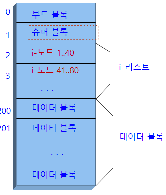
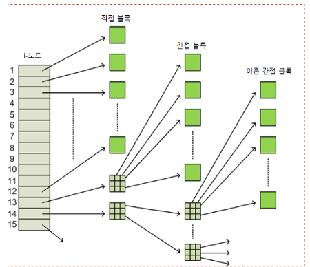
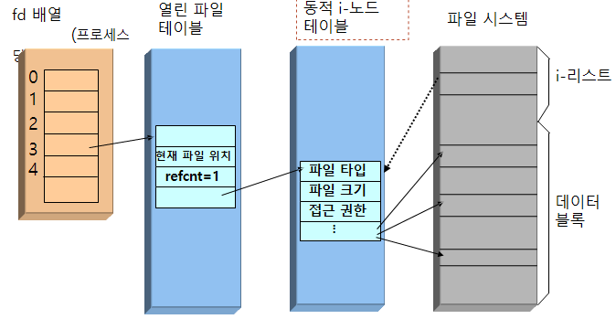
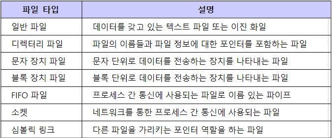
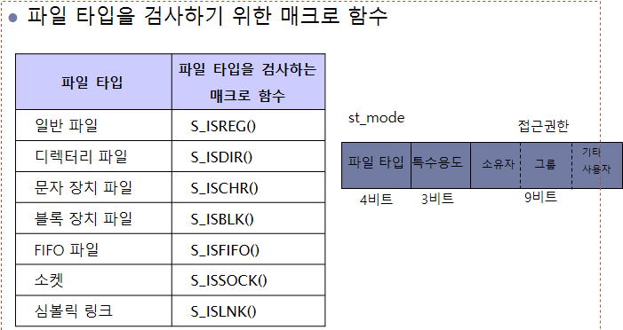
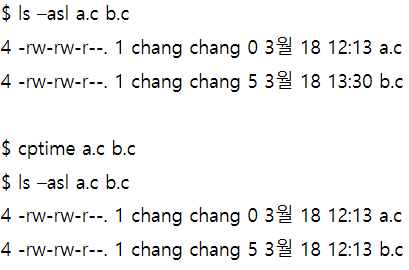
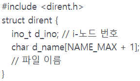
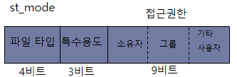
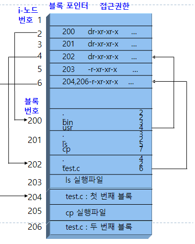
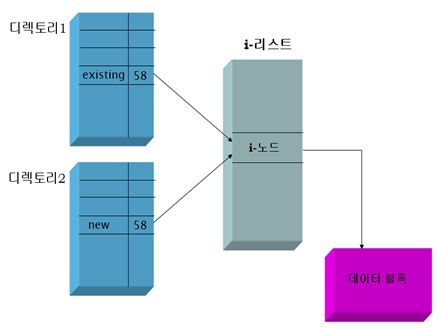

# 6장 파일 시스템

## 6.1 파일 시스템 구현

- 유닉스 파일 시스템의 전체적인 구조

- ext 파일 시스템
  - 리눅스는 유닉스 파일 시스템을 확장한 ext 파일 시스템 사용
- 현재 리눅스에서 사용되는 ext4 파일 시스템
  - 1EB 이상의 볼륨과 16TB 이상의 파일을 지원
- 부트 블록(boot block)
  - 파일 시스템 시작부에 위치하고 보통 첫 번째 섹터를 차지
  - 부트스트랩 코드가 저장되는 블록
- 슈퍼 블록(Super block)
  - 전체 파일 시스템에 대한 정보를 저장
  - 총 블록 수, 사용 가능한 i-노드 개수, 사용 가능한 블록 비트 맵, 블록의 크기, 사용 중인 블록 수, 사용 가능한 블록 수 등
- i-리스트
  - 각 파일을 나타내는 모든 i-노드들의 리스트
  - 한 블록은 약 40개 정도의 i-노드를 포함
- 데이터 블록
  - 파일의 내용을 저장하기 위한 블록들
- i-노드
  - 한 파일은 하나의 i-노드를 갖는다
  - 파일에 대한 모든 정보를 가지고 있음
    - 파일 타입: 일반파일, 디렉터리, 블록 장치, 문자 장치 등
    - 파일 크기
    - 접근권한
    - 파일 소유자 및 그룹
    - 접근 및 갱신 시간
    - 데이터 블록에 대한 포인터 주소 등

i-노드와 블록 포인터

- 데이터 블록에 대한 포인터
  - 파일의 내용을 저장하기 위해 할당된 데이터 블록의 주소
- 하나의 i-노드 내의 블록 포인터
  - 직접 블록 포인터 12개
  - 간접 블록 포인터 1개
  - 이중 간접 블록 포인터 1개
  - 삼중 간접 블록 포인터 1개
- 최대 몇 개의 데이터 블록 가리키나?
  - 블록이 4KB이고 주소가 4B면 삼중이 10^30승

## 6.2 파일 입출력 구현

파일 열기 open()

- 시스템은 커널 내에 파일을 사용할 준비를 한다.

파일 입출력 구현을 위한 커널 내 자료구조

- 파일 디스크립터 배열 Fd array
- 열린 파일 테이블 open File Table
- 동적 i-노드 테이블 Active i-node table

- 프로세스 당 하나씩 갖는다
- 파일 디스크립터 배열
  - 열린 파일 테이블의 엔트리를 가리킴
- 파일 디스크립터
  - 파일 디스크립터 배열의 인덱스
  - 열린 파일을 나타내는 번호

열린 파일 테이블

- 커널 자료구조
- 열려진 모든 파일 목록
- 열려진 파일 → 파일 테이블의 항목

파일 테이블 항목

- 파일 상태 플래그(R, W, append, sync, nonblocking)
- 파일의 현재 위치(current file offset)
- i-node에 대한 포인터

동적 i-노드 테이블

- 커널 내의 자료 구조
- open 된 파일들의 i-node를 저장하는 테이블

i-노드

- 하드 디스크에 저장되어 있는 파일에 대한 자료구조
- 한 파일에 하나의 i-node
- 하나의 파일에 대한 정보 저장
  - 소유자, 크기
  - 파일이 위치한 장치
  - 파일 내용 디스크 블럭에 대한 포인터

## 6.3 파일 상태 정보

파일 상태

- 파일에 대한 모든 정보
- 블록수, 파일 타입, 사용 권한, 링크수, 파일 소유자의 사용자ID
- 그룹 ID, 파일 크기, 최종 수정 시간 등

상태정보: stat()

- 파일 하나당 하나의 i-node가 있으며 i-node 내에 파일에 대한 모든 상태 정보가 저장되어 있다.
- int stat(const char *filename, struct stat *buf)
- fstat(int fd, struct stat *buf)
- int lstat(const char *filename, struct stat *buf)

파일 타입

### ftype.c

파일 접근권한

- 각 파일에 대한 권한 관리
  - 소유자 owner / 그룹 group / 기타 others로 구분
- 파일에 대한 권한
  - 읽기 r
  - 쓰기 w
  - 실행 x
- 파일의 접근권한 가져오기
  - stat() system call
- 파일의 접근권한 변경
  - chmod() system call
    - 리턴 값: 성공하면 0 실패하면 -1
    - mode: 8진수 접근권한 (예: 0644)

chmod

- int chmod(const char *path, mode_t mode)
- int fchmod(int fd, mode_t mode)

### fchmod.c

접근 및 수정 시간 변경 utime()

- 파일의 최종 접근 시간과 최종 변경 시간을 조정
- int utime(const char *filename, const struct utimbuf *times)
- times가 NULL이면, 현재시간으로 설정됨
- 리턴 값: 성공0 실패 -1
- UNIX 명령어 touch 참고

### touch.c

접근 및 수정 시간 복사

### cptime.c

파일 소유자 변경 chown()

- 파일의 userID와 groupID를 변경
- int chown(const char *path, uid_t owner, gid_t group)
- int fchown(int filedes, uid_t owner, gid_t group)
- int lchown(const char *path, uid_t owner, gid_t group)
- 리턴: 성공 0, 실패 -1
- lchown()은 심볼릭 링크 자체를 변경
- super-user만 변환 가능

## 6.4 디렉터리

디렉터리 구현

- 디렉터리 내에는 무엇이 저장?
- 디렉터리 엔트리

디렉터리 리스트

- opendir()
  - 디렉터리 열기 함수
  - DIR 포인터(열린 디렉터리를 가리키는 포인터) 리턴
  - DIR *opendir(const char *path)
- readdir()
  - 디렉터리 읽기 함수
  - struct dirent *readdir(DIR *dp)

### list1.c

파일 이름과 크기 출력

- 디렉터리 내에 있는 파일 이름과 파일 크기를 출력하도록 확장

st_mode

- lstat() system call
  - 파일 타입과 접근권한 정보는 st → st_mode 필드에 함께 저장됨.
- st_mode 필드

디렉터리 리스트

### list2.c

디렉터리 생성

- mkdir() system call
  - path가 나타내는 새로운 디렉터리를 만든다.
  - int mkdir(const char *path, mode_t mode)
  - . 과 .. 파일은 자동적으로 만들어진다

디렉터리 삭제

- rmdir()
- int rmdir(const char *path)

디렉터리 구현

- 파일 시스템 내에서 디렉터리를 어떻게 구현?
  - 디렉터리도 일종의 파일로 다른 파일처럼 구현
  - 디렉터리도 다른 파일처럼 하나의 i-node로 표현
  - 디렉터리의 내용은 디렉터리 엔트리(파일이름, i-node 번호)

## 6.5 링크

하드 링크

- 지금까지 살펴본 링크
- 파일 시스템 내의 i-node를 가리키므로 같은 파일 시스템 내에서만 사용 가능

심볼릭 링크

- 소프트 링크
- 실제 파일의 경로명 저장하고 있는 링크
- 파일에 대한 간접적인 포인터 역할을 함
- 다른 파일 시스템에 있는 파일도 링크 가능

링크

- 링크는 기존 파일에 대한 또 다른 이름
- 하드와 심볼릭 링크가 있음
- link() system call
  - 기존 파일 existing에 대한 새로운 이름 new 즉 링크를 만든다
- int link(char *existing, char *new)
- int unlink(char *path)

### link.c

### unlink.c

심볼릭 링크

- int symlink(const char *actualpath, const char *sympath);
- 성공 0 실패 -1

심볼릭 링크 내용

- readlink(const char *path, char *buf, size_t bufsize)
- path 심볼릭 링크의 실제 내용 읽어서 buf에 저장
- 성공하면 buf에 저장한 바이트 수 반환, 실패 -1

### rlink.c
