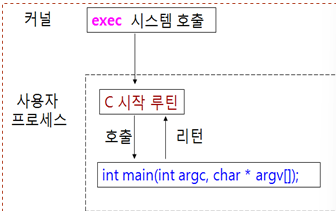
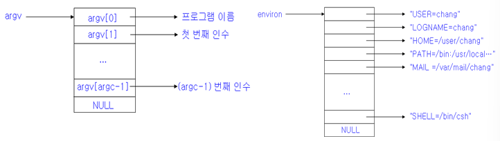
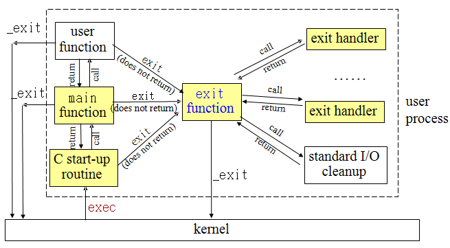
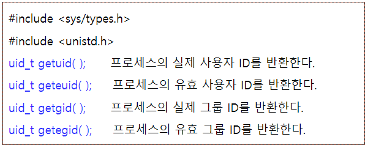
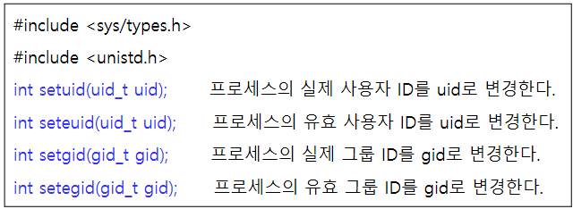
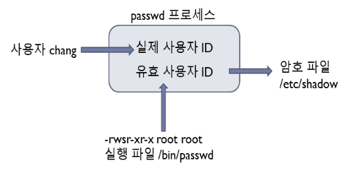
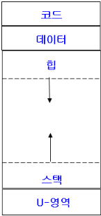

# 8장 프로세스

## 8.1 쉘과 프로세스

쉘의 역학

- 사용자와 운영체제 사이에 창구 역할을 하는 소프트웨어
- 명령어 처리기
- 사용자로부터 명령어를 입력받아 이를 처리

쉘의 실행 절차

- 시작 파일을 읽고 실행
- 프롬프트를 출력하고 사용자 명령을 기다림
- 사용자 명령을 실행

전면처리

- 명령어를 입력하면 명령어가 전면에서 실행, 명령어 실행이 끝날 때가지 쉘이 기다려 줌

후면처리

- 명령어들을 후면에서 처리, 전면에는 다른 작업 가능

프로세스

- 실행중인 프로그램을 프로세스라고 부름
- 각 프로세스는 유일한 프로세스 번호 PID를 가짐
- ps 명령어를 사용하여 나의 프로세스들을 볼 수 있음

프로세스 상태: ps

- ps -aux (BSD 유닉스)
  - a: 모든 사용자의 프로세스를 출력
  - u: 프로세스에 대한 좀 더 자세한 정보 출력
  - x: 더 이상 제어 터미널을 갖지 않은 프로세스들도 함께 출력
- ps -ed (시스템 V)
  - e: 모든 사용자 프로세스 정보를 출력
  - f: 프로세스에 대한 좀 더 자세한 정보 출력

프로세스 제어

- 프로세스 제어 위한 명령어들
  - sleep
    - 지정된 시간만큼 실행을 중지
    - sleep 초
  - kill
    - 현재 실행중인 프로세스를 강제로 종료
    - kill [-시그널] 프로세스번호
    - kill %작업번호
  - wait
    - wait [프로세스번호]
    - 해당 프로세스 번호를 갖는 자식 프로세스가 종료될 때까지 기다림
    - 프로세스 번호를 지정하지 않으면 모든 자식 프로세스 기다림
  - exit
    - 쉘을 종료하고 종료코드을 부모 프로세스에 전달
    - exit [종료코드]

## 8.2 프로그램 실행

프로그램 실행 시작



- exec system call
  - C 시작 루틴에 명령줄 인수와 환경변수를 전달하고 프로그램 실행
- C 시작 루틴(start-up routine)
  - main 함수를 호출하면서 명령줄 인수, 환경 변수를 전달
  - 실행이 끝나면 반환값을 받아 exit한다

명령줄 인수/환경 변수



- argc: 명령줄 인수의 개수
- argv[]: 명령줄 인수 리스트를 나타내는 포인터 배열

### args.c

```c
#include <stdio.h>
#include <stdlib.h>
// 모든 명령줄 인수 출력하는 코드

int main(int argc, char *argv[]) {
    int i;
    for (i = 0; i < argc; i++) {
        printf("argv[%d]: %s \n", i, argv[i]);
    }
    exit(0);
}
```

### environ.c

```c
#include <stdio.h>
#include <stdlib.h>
// 모든 환경 변수 출력

int main(int argc, char *argv[]) {
    char **ptr;
    extern char **environ;  // environ 형태 char *environ[]
    // environ을 통해 환경 변수 배열의 시작을 가리키는 포인터를 가져옵니다.
    for (ptr = environ; *ptr != 0; ptr++) {
        printf("%s \n", *ptr);  // 현재 가리키고 있는 환경 변수를 출력합니다.
    }
    exit(0);  // 프로그램을 성공적으로 종료합니다.
}
```

환경 변수 접근

- getenv() 시스템 호출을 사용하여 환경 변수를 하나씩 접근 가능
- char *getenv(const char *name)
  - 환경 변수 name의 값을 반환., 해당 변수가 없으면 NULL 반환

### myenv.c

```c
#include <stdio.h>
#include <stdlib.h>
// 환경변수 3개 프린트

int main(int argc, char *argv[]) {
    char *ptr;
    ptr = getenv("Home");
    printf("Home=%s \n", ptr);
    ptr = getenv("SHELL");
    printf("Home=%s \n", ptr);
    ptr = getenv("PATH");
    printf("Home=%s \n", ptr);
    exit(0);
}
// 환경변수 설정은 putenv()
```

환경 변수 설정

- putenv(), setenv() 사용하여 특정 환경 변수 설정
- int putenv(const char *name)
  - name=value 형태의 스트링을 받아서 이를 환경 변수 리스트에 넣음
  - name이 이미 존재하면 원래 값을 새로운 값으로 대체
- int setenv(const char *name, const char *value, int rewrite)
  - 환경 변수 name의 값을 value로 설정.
  - name이 이미 존재하는 경우에는 rewrite값이 0이 아니면 우너래 값을 새로운 값으로 대체
  - rewrite 값이 0이면 그대로 둠
- int unsetenv(const char *name)
  - 환경 변수 name의 값을 지움

## 8.3 프로그램 종료

- 정상 종료
  - main 실행을 마치고 리턴하면 C 시작 루틴은 이 리턴값을 가지고 exit 호출
  - 프로그램 내에서 직접 exit 호출
  - 프로그램 내에서 직접 _exit을 호출
- 비정상 종료
  - abort()
    - 프로세스에 SIGABRT 시그널을 보내어 프로세스를 비정상적으로 종료
  - 시그널에 의한 종료

프로그램 종료

- exit()
  - 모든 열려진 스트림을 닫고(fclose), 출력 버퍼의 내용을 디스크에 쓰는(fflush) 등의 뒷정리 후 프로세스를 정상적으로 종료
  - 종료 코드(exit code)를 부모 프로세스에게 전달
  - void exit(int status) → 뒷정리를 한 후 프로세스 정상적으로 종료
- _exit()
  - void _exit(int status) → 뒷정리를 하지 않고 프로세스를 즉시 종료

### atexit.c

```c
#include <stdio.h>
#include <stdlib.h>

static void exit_handler1(void), exit_handler2(void);
// exit 처리기를 등록
// exit()는 exit handler들을 등록된 역순으로 호출한다
// return 0이면 등록 된거임

int main(void) {
    if (atexit(exit_handler1) != 0) {
        perror("exit_handler1 등록할 수 없음");
    }
    if (atexit(exit_handler2) != 0) {
        perror("exit_handler2 등록할 수 없음");
    }
    printf("main 끝\n");
    exit(0);
}

static void exit_handler1(void) {
    printf("첫 번째 exit 처리기 \n");
}
static void exit_handler2(void) {
    printf("두 번째 exit 처리기\n");
}
```



exit 처리기 atexit()

- void atexit(void (*func)(void))
- exit 처리기를 등록한다
  - 프로세스당 32개까지
- func
  - exit 처리기
  - 함수 포인터(이름)
- exit()는 handler들을 등록된 역순으로 호출

## 8.4 프로세스 ID와 프로세스의 사용자 ID

- 각 프로세스는 프로세스를 구별하는 번호인 프로세스 ID를 가짐
- 각 프로세스는 자신을 생성해준 부모 프로세스 존재
- int getpid : 프로세스의 ID 리턴
- int getppid 부모 프로세스의 ID 리턴

### pid.c

프로세스의 사용자 ID

- 프로세스는 프로세스 ID 외에 프로세스의 사용자 ID와 그룹 ID를 가짐
  - 그 프로세스를 실행시킨 사용자의 ID와 사용자의 그룹 ID
  - 프로세스가 수행할 수 있는 연산을 결정하는 데 사용
- 프로세스의 실제 사용자 ID
  - 그 프로세스를 실행한 원래 사용자의 사용자 ID로 설정
- 프로세스의 유효 사용자 ID
  - 현재 유효한 사용자 ID로 새로 파일을 만들 때나 파일에 대한 접근 권한을 검사할 때 주로 사용
  - 보통 유효 사용자 ID와 실제 사용자 ID는 특별한 실행파일을 실행할 때를 제외하고는 동일

소유자와 실행자의 차이인 듯 함



### uid.c

```c
#include <stdio.h>
#include <unistd.h>
#include <pwd.h>
#include <grp.h>
// 사용자 ID 출력

int main() {
    printf("나의 실제 사용자 ID: %d(%s)\n", getuid(), getpwuid(getuid())->pw_name);
    printf("나의 유효 사용자 ID: %d(%s)\n", geteuid(), getpwuid(geteuid())->pw_name);
    printf("나의 실제 그룹 ID: %d(%s)\n", getgid(), getgrgid(getgid())->gr_name);
    printf("나의 유효 그룹 ID: %d(%s)\n", getegid(), getgrgid(getegid())->gr_name);
}
```



set-user-id 실행권한

- 특별한 실행권한 set-user-id
  - set-user-id 설정된 실행파일을 실행하면
  - 이 프로세스의 유효 사용자 ID는 그 실행파일의 소유자로 바뀜
  - 이 프로세스는 실행되는 동안 그 파일의 소유자 권한을 갖게 됨.
  - 예 /bin/passwd 명령어

1. set-user-id 실행권한이 설정된 실행파일이며 소유자는 root
2. 일반 사용자가 이 파일을 실행하면 이 프로세스의 유효 사용자 ID는 root가 됨
3. /etc/shadow처럼 root만 수정할 수있는 파일의 접근 및 수정 가능



set-user-id 실행권한 설정

- set-user-id 실행권한은 심볼릭 모드로 's'로 표시
- set-user-id 실행권한 설정
  - chmod 4755 file1

## 8.5 프로세스 이미지

프로세스

- 프로세스는 실행중인 프로그램
- 프로그램 실행을 위해서
  - 코드, 데이터, 스택, 힙, U-영역 등이 필요
- 프로세스 이미지(구조)
  - 메모리 내의 프로세스 레이아웃
- 프로그램 자체가 프로세스는 아님



프로세스 구조

- 텍스트
  - 프로세스가 실행하는 실행코드를 저장하는 영역
- 데이터
  - 전역 변수 및 정적 변수를 위한 메모리 영역
- 힙
  - 동적 메모리 할당을 위한 영역. malloc 함수를 호출하면 이 영역에서 동적 메모리 할당
- 스택
  - 함수 호출을 구현하기 위한 실행시간 스택을 위한 영역. 활성 레코드가 저장됨
- U-영역(user area)
  - 열린 파일 디스크립터, 현재 작업 디렉터리 등과 같은 프로세스의 정보를 저장하는 영역
