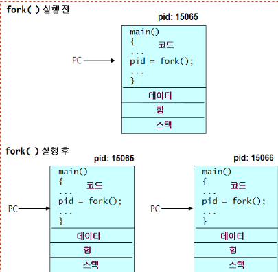
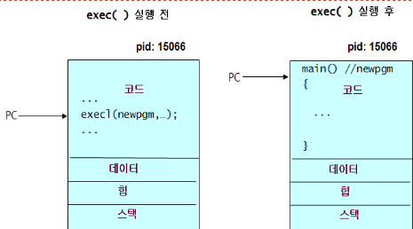
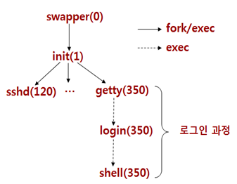

# 9장 프로세스 제어

## 9.1 프로세스 생성

프로세스 생성

- 부모 프로세스가 자식 프로세스 생성
- fork system call
  - 부모 프로세스를 똑같이 복제하여 새로운 자식 프로세스 생성
  - pid_t fork(void)
  - 자식 프로세스에게 0리턴, 부모 프로세스에게 자식 프로세스 ID 리턴
  - 병행적으로 각각 실행을 계속함



### fork1.c

```c
#include <stdio.h>
#include <unistd.h>
// 자식 프로세스 생성

int main() {
    int pid;
    printf("[%d] 프로세스 시작\n", getpid());
    pid = fork();  // fork 호출된 시점 이후의 코드만으로 프로세스 만들어짐
    printf("[%d] 프로세스: 리턴값 %d\n", getpid(), pid);
}
```

부모 프로세스와 자식 프로세스 구분

- fork 호출 후에 리턴값이 다르므로 이 리턴값을 이용하여 부모 프로세스와 자식 프로세스를 구별하고 서로 다른 일을 하도록 할 수 있음

### fork2.c

```c
#include <unistd.h>
#include <stdio.h>
// 부모 프로세스가 자식 프로세스 생성 후 서로 다른 메시지 프린트

int main() {
    int pid;
    pid = fork();
    if (pid == 0) {  // 자식 프로세스면
        printf("[Child]: Hello world pid=%d, ppid=%d\n", getpid(), getppid());
    } else {
        printf("[Parent]: Hello world pid=%d, ppid=%d\n", getpid(), getppid());
    }
}
```

### fork3.c

```c
#include <unistd.h>
#include <stdio.h>
#include <stdlib.h>
// 두 개의 자식 프로세스 생성

int main() {
    int pid1, pid2;
    pid1 = fork();
    if (pid1 == 0) {
        printf("[Child1]: Hello world pid=%d, ppid=%d\n", getpid(), getppid());
        exit(0);
    }
    pid2 = fork();
    if (pid2 == 0) {
        printf("[Child2]: Hello world pid=%d, ppid=%d\n", getpid(), getppid());
        exit(0);
    }
    printf("[Parent]: Hello world pid=%d, ppid=%d\n", getpid(), getppid());
}
```

프로세스 기다리기 wait()

- 자식 프로세스 중의 하나가 끝날 때까지 기다림
  - 끝난 자식 프로세스의 종료 코드가 status 에 저장
  - 끝난 자식 프로세스의 번호 리턴
  - pid_t wait(int *status)
  - pid_t waitpid(pid_t pid, int *statloc, int options)

### forkwait.c

```c
#include <sys/types.h>
#include <sys/wait.h>
#include <unistd.h>
#include <stdio.h>
#include <stdlib.h>
// 부모 프로세스가 자식 프로세스 생성하고 끝나기를 가다린다

int main() {
    int pid, child, status;
    printf("[%d] 부모 프로세스 시작 \n", getpid());
    pid = fork();
    if (pid == 0) {
        printf("[%d] 자식 프로세스 시작 \n", getpid());
        exit(1);
    }
    // 자식 프로세스의 종료 상태를 status 변수에 저장
    child = wait(&status);  // 자식 프로세스가 끝나길 기다림 자식프로세스 번호 리턴
    printf("[%d] 자식 프로세스 %d 종료 \n", getpid(), child);
    // wait() 함수에서 반환된 종료 상태에서 하위 8비트를 제거하여 종료 코드를 추출
    printf("\t종료 코드 %d\n", status >> 8);
    // 상위 8비트는 자식 프로세스의 종료 상태
    // 하위 8비트는 자식 프로세스가 종료될 때 반환한 부가 정보
}
```

### waitpid.c

```c
#include <sys/types.h>
#include <sys/wait.h>
#include <unistd.h>
#include <stdio.h>
#include <stdlib.h>
// 부모 프로세스가 자식 프로세스 생성하고 끝나기를 가다린다

int main() {
    int pid1, pid2, child, status;
    printf("[%d] 부모 프로세스 시작\n", getpid());
    pid1 = fork();
    if (pid1 == 0) {
        printf("[%d] 자식 프로세스[1] 시작\n", getpid());
        sleep(1);
        printf("[%d] 자식 프로세스[1] 종료\n", getpid());
        exit(1);
    }
    pid2 = fork();
    if (pid2 == 0) {
        printf("[%d] 자식 프로세스[2] 시작\n", getpid());
        sleep(2);
        printf("[%d] 자식 프로세스[2] 종료\n", getpid());
        exit(2);
    }
    // 자식 프로세스 1의 종료 기다림
    child = waitpid(pid1, &status, 0);
    printf("[%d] 자식 프로세스 ##1 종료\n", getpid());
    printf("\t종료코드 %d\n", status >> 8);
}
```

## 9.2 프로그램 실행

프로그램 실행 원리

- fork 후
  - 자식 프로세스는 부모 프로세스와 똑같은 코드 실행
- 자식 프로세스에게 새 프로그램 실행
  - exec() 시스템 호출 사용
  - 프로세스 내의 프로그램을 새 프로그램으로 대치
- 보통 fork 후에 exec
- 프로세스가 exec 호출을 하면
  - 그 프로세스 내의 프로그램은 완전히 새로운 프로그램으로 대치
  - 자기대치
  - 새 프로그램의 main부터 실행이 시작됨.



프로그램 실행: exec()

- exec() 호출이 성공하면 리턴할 곳이 없어짐
- 성공한 exec 호출은 절대 리턴하지 않음
- int execl(char *path, char *arg0, char *arg1 …, NULL)
- execl, execv, execlp, execvp
  - l=list v=vector, p=path search, e=environment

fork/exec

- 보통 fork() 호출 후에 exec 호출
  - 새로 실행할 프로그램에 대한 정보를 arguments로 전달
- exec 호출이 성공하면
  - 자식 프로세스는 새로운 프로그램을 실행
  - 부모는 계속해서 다음 코드 실행

### execute1.c

```c
#include <sys/types.h>
#include <sys/wait.h>
#include <unistd.h>
#include <stdio.h>
#include <stdlib.h>
// 자식 프로세스를 생성하여 echo 명령어 실행

int main() {
    printf("부모 프로세스 시작 \n");
    if (fork() == 0) {
        execl("/bin/echo", "echo", "hello", NULL);
        fprintf(stderr, "첫 번쨰 실패");
        exit(1);
    }
    printf("부모 프로세스 끝\n");
}
```

### execute2.c

```c
#include <sys/types.h>
#include <sys/wait.h>
#include <unistd.h>
#include <stdio.h>
#include <stdlib.h>
// 자식 프로세스를 생성하여 echo 명령어 실행

int main() {
    printf("부모 프로세스 시작 \n");
    if (fork() == 0) {
        execl("/bin/echo", "echo", "hello", NULL);
        fprintf(stderr, "첫 번쨰 실패");
        exit(1);
    }
    if (fork() == 0) {
        execl("/bin/date", "date", NULL);
        fprintf(stderr, "두 번쨰 실패");
        exit(2);
    }
    if (fork() == 0) {
        execl("/bin/ls", "ls", "-l", NULL);
        fprintf(stderr, "세 번쨰 실패");
        exit(3);
    }
    printf("부모 프로세스 끝\n");
}
```

### execute3.c

```c
#include <sys/types.h>
#include <sys/wait.h>
#include <unistd.h>
#include <stdio.h>
#include <stdlib.h>
// 명령줄 인수로 받은 명령 실행

int main(int argc, char *argv[]) {
    int child, pid, status;
    pid = fork();
    if (pid == 0) {
        execvp(argv[1], &argv[1]);
        fprintf(stderr, "%s: 실행 불가\n", argv[1]);
    } else {
        child = wait(&status);
        printf("[%d] 자식 프로세스 %d 종료 \n", getpid(), child);
        printf("\t종료 코드 %d \n", status >> 8);
    }
}
```

명령어 실행 함수 system()

- int system(const char *cmdstring)
  - 이 함수는 /bin/sh -c cmdstring 호출하여 cmdstring에 지정된 명령어를 실행.
  - 명령어가 끝난 후 명령어의 종료코드 반환
- 자식 프로세스 생성하고 /bin/sh로 하여금 지정된 명령어 실행

### syscall.c

```c
#include <sys/types.h>
#include <sys/wait.h>
#include <unistd.h>
#include <stdio.h>
#include <stdlib.h>

int main() {
    int status;
    if ((status = system("date") < 0)) {
        perror("system() 오류");
    }
    printf("종료코드 %d\n", WEXITSTATUS(status));
    if ((status = system("hello") < 0)) {
        perror("system() 오류");
    }
    printf("종료코드 %d\n", WEXITSTATUS(status));
    if ((status = system("who; exit44") < 0)) {
        perror("system() 오류");
    }
    printf("종료코드 %d\n", WEXITSTATUS(status));
}
```

## 9.3 입출력 재지정

입출력 재지정

- 출력 재지정 기능 구현
  - 파일 디스크립터 fd를 표준출력(1)에 dup2

### redirect1.c

```c
#include <stdio.h>
#include <fcntl.h>
#include <unistd.h>
// 표준출력을 파일에 재지정하는 프로그램

int main(int argc, char *argv[]) {
    int fd, status;
    fd = open(argv[1], O_CREAT|O_TRUNC|O_WRONLY, 0600);
    dup2(fd, 1);  // 파일을 표준출력에 복제
    close(fd);
    printf("Hello stdout ! \n");
    fprintf(stderr, "Hello stderr ! \n");
}
```

### redirect2.c

```c
#include <sys/types.h>
#include <sys/wait.h>
#include <unistd.h>
#include <stdio.h>
#include <stdlib.h>
#include <fcntl.h>
// 자식 프로세스의 표준 출력을 파일에 재지정

int main(int argc, char *argv[]) {
    int child, pid, fd, status;
    pid = fork();
    if (pid == 0) {  // 자식이면
        fd = open(argv[1], O_CREAT|O_TRUNC|O_WRONLY, 0600);
        dup2(fd, 1);
        close(fd);
        execvp(argv[2], &argv[2]);
        fprintf(stderr, "%s: 실행불가\n", argv[1]);
    } else {  // 부모면
        child = wait(&status);
        printf("[%d] 자식 프로세스 %d 종료\n", getpid(), child);
    }
}
```

## 9.4 프로세스 그룹

- 프로세스 그룹은 여러 프로세스들의 집합
- 보통 부모 프로세스가 생성하는 자손 프로세스들은 부모와 같은 프로세스 그룹에 속함
- 프로세스 그룹 리더: Process GID = PID
- 프로세스 그룹은 signal 전달 등을 위해 사용됨.
- 프로세스 IDs
- 프로세스 ID(PID)
  - 프로세스 그룹 ID(GID)
  - 각 프로세스는 하나의 프로세스 그룹에 속함
  - 각 프로세스는 자신이 속한 프로세스 그룹 ID를 가지며 fork 시 물려받음
  - pit_t .getpgrp(void)

### pgrp1.c

```c
#include <stdio.h>
#include <unistd.h>

int main() {
    int pid, gid;
    printf("PARENT: PID = %d GID = %d\n", getpid(), getpgrp());  // 부모 pid gid 같음
    pid = fork();
    if (pid == 0) {
        printf("CHILD: PID = %d GID = %d\n", getpid(), getpgrp());  // pid 자식 gid 부모
    }
}
```

프로세스 그룹

- 프로세스 그룹 만들기
  - int setpgid(pid_t pid, pid_t pgid)
  - 프로세스 pid의 프로세스 그룹 ID를 pgid로 설정
  - 성공0 실패 -1
- 프로세스 그룹 소멸
  - the last process terminates OR
  - joins another process group
  - leader may terminate first
- 새로운 프로세스 그룹을 생성하거나 다른 그룹에 멤버로 참여
- 호출자가 새로운 프로세스 그룹을 생성하고 그룹의 리더
  - setpgit(getpid(). getpid())
  - setpgid(0,0)

### pgrp2.c

```c
#include <stdio.h>
#include <unistd.h>

int main() {
    int pid, gid;
    printf("PARENT: PID = %d GID = %d\n", getpid(), getpgrp());
    pid = fork();
    if (pid == 0) {
        setpgid(0, 0);  // 0은 현재 프로세스
        printf("CHILD: PID = %d GID = %d\n", getpid(), getpgrp());
    }
}
```

프로세스 그룹 사용

- 프로세스 그룹 내의 모든 프로세스에 시그널을 보낼 때 사용
- pid_t waitpid(pid_t pid, int *status, int options)
  - pid == -1: 임의의 자식 프로세스가 종료하기를 기다림
  - pid > 0: 자식 프로세스 pid가 종료하기를 기다림
  - pid == 0: 호출자와 같은 프로세스 그룹 내의 어떤 자식 프로세스가 종료하기를 기다림
  - pid < -1: pid이 절대값과 같은 프로세스 그룹 내의 어떤 자식 프로세스가 종료하기를 기다림

## 9.5 시스템 부팅

- 시스템 부팅은 fork/exec 시스템 호출을 통해 이루어짐



- swapper(스케줄러 프로세스)
  - 커널 내부에서 만들어진 프로세스로 프로세스 스케줄링을 함.
- init(초기화 프로세스)
  - /etc/inittab 파일에 기술된 대로 시스템을 초기화
- getty 프로세스
  - 로그인 프롬프트를 내고 키보드 입력을 감지
- login 프로세스
  - 사용자의 로그인 아이디 및 패스워드를 검사
- shell 프로세스
  - 시작 파일을 실행한 후에 쉘 프롬프트를 내고 사용자로부터 명령어를 기다림.
