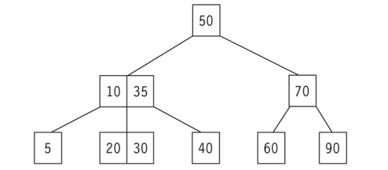

# 12.탐색

- 원하는 자료를 찾는 작업
- 탐색키
  - 항목과 항목을 구별해주는 키
- 사용 자료구조
  - 배열, 연결리스트, 트리, 그래프

순차탐색

이진탐색

- 정렬먼저 z퀵정렬 이후면 피봇이 맞지
- 피봇이아니라 그냥 중앙값인듯
- 자르고 탐색하고 자르고 탐색하고 . ..
- O(m+n/m)

보간탐색

- 배열이 일정한 간격으로 정렬되어 있을 대, 특정 값을 찾기 위해 배열 내에서 적절한 위치를 추정하는 방법
- 사전이나 전화번호부 탐색하는 방법
  - 'ㅎ'은 뒷부분 'ㄱ'은 앞부분에서 찾기
- O(logn)
- 이진탐색과 유사하나 리스트를 불균등 분할함
- 첫번째 값과 마지막 값 사이의 비율 사용
- 보간위치에 해당하는 배열과 비교 -> 앞,뒤 선택
- 이진탐색보다 평균적으로 더 빠르지만 배열의 값들이 불균등하면 이진탐색보다 성능이 떨어짐.

균형 이진탐색트리

- 이진탐색은 배열이라서 삽입 삭제가 비효율적이지만 이진탐색트리는 빠름
- 트리의 높이를 최소화하여 시간복잡도 개선

AVL 트리

- 모든 노드의 왼쪽과 오른쪽 서브트리의 높이 차가 1이하인 이진탐색트리
- 트리가 비균형상태면 스스로 노드 재배치
- 시간복잡도 O(logn)
- 균형인수 = 왼쪽 height - 오른쪽 height
- 모든 노드의 균형인수가 |1|이하면 AVL트리
- 연산
  - 탐색: 이진탐색트리와 동일
  - 삽입과 삭제연산 시 균형 깨질 수 있음
    - 가장 가까운 조상노드의 서브트리에 대하여 **재균형 회전함** 시계방향으로, 오른쪽이면 반시계방향

2-3트리

- 차수가 2 or 3인 노드를 가지는 트리
- 2-노드
  - 하나의 데이터와 두개의 자식노드
- 3-노드
  - 2개의 데이터 k1,k2와 3개의 자식노드
  - 왼쪽 서브트리 < k1
  - k2 > 중간 서브트리 > k1
  - 오른쪽 > k2

