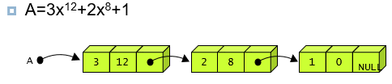

# 6. 연결리스트

기본연산

- 리스트에 새로운 항목 추가(insert)
- 삭제
- 탐색

배열로 구현

- 순차적인 메모리공간이 할당, 리스트의 순차적 표현이라고 함.

linked list

- 리스트의 항목들을 노드라고 하는 곳에 분산
- 노드는 데이타 필드와 링크 필드로 구성
  - 데이타 필드 - 리스트의 원소, 데이타 값을 저장하는 곳
  - 링크 필드 - 다른 노드의 주소값을 저장하는 장소 pointer

단순 연결 리스트

- 하나의 링크 필드를 이용하여 연결
- 마지막 노드의 링크 값은 null
- 연산
  - insert_first(): 첫 삽
  - insert(): 중 삽
  - delete_first: 첫 삭
  - delete(): 중 삭
  - print_list(): 모든 항목 출력
- 응용
  - 하나의 다항식을 하나의 연결리스트로 표현

  - 2개의 다항식을 더하는 덧셈 연산 -> 그냥 숫자를 -로 표현 다항식 정렬ㅋ

원형 연결 리스트

- 마지막 노드의 링크가 첫 번째 노드를 가리키는 리스트
- 한 노드에서 다른 모든 노드로의 접근이 가능
- 헤드포인터가 마지막 노드를 가리키게끔 구성하면 리스트의 처음이나 마지막에 노드 삽입하는 연산 용이
- 응용
  - 대기 큐, 준비큐, ??

이중 연결 리스트

- 단순연결 리스트의 문제점: 선행 노드를 찾기가 힘들다.
- 하나의 노드가 선행 노드와 후속 노드에 대한 두 개의 링크를 가지는 리스트
- 공간 많이차지하고 코드가 복잡함.
- 헤드노드: 데이터를 가지지 않고 단지 삽입, 삭제 코드를 간단하게 할 목적으로 만들어진 노드 -> 맨 처음 노드가 뭔지 알 수 없기 때문에 맨 처음 노드를 가리키는 헤드노드가 필요

연결 리스트로 구현한 스택과 큐?
