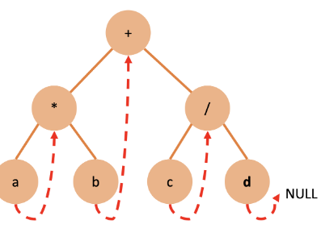

# 8. 트리

- 계층적인 구조를 나타내는 자료구조
- 부모-자식 관계의 노드들로 이루어진다.
- 용어
  - 노드: 트리의 구성요소
  - 루트: 맨 위
  - 서브트리: 하나의 노드와 그 노드들의 자손들로 이루어진 트리
  - 단말노드: 자식x
  - 비단말노드: 자식o
  - 자식, 부모, 조상 뭐시기 : 인간과 동일 -> 이딴건 왜있냐
  - 레벨: 트리의 층 번호
  - 높이: 트리의 최대 레벨
  - 차수: 노드가 가지고있는 자식 노드의 수

이진 트리

- 모든 노드가 2개의 서브 트리를 가지고 있는 트리
- 모든 노드의 차수가 2 이하
- 서브 트리간의 순서가 존재
- 검증
  - 공집합이거나, 왼 오른쪽 서브트리로 구성된 노드들의 유한집합으로 정의
- 성질
  - 노드개수 n. 간선의 개수 n-1
  - 높이 h, 최소 h개 노드 - 최대 2^h-1개의 노드
  - 높이 최대 n, 최소 log2(n+1)
- 분류
  - 포화 이진트리
    - 꽉 차있음
  - 완전 이진트리
    - 레벨 1부터 k-1까지 노드 모두 채워져 있고 왼쪽부터 순서대로 채워져 있는 트리
  - 기타 이진트리
- 부모 자신 관계
  - 부모: i/2
  - 왼쪽자식: 2i
  - 오른쪽 자식: 2i+1
- 링크 표현법 -> 포인터를 이용하여 부모노드가 자식노드 가리키게 하는 방법
- 이진트리 순회
  - 전위순회: Root -> Left -> Right
  - 중위순회: Left -> Root -> Right
  - 후위순회: Left -> Right -> Root
  - 레벨 순회: 각 노드를 레벨 순으로 검사

수식트리: 산술식을 트리형태로 표현

- 비단말노드: 연산자
- 단말노드: 피연산자

이진트리 연산

- 노드 개수: 각각 서브트리에 대하여 순환호출 -> 반환되는 값에 1을 더하여 반환
- 높이: 서브트리에 대하여 순환호출 -> 반환값 중 최대값을 구하여 +1 반환

스레드 이진트리

- null링크에 중위 순회할 때 후속노드를 저장시켜놓음 -> 스레드 이진트리

- 이진트리의 null링크를 이용하여 순환 호출 없이도 트리의 노드들을 순회
- null링크에 중위 순회시에 후속 노드인 중위 후속자를 저장시켜 놓은 트리가 스레드 이진트리

이진탐색트리

- 탐색작업을 효율적으로 하기 위한 자료구조
- 값이 key(Left 서브트리) <= key(Root node) <= key(Right 서브트리) 인 이진트리
- 탐색연산
  - 비교 결과 같으면 탐색이 끝남
  - 결과가 루트노드의 값보다 작으면 루트노드의 왼쪽 자식을 기준으로 다시 시작
  - 결과가 더 크면 오른쪽 자식 기준으로 다시 시작.
- 삽입연산
  - 탐색이 먼저
  - 탐색에 실패한 위치가 새로운 노드 삽입하는 위치
- 삭제연산
  - 단말노드일 경우
    - 단말노드의 부모노드를 찾아서 끊으면 됨
  - 하나의 서브트리를 가지고 있는 경우
    - 그 노드 삭제하고 서브트리를 부모노드에 붙여줌
  - 두개의 서브트리를 가지고 있는 경우
    - 위와 같지만 둘 중 삭제노드와 가장 비슷한 값을 가진 노드를 가지고 옴
- 성능
  - 높이 h에 비례
  - 최선의 경우 h=log2(n)
  - 최악의 경우 h=n
