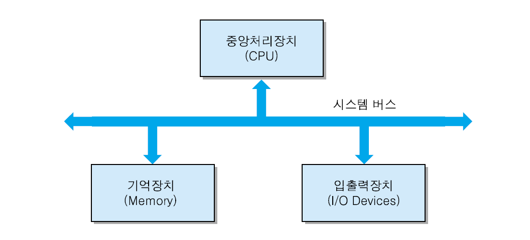
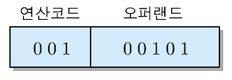
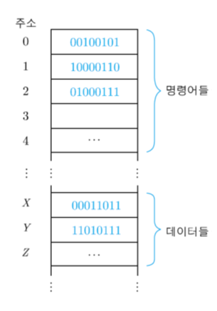
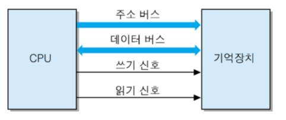
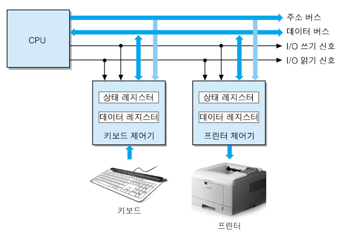

# 1. 하드웨어

소프트웨어

- 시스템 소프트웨어
  - driver, os
- 응용 소프트웨어
  - 워드, excel . . .

컴퓨터 기능: read -> processing -> store

시스템 버스 -> 모두 연결

- 중앙처리장치 cpu
  - processor
  - 프로그램 실행, 데이터 처리
- 기억장치 memory
  - 휘발성임
  - 반도체 기억장치 칩들로 구성
- 보조저장장치
  - 메모리보다 r/w속도 떨어짐
  - 저장 밀도가 높음
- 입출력장치 I/O Device

## 1.2 정보의 표현과 저장

- 2진수 비트들로 표현된 프로그램 코드와 데이터
- PROGRAM CODE
  - 기계어, .asm, 고급언어(C, python…)

레지스터

cpu 레지스터 -> 매우빠름, 용량이 작음

- 기계어 형식

- 연산 코드(op code)
  - cpu가 수행할 연산을 지정해 주는 비트들
  - 지정될 수 있는 연산의 최대 수 2^n개(n은 bit수)
- 오퍼랜드(operand)
  - 연산에 사용될 데이터 혹은 그것이 저장되어 있는 기억장치 주소
  - 주소지정 할 수 있는 기억장소의 수 2^n개(n은 bit수)
- 프로그램 코드와 데이터는 지정된 메모리에 저장
- 단어(word)단위로 저장
  - 단어: cpu에 의해 한번에 처리될 수 있는 비트들의 그룹
  - 주소지정 단위: 단어 단위 혹은 byte

## 1.3 시스템 구성

- 시스템 버스
  - cpu와 시스템 내의 다른요소들 사이에 정보 교환하는 통로
  - 구성
    - 주소 버스: 단방향
      - cpu가 외부로 발생하는 주소 정보를 전송하는 신호 선들의 집합
      - 주소 선의 수는 cpu와 접속될 수 있는 최대 기억장치 용량 결정
- 데이터 버스: 양방향
  - cpu가 메모리 혹은 I/O장치 사이에 데이터 전송하기 위한 선들
- 제어 버스: 양방향
  - cpu가 시스템 내의 각종 요소들의 동작을 제어하기 위한 신호 선들 ex) interrupt, memory r/w 신호, bus control

I/O장치 접속 시 I/O장치 제어기가 메모리 같은 역할 함.

보조저장장치

키보드는 byte단위 보조저장장치는 페이지(2K, 4K byte) or 블록(512byte)단위로 전송
