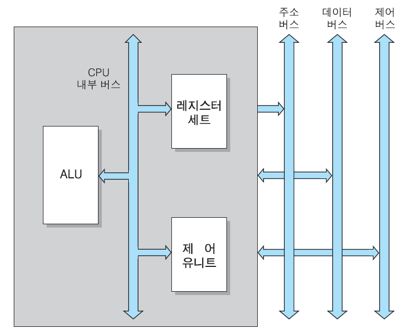
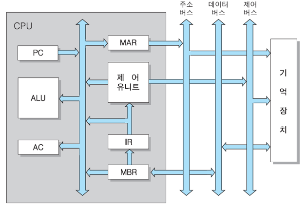
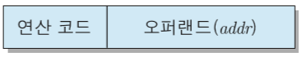
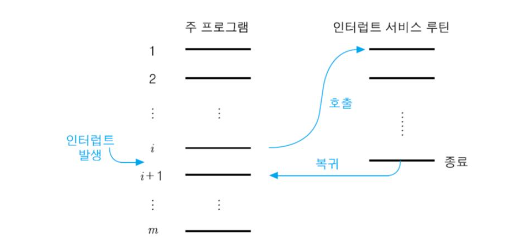
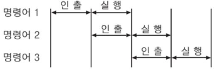
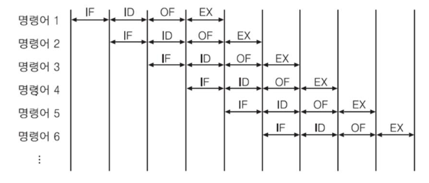
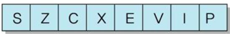
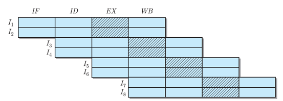
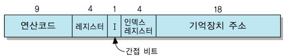

# 2. cpu

메모리는 저장에 주소가 필요하지만 cpu는 모두 고정되어있다.

기능

- 명령어 인출: 기억장치에서 가지고옴
- 명령어 해독: 수행 할 동작 결정하기위해 명령어 해독
- data fetch
- data process
- data store

## 2.1 cpu 기본구조

- cpu 내부버스
  - 시스템버스와 연결되어있지는 않지만 버퍼 레지스터, 시스템 버스인터페이스 와 연결되어있음.
- 산술논리연산장치(ALU)
  - 각종 산술,논리 연산 수행하는 회로들로 이루어진 모듈
- 레지스터 세트
  - 엑세스 속도 가장 빠름
  - 수 제한
- 제어 유닛
  - 코드 해석, 제어 신호를 순차적으로 발생하는 모듈

## 2.2 명령어 실행

- 명령어 사이클 -> cpu가 한 개의 명령어를 실행하는 데 필요한 전체 처리 과정.
- 두 개의 subcycle들로 분리
  - fetch cycle: cpu가 메모리로부터 명령어 읽어옴.
  - execution cycle: 명령어 실행단계

기본 명령어 사이클

cpu inner register

- program counter(PC)
  - **다음에 인출할** 주소를 가지고 있는 register
  - 각 명령어가 인출된 후에는 자동적으로 한 명령어 길이만큼 증가
  - 분기 명령어가 실행되는 경우 목적지 주소로 갱신 -> x86_64 asm의 je
- 누산기(Accumulator: AC)
  - 데이터 일시적으로 저장하는 register
  - 레지스터의 길이는 cpu가 한 번에 처리할 수 있는 데이터 비트 수와 동일
- 명령어 레지스터(Instruction register: IR)
  - **가장 최근에 인출된** 명령어 코드가 저장되어 있는 register
- 기억장치 주소 레지스터(Memory address register: MAR)
  - PC에 저장된 명령어 주소가 시스템 주소 버스로 출력되기 전에 일시적으로 저장되는 주소 register
- 기억장치 버퍼 레지스터(Memory Buffer Register: MBR)
  - 기억장치에 쓰여질 데이터 혹은 읽혀진 데이터를 일시적으로 저장하는 buffer register

인출 사이클의 마이크로 연산

t0: MAR <- PC

t1: MBR <- M[MAR], PC <- PC + 1        서로 독립적으로 움직이는게 가능하기에 동시에 함.

t2: IR <- MBR

기본적인 명령어 형식의 구성

- opcode(operation code)
  - cpu가 수행할 연산 지정
- operand
  - 명령어 실행에 필요한 데이터 저장된 주소

LOAD addr 명령어

- 기억장치에 저장되어 있는 데이터를 AC로 이동하는 명령어

t0: MAR <- IR(addr)

t1: MBR <- M[MAR]

t2: AC <- MBR

STA addr

- AC to memory

t0: MAR <- IR(addr)

t1: MBR <- AC

t2: M[MAR] <- MBR

ADD addr

t0: MAR <- IR(addr)

t1: MBR <- M[MAR]

t2: AC <- AC+MBR   솔직히 ALU 거치긴 함.

### 2.2.3 interrupt cycle

interrupt: 프로그램 실행 중에 cpu의 현재 처리 순서를 중단시키고 다른 동작을 수행하도록 요구하는 시스템 동작

- 원래 프로그램 수행 중단
- 요구된 인터럽트를 위한 서비스 프로그램을 먼저 수행

interupt service routine(ISR)

interrupt 세부 동작

- 현재 명령어 실행 끝낸 즉시, 다음에 실행할 명령어의 주소 stack에 저장 -> 스택은 주기억 장치의 특정 부분에 저장(memory stack)
- ISR 호출을 위해 루틴의 시작 주소 PC에 적재. 이때 시작 주소는 인터럽트 요구한 장치로부터 전송 or 미리 정해진 값

서비스 루틴에서 실행하는 것이 아니라 스택에 저장하는 것 까지, 이후 돌아가서 실행.

t0: MBR <- PC

t1: MAR <- SP(stack pointer), PC <- ISR 시작주소

t2: M[MAR] <- MBR

- SP는 stack pointer라는 register라네요.

multiple interrupt

- 다중 인터럽트의 처리방법(두 가지)

1. interrupt 처리 도중에는 새로운 interrupt요구가 들어오더라도 사이클 수행하지 않는 방법

- interrupt flag=0 -> interrupt disable
- 중요한 프로그램일 시 사용함.

2. interrupt 우선순위 정함. 우선순위가 낮은 interrupt가 처리되고 있는 동안에 우선순위가 더 높은 interrupt가 들어온다면 새로운 interrupt 먼저 처리

### 2.2.4 간접 사이클(indirect cycle)

1. 직접 주소지정 방식

- 그냥 직접 주소매핑

2. 간접 주소지정 방식

- operand field에 기억장치 주소가 저장, but 그 주소가 가리키는 기억 장소에 데이터의 유효 주소를 저장
- 명령어에 포함되어 있는 주소를 이용하여, 그 명령어 실행에 필요한 데이터의 주소를 인출하는 사이클
- 인출 사이클과 실행 사이클 사이에 위치
- 인출된 명령어의 주소 필드 내용을 이용하여 기억장치로부터 데이터의 실제 주소를 인출하여 IR의 주소 필드에 저장

## 2.3 명령어 파이프라이닝

cpu program 속도 높이기 위해 cpu 내부 하드웨어를 여러 단계로 나누어 동시 처리하는 기술

1. two-stage instruction pipeline

인출단계와 실행단계라는 독립적인 파이프라인 모듈로 분리

- 두 단계들에 동일한 클록을 가하여 동작 시간을 일치시키면
  - 1 clock 주기에서는 인출단계 첫 번째 명령어
  - 2 clock 주기에서는 인출된 첫 번째 명령어가 실행단계로 보내져서 실행, 동시에 인출단계는 두 번째 명령어 인출
- 문제점
  - 두 단계의 처리 시간이 동일하지 않으면 두 배의 속도 향상을 얻지 못함
- 해결책
  - 파이프라인 단계를 세분하여, 각 단계의 처리 시간을 (거의)같아지도록 함

속도향상(Sp) = 1.5배, 실행되는 명령어 수 증가 시, Sp=2배에 수렴

2. four-stage instruction pipeline

- 명령어 인출(IF) 단계: 다음 명령어를 기억장치로부터 인출
- 명령어 해독(ID) 단계: decoder를 이용하여 명령어 해석
- 오퍼랜드 인출(OF) 단계: 기억장치로부터 오퍼랜드 인출
- 실행(EX) 단계: 지정된 연산 수행

실행시간

- pipeline 단계 수 = k
- 실행할 명령어 수 = N
- 파이프라인 단계가 한 클록 주기씩 걸린다고 가정

**Tk = k + N-1**

Sp는 4에 수렴

- 문제점
  - 모든 명령어들이 파이프라인 단계를 모두 거치지는 않는다.
  - 파이프라인 클록은 처리 시간이 가장 오래 걸리는 단계를 기준으로함
  - IF 단계와 OF 단계가 동시에 기억장치를 액세스하는 경우에, 기억장치 충돌이 일어나면 지연 발생
  - 조건 분기가 실행되면, 미리 인출하여 처리하던 명령어들이 무효화 됨.
- 성능 저하의 최소화 방법
  - 분기 예측
- 분기가 일어날 것인 지를 예측, 그에 따라 명령어를 인출하는 확률적 방법
- branch history table 이용하여 최근의 분기 결과 참조
- 분기 목적지 선인출
- 조건분기 인식되면, 분기 명령어의 다음 명령어뿐만 아니라 분기의 목적지 명령어도 함께 인출하여 실행
- loop buffer 사용
- 파이프라인 명령어 인출 단계에 포함되어 있는 작은 고속 기억장치인 loop buffer에 가장 최근 인출된 n개의 명령어들을 순서대로 저장
- delayed branch
- 분기 명령어의 위치 재배치

상태 레지스터(status register)

- 명령어 실행 결과에 따른 조건 플래그들 저장
- 종류
  - 부호(S) 플래그: 직전에 수행된 산술연산 결과값 부호 비트 저장(양수:0, 음수:1)
  - 영(Z) 플래그: 연산 결과값이 0이면, 1로 세트
  - 올림수(C) 플래그: 덧셈이나 뺄셈에서 올림수나 빌림수가 발생한 경우에 1로 세트
  - 동등(E) 플래그: 두 수를 비교한 결과가 같게 나왔을 경우에 1로 세트
  - 오버플로우(V) 플래그: 산술 연산 과정에서 오버플로우가 발생한 경우에 1로 세트
  - interrupt flag(I): 가능=0, 불가능=1
  - superviser(P) flag: supervisor mode=1, user mode=0

### 2.3.3 슈퍼스칼라

- cpu 처리 속도를 더욱 높이기 위해 내부에 두 개 혹은 그 이상의 명령어 파이프라인들을 포함시킨 구조
- 파이프라인의 수 m : m-way 슈퍼스칼라

- 2 way super 슈퍼스칼라

속도향상

- 단일 T(1)= k + N-1
- T(m) = k + (N-m)/m
- 이론적으로 m배 빨라짐

속도 저하 요인:

- 명령어들 간의 데이터 의존 관계
- 하드웨어(register, memory, cache) 이용에 대한 경합 발생
- 해결책
  - 명령어 순서 재배치 -> 의존성 제거
  - 하드웨어 추가 설치

### 2.3.4 듀얼-코어, 멀티-코어

- cpu core
- chip-level multiprocessor 혹은 multiprocessor-on-a-chip 이라고도 부름
- dual core processor
  - 단일-코어 슈퍼스칼라 프로세서에 비하여 2배의 속도 향상 기대
  - 코어들은 내부 캐시와 시스템 버스 인터페이스만 공유
  - 코어 별로 독립적 프로그램 -> multitasking, multithreading

## 2.4 명령어 세트

어떤 CPU를 위하여 정의되어 있는 명령어들의 집합

명령어 세트 설계를 위해 결정되어야 할 사항들

- 연산종류
- 데이터 형태
- 명령어 형식
- 주소지정 방식

### 2.4.1 연산 종류

- 데이터 전송
- 산술연산
- 논리연산
- I/O
- 프로그램 제어
  - 분기(branch), 서브루틴 호출(subroutine call)
  - 명령어 실행 순서를 변경하는 연산들

서브루틴 호출을 위한 명령어들

- call: 현재의 pc 내용을 스택에 저장하고 서브루틴의 시작 주소로 분기하는 명령어

t0: MBR <- PC

t1: MAR <- SP, PC <- X

t2: M[MAR] <- MBR, SP <- SP - 1

- ret: cpu가 원래 실행하던 프로그램으로 복귀

t0: SP <- SP + 1

t1: MAR <- SP

t2: PC <- M[MAR]

### 2.4.2 명령어 형식

오퍼랜드 수에 따른 명령어 분류

### 2.4.3 주소지정 방식

명령어 실행에 필요한 오퍼랜드의 주소를 결정하는 방식

명령어 내 오퍼랜드 필드의내용

- 기억장치 주소
- register number
- data

주소지정 방식의 종류

1. 직접 주소지정 방식(direct addressing mode)

- EA=A
- memory 주소를 직접 가리킴 . .. 포인터?

2. 간접 주소지정방식

- EA=(A)
- 이중포인터 ㅋ
- 명령어 형식에 간접비트 필요(I)
- 만약 I=0, 직접주소지정
- 만약 I=1, 간접주소지정
- 다단계 간접 주소지정 방식
- EA=((..A..))

3. 묵시적 주소지정 방식

- 명령어 실행에 필요한 데이터의 위치가 묵시적으로 지정
- SHL, PUSH

4. 즉시 주소지정 방식

- 오퍼랜드 필드의 내용이 연산에 사용할 실제 데이터

5. 레지스터 주소지정 방식

- EA=R
- 명령어의 오퍼랜드가 해당 레지스터를 가리키는 방식

6. 레지스터 간접 주소지정 방식

- 오퍼랜드 필드(레지스터 번호) -> 레지스터 세트(memory adress) -> memory(data)

7. 변위 주소지정 방식

- 직접 + 레지스터 주소지정 방식의 조합
- EA = A + (R)
- 사용 register에 따라 다양한 변위 주소지정 방식 가능
- PC -> 상대 주소지정 방식

ex) memory 200번지 = 100+200=300

- 주로 분기 명령어에서 사용
- EA = A + (PC) A는 2의 보수
- A>0이면 forward 반대면 backward
- index register -> 인덱스 주소지정 방식
  - 기준 주소 정함 이후 0,1,2 …
  - EA = (IX) + A
  - 배열 데이터 액세스
    - 자동 인덱싱
      - 자동적으로 증가 감소
- base register -> base register addreessing mode
  - EA = (BR) + A
  - multiprogramming환경에서 주소 옮겨야 할 시 사용

### 2.4.4 실제 상용 프로세서들의 명령어 형식

CISC(Complex Instruction Set Computer) processor

- PDP-10 processor: 고정길이의 명령어

- 펜티엄 계열 processor

(Intel 계열)

RISC(Reduced Instruction Set Computer) processor

- ATmega128 microcontroller
  - 8bit CPU
  - 명령어 16bit
  - LOAD, STORE 32비트
  - 내부 register = 32개

(ARM 계열)

- ARM
  - 32bit RISC processor
