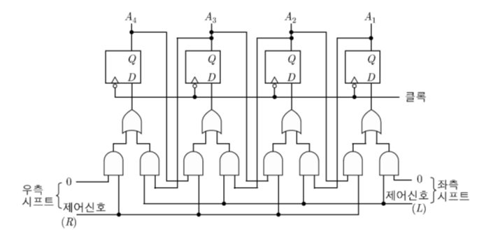
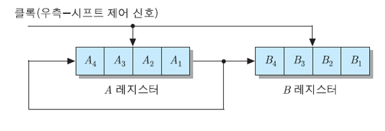
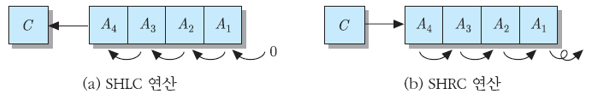
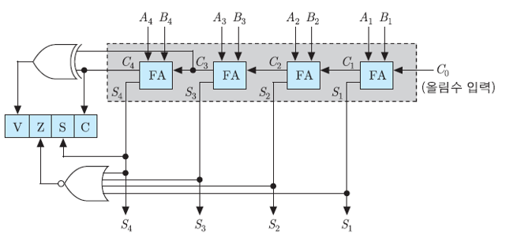
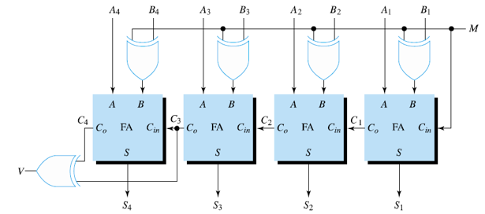
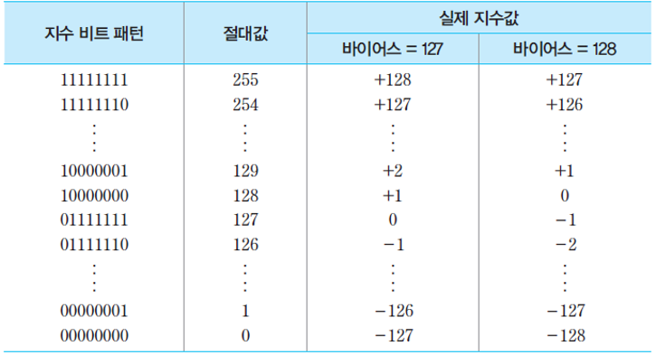

# 3. 컴퓨터 산술 논리 연산

## 3.1 ALU 구성 요소

- 산술 연산장치
- 논리 연산장치
- shift register
- 보수기
- status register

### 3.2.1 부호화

in 8bit

0 0000001 = +1

1 0000001 = -1

### 3.2.2 보수 표현

- 1의 보수
  - 반전
- 2의 보수
  - 반전 후 + 1

연산

선택적-세트 연산 -> OR

선택적-보수 연산 -> XOR

mask 연산 -> AND

삽입연산 -> AND - OR

비교연산 -> XOR

## 3.4 shift 연산

- logical shift: register 내의 data bit들을 왼쪽, 오른쪽으로 한 칸씩 이동
  - left shift - 최하위 비트=0, 최상위 비트는 버려짐
  - right shift - 그 반대

shift register

- circular shift
  - 버려지는 bit를 반대편 끝으로 이동
- 직렬 데이터 전송(serial data transfer)

4클럭 이후 A=A4321 B=A4321

- 산술적 시프트(arithmetic shift)
  - 부호 나타내는 비트는 불변
  - 나머지 숫자 나타내는 비트에만 shift연산 적용
- C 플래그를 포함한 시프트 연산

순환도 있음

## 3.5 정수 산술 연산

### 3.5.1 덧셈

병렬 가산기

- 덧셈 수행하는 hw 모듈
- 비트 수만큼 전가산기(full-adder)들로 구성
- 덧셈 연산 결과에 따라 해당 조건 플래그들(condition flags) 세트

마지막 cary는 C 플래그에 저장

flag

- C flag: carry
- S flag: sign(부호)
- Z flag: 0 -> 모든 값이 0이면 1
- V flag: overflow -> S flag 값이 뒤집어지는 경우 C4 XOR C3 = 1인 경우

### 3.5.2 뺄셈

보수 취해준 후 더하기

4-비트 병렬 가감산기

- 제어신호 M=0: ADD, M=1 SUB
- B를 M과 XOR연산 먼저 실행, 이후 M을 더함

### 3.5.3 부호 없는 정수의 곱셈

- M register: 피승수(multiplicand) 저장
- Q register: 승수(multiplier) 저장

1. Q register 값을 1bit씩 제어회로에 전달
2. M reigter와 연산
3. 저장은 A register에
4. 매 clock마다 shift 연산(C-A-Q)하여 Q register 전달. 이런식으로 자릿수 맞춤

skip

## 3.6 부동소수점 수의 표현

N = (-1)^s * M * B^E

- 실제 숫자: M(mantissa) 가수
- S: 부호
- B: 기수
- E: 지수

2진과 10진 Base만 다르고 똑같음

- 단일-정밀도(single precision) 부동소수점 수: 32bit
- 복수-정밀도(double-precision) 부동소수점 수: 64bit

지수 필드 비트수 증가 -> 표현 가능한 수의 범위 확장

가수 필드의 비트 수 증가 -> precision 증가

- 정규화된 표현
  - (-1)^S * 0.1BBB * 2^E
- 편향된 지수(biased exponent)

biased = 어떤 수를 0으로 잡을 것인가.

biase는 누가정함?
