# 5. 기억장치

## 5.1 분류와 특성

- memory access: r/w
- acceess 유형
  - 순차적(sequential access): 순서대로 저장
  - 직접 엑세스(direct access): 엑세스할 위치 근처로 직접 이동, 순차적 검색을 통하여 최종 위치에 도달
  - 임의 액세스(random access): 주소에 의해 직접 기억장소 찾음
  - 연관 엑세스(associative access): 저장된 내용의 특정 비트들을 비교, 일치하는 내용 액세스
- 용량, 엑세스 속도
- 전송 단위
  - main memory: word
  - 보조저장장치: 블록(512byte)
- 주소지정 단위: 주소 지정된 각 기억 장소 당 저장되는 데이터 길이
  - byte or word

access time,

data transer rate = 한 번에 읽혀지는 데이터 bit / access time

반도체 기억장치(ram, ssd, rom)

자리-표면 기억장치(디스크)

휘발성, 비휘발성

삭제불가능 기억장치 → 내용변경이 불가능(ROM)

2-단계 계층적 기억장치

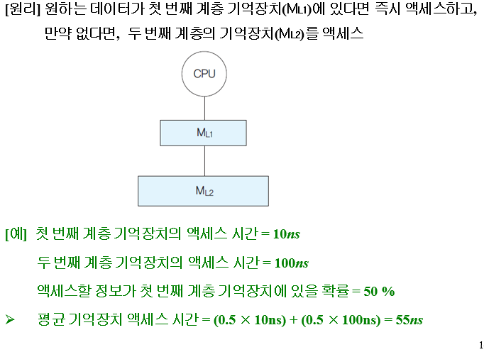

지역성의 원리

- 프로그램 처리되는 과정에서 기억장치 액세스들이 특정 영역에 집중되는 현상
- 지역성의 원리에 의해 첫 번째 기억장치 많이 돌음.

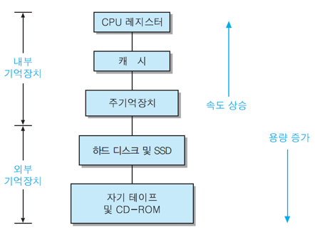

외부, 내부 나누는 기준 = 시스템버스를 통해 데이터를 받냐 아니냐 → cpu가 직접 액세스할 수 있는가

cache memory: cpu와 memory 사이에 성능저하(엑세스 속도)를 줄이기 위해 둠.

## 5.3 반도체 기억장치

### 5.3.1 RAM

- 특성
  - 임의 액세스 방식

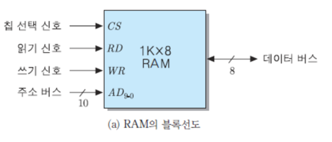

데이터 버스 단자 8개, 각 핀 용량은 1K

CS = 1이면 ram 켜짐

RD = 1이면 읽기동작

WR = 1이면 쓰기동작

AD 10bit-2^10개  한 번에 나올 수 있는 것 8K

- DRAM(dynamic ram)
  - capacitor에 전하를 충전, memory cells 구성 → 밀도가 높다
  - 용량이 큰 main memory로 사용
- SRAM(static ram)
  - 기억소자로 flip-flop 이용 → 집적 밀도 낮다.
  - DRAM보다 빠름
  - 높은 속도가 필요한 cache로 사용

64bit ram 내부1

- 8bit로 이루어진 8개의 기억 장소들

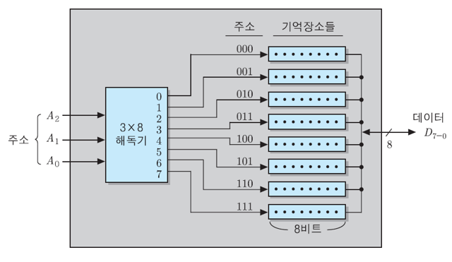

64bit ram 내부2

- 4비트로 이루어진 16개의 기억 장소

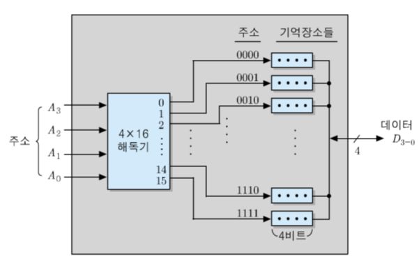

64bit ram 내부3: 64x1 조직

- 1bit씩 64개의 기억 장소들

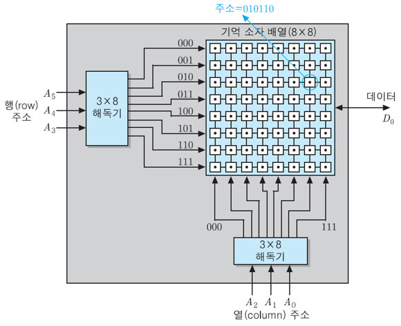

RAS 신호와 CAS신호 사용

- RAS: 행 주소를 가리키는 제어신호
- CAS: 열 주소를 가리키는 제어신호
- OE: output enable → read
- WE: write enable → write

16M * 4비트 RAM

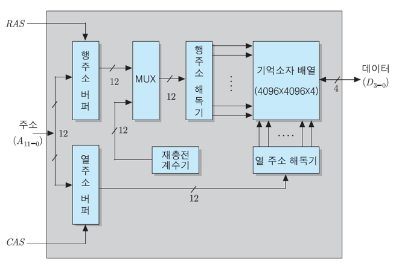

### 5.3.2 ROM(Read Only Memory)

- 영구 저장 가능한 반도체
- 읽는 것만 가능, 쓰는 것은 불가능

ROM 종류

- PROM(Programmable ROM): 한 번 쓰기 가능
- EPROM(Erasable Programmable ROM): 자외선 이용하여 내용 지움, 여러 번 쓰기 가능
- EEPROM(Electrically Erasable PROM): 전기적을 지울 수 있는 EPROM, 데이터 갱신 횟수 제한
- flash memory
  - SSD(solid-state drive) 구성요소

## 5.4 기억장치 모듈 설계

병렬접속

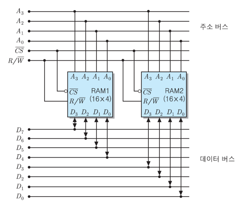

R/Wbar → 1일 때는 Read, 0일 때는 write

CSbar → 원래 CS와 반대로 동작

직렬접속

RAM chip = 16 * 4라면

2개 = 32 * 4

주소 비트 수: 5개

- 맨 앞 비트: 칩 선택(CS) 신호로 이용
- 나머지: datafield

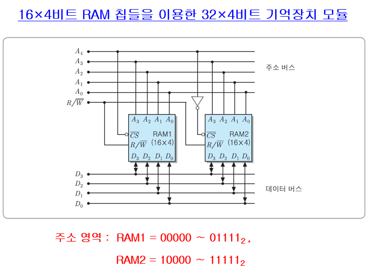

ROM과 RAM 같이 써도 구분주소 필요

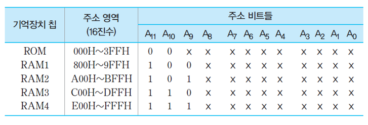

cache

- block
- line: 블록 저장
- tag: 라인에 적재된 블록 구분

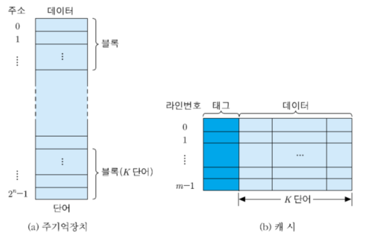

### 5.5.3 사상 방식

- 각 주기억장치 블록이 어느 캐시라인에 적재될 것인가

1. 직접사상

- line field L, tag field t, word filed=w
- main memory 블록 j가 적재될 수 있는 캐시 라인의 번호 i:
  - i = j mod m(캐시 라인 전체 수)
- main memory의 line size는 cache size에 의해 결정됨

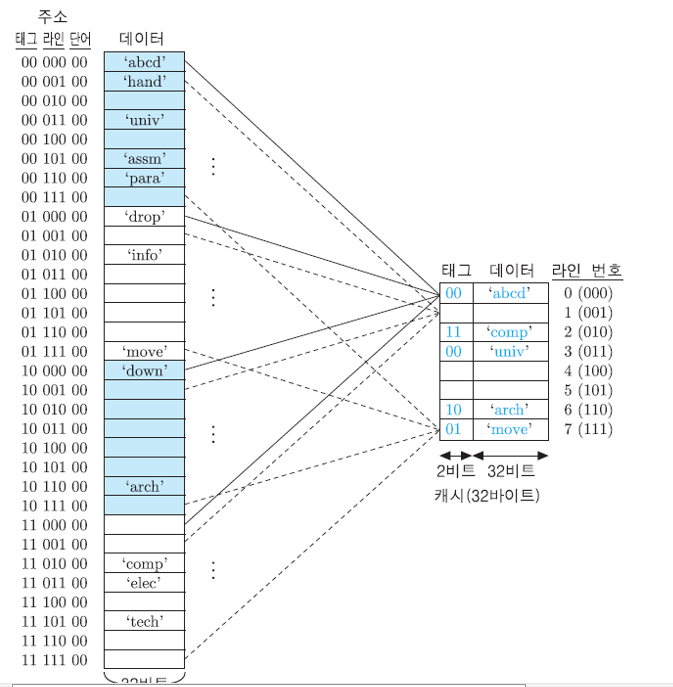

캐시에 들어갈 때 태그와 라인 번호 그대로 들어감.

단점

- line이 정해져 있어 cache 공간을 효율적으로 못씀

2. 완전-연관 사상

- 주기억장치 블록이 캐시의 어떤 라인으로든 적재 가능
- tag field = main memory block number
- tag field = block addr

3. 세트-연관 사상

- k-way 세트-연관 사상
- main memory block group이 하나의 캐시 세트 공유, 그 세트에는 두 개 이상의 라인들이 적재될 수 있음.

### 5.5.4 교체 알고리즘

- if cache miss, 뭘 버리고 채워넣느냐
  - FIFO: queue
  - LRU(Least Recently Used): access time check
  - LFU(Least Frequently Used): access frequency check

### 5.5.5 쓰기 정책

- access에는 r/w가 있다.
- write는 적중해도 memory에 써야한다.
- 종류
  - write-through
  - write-back
    - 데이터 불일치 문제 → 문제 발생하는 경우와 발생 안하는 경우가 있음.
    - 미스 발생 시 읽오오기 + 캐시 업데이트 but 전에 캐시만 write된 경우…

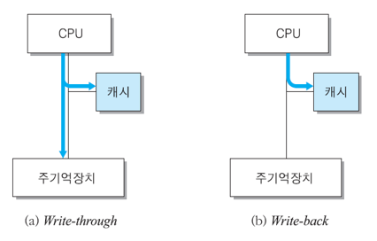

### 5.5.6 multiple cache

1. 계층적 캐시
2. 분리 캐시

## 5.6 DDR SDRAM

- memory 액세스 속도 cpu에 비해 현저히 낮음
- 엑세스 속도 높인거 → SDRAM, DDR SDRAM

### 5.6.1 SDRAM

- 동기식 DRAM: 액세스 동작이 시스템 클럭에 맞추어 수행되는 DRAM

내부

다수의 뱅크들로 구성

512Mbit SDRAM

- 16M x 8bit 뱅크 4개로 구성
- 주소개수 26bit, 2비트는 뱅크 선택

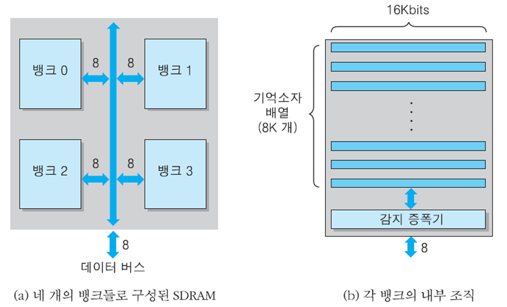

버스트 모드: 여러 바이트들을 연속적으로 전송하는 동작(행), 행 전체를 읽지는 않음

버스트 길이: 몇개씩?

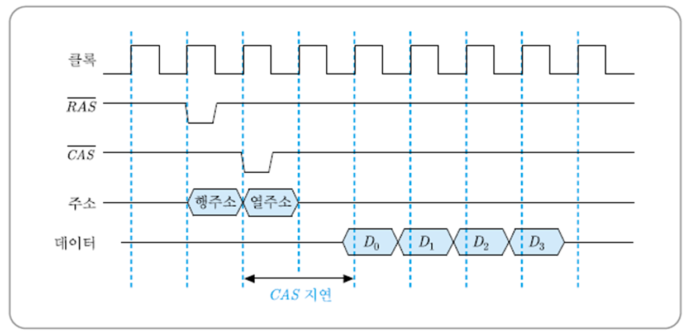

CAS 지연: CAS 신호와 열 주소가 들어온 순간부터 데이터가 인출되어 버스에 실릴 때까지의 시간(주소 해독 및 액세스 시간)

효과: 원래 D0읽고 CAS 지연 D1읽고 CAS지연이지만 버스트모드 쓰면 위 그림처럼 됨.

기억장치 모듈

- 여러개의 SDRAM 칩들을 병렬로 접속하여 기억장치 모듈을 구성

### 5.6.2 DDR SDRAM

- Double data rate
- 버스 클록 당 두번의 데이터 전송(상승, 하강엣지 당 한번씩)
- DDR
- DDR2: 버스 **클록 주파수를 두 배**로 높여 대역폭 향상, 현재 DDR5까지 나온거 알져?

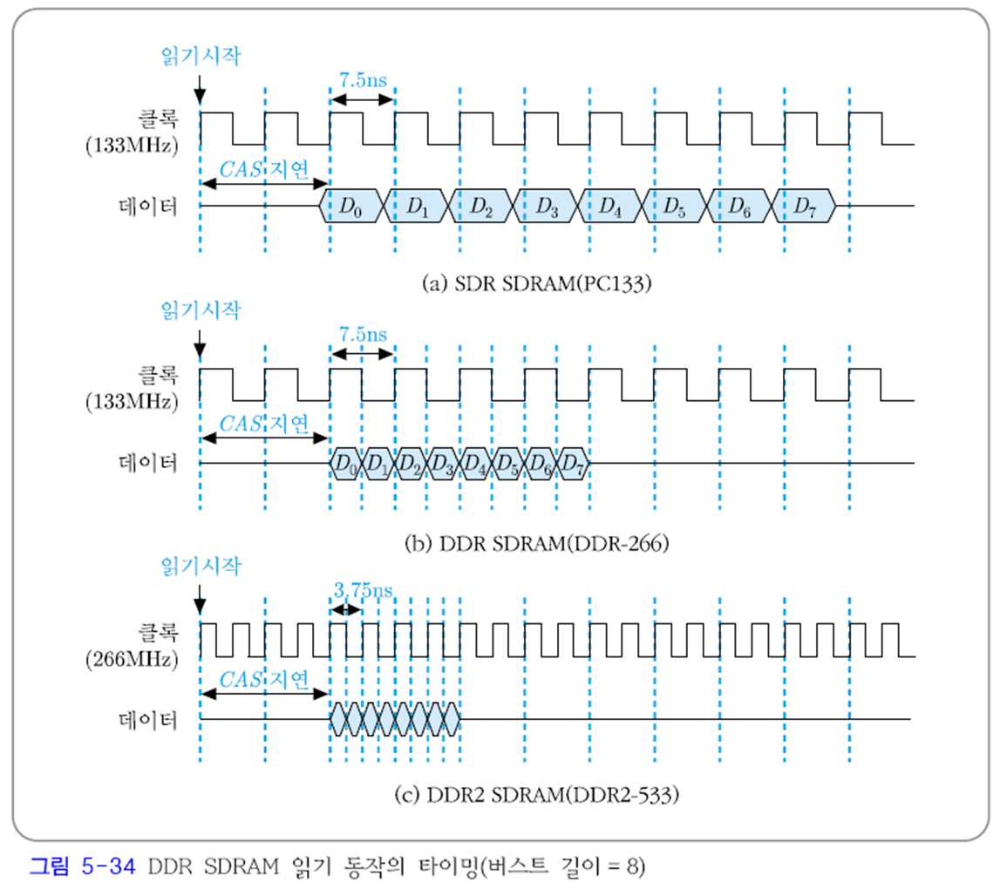

CAS지연은 똑같다. → DDR2이여도 DDR과 CAS지연은 같다. but 클럭수가 달라짐.

DDR-226 의 클럭 주파수는 133MHz이다.

DDR2-553의 데이터 주파수 왜533?? 오타입니다…  2배가 맞다.

기억장치 대역폭

- 단위 시간 당 데이터 전송량

### 5.5.3 기억장치 랭크

- 데이터 입출력 폭이 64비트가 되도록 구성한 기억장치 모듈

단면모듈: SIMM

양면모듈: DIMM

단일: 단면모듈SIMM 상에 x8 조직의 SDRAM 8개 병렬접속

2중: 양면모듈DIMM 앞 뒤로 8개씩

x4조직

16개 병렬접속 DIMM에 하나의 랭크 double-side single-rank module

4중 랭크 모듈(quad-rank module)

- x16
- 면단 두 랭크씩
