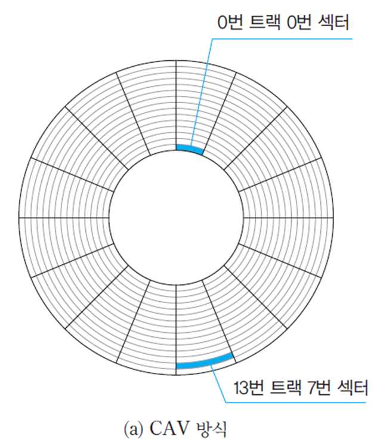
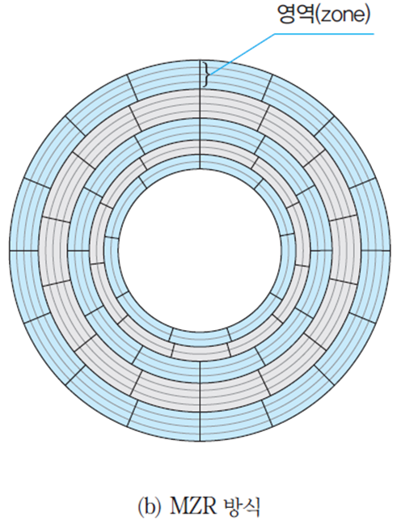
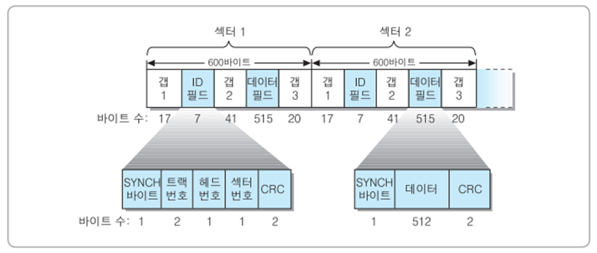
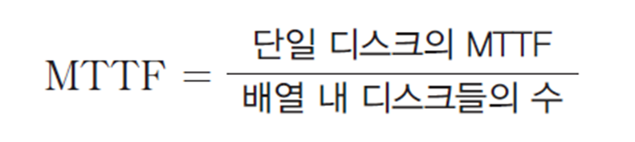
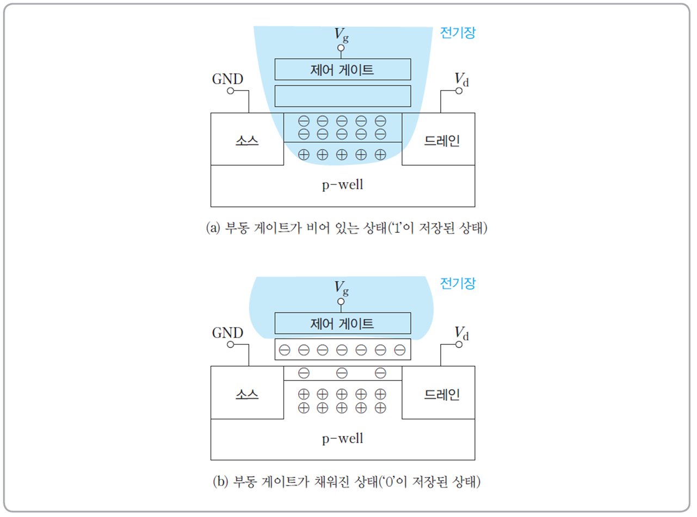

# 6. 장기 기억장치

## 6.1 하드디스크

자기디스크

등각속도(CAV)

- 디스크가 일정한 속도로 회전하는 상태

다중영역 기록(MZR)

- 디스크 용량 증가
- 트랙 위치에 따라 회전속도가 변경 → 제어회로가 복잡

디스크 형식화 작업(disk formatting)

CRC 데이터 링크층의 에러검출과 똑같음 ID,data field끼리 사용

디스크 드라이브

- 양면, 단면 있음
- 실린더: 다중 평판 디스크에서 서로 다른 섹션에 있지만 같은 반경에 있는 트랙들 집합

### 6.1.2 디스크 액세스 시간

r/w동작 순서

1. 헤드를 해당 트랙으로 이동
2. 원하는 섹터가 헤드 아래로 회전되어 올 때까지 대기
3. 데이터 전송

액세스 시간

- 탐색 시간: 1번 걸리는 시간
- 회전 지연 시간: 2번 시간 → min max scaling, 7200rpm은 초당 120바퀴 회전 (7200/60)
- 데이터 전송 시간: 3번 시간

## 6.2 RAID

하나의 큰 용량을 가진 디스크 배열

분산 저장에 의한 동시 액세스 가능

병렬 데이터 채널에 의한 데이터 전송 속도 향상

결함발생 가능성 증가

디스크 인터리빙

- 데이터 블록들을 여러 개의 디스크들로 이루어진 디스크 배열에 분산 저장하는 기술
- 균등 분산 저장을 위한 round-robin 방식 사용

디스크 배열의 결함허용도 fault-tolerance를 높이기 위하여 RAID 제안됨.

복구 절차

1. 디스크 사용 중단 및 시스템으로부터 분리
2. 검사 디스크에 저장된 정보 이용하여 원래 데이터 복구
3. 결함 수리 후 디스크 재설치
4. 시스템 재구성

### 6.2.2 종류

1. RAID-1

- 디스크 미러링

2. RAID-2

- 비트-단위 인터리빙 방식
- 해밍 코드 이용한 오류 검출
- 검사 디스크(parity bit)들 많음.
- 필요한 검사 디스크 수 2^C-1 >= G+C
- G=데이터 디스크 수, C=필요한 검사 디스크 수
- 오버헤드 = G / C

3. RAID-3

- parity bit 이용
- parity bit = b1 XOR b2 XOR b3 XOR b4
- b2디스크 결함 발생 시: b2 = p XOR…
- write마다 parity bit 갱신해야함 → 속도 저하

4. RAID-4

- 블록-단위 인터리빙 방식 사용
- 데이터 디스크들의 동일한 위치에 있는 parity bit 갱신

5. RAID-5

- parity bit 블록들을 round-robin 방식으로 분산 저장
- small write problem 존재 → 네 번의 디스크 엑세스 필요하기 때문에 성능 저하됨

## 6.3 플래시 메모리와 SSD

SSD

플래시 메모리

- 메모리 셀 구현: NMOS 트랜지스터 사용
- 제어게이트: 일반 트랜지스터 게이트와 동일
- 부동 게이트: 정보 저장의 핵심적 역할

부동 게이트: 절연체

메모리 셀 동작 방식

NOR형 플래시 메모리

- NMOS 트렌지스터들의 병렬접속
- 마지막에 NOT으로 전압이 들어올 때 1로 바꿔줌

NAND형 플래시 메모리

- NMOS 트렌지스터들의 직렬접속
- 블록들로 구성되며, 각 블록은 다수의 페이지들로 구성
- r/w는 페이지단위, 삭제:블록단위

SLC

MLC

TLC

전자 수 조정하여 각 셀에 저장되느 상태의 수 증가

SSD

- SSD 제어기
- FTL이 있음 → 하드디스크 방식 플래시메모리 방식 전환기
  - 마모 평준화
  - 가비지 컬랙션
  - TRIM 명령
  - over-provisioning: 위 두개 모듈 효율성을 위해 추가 저장공간을 둠.
