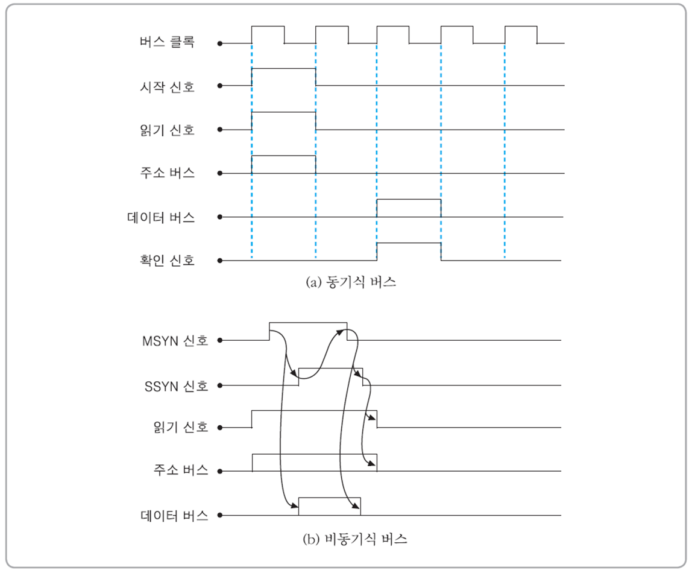
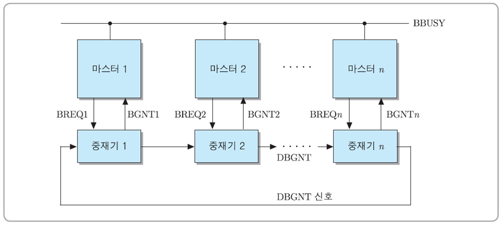

# 7. 시스템 버스, I/O 및 interrupt

## 7.1 System bus

제어버스

- 데이터 교환
- 버스

중재 버스

- bus master: 버스 사용의 주체가 되는 요소들 (CPU, memory module, I/O제어기)
- bus arbitation
- 중재버스

interrupt bus

bus bandwidth

- 버스의 속도를 나타내는 척도, 단위 시간당 전송할 수 있는 데이터 양

### 7.1.2 시스템 버스의 기본 동작

동기 / 비동기식 버스

동기식 버스(중/대형 컴퓨터에 사용)

- 장점
  - 인터페이스 회로 간단
- 단점
  - 가장 오래걸리는 버스 동작의 소요 시간이 기준이라 느림

비동기식 버스(소규모 컴퓨터에 사용)

- 장점
  - 낭비되는 시간이 없음
- 단점
  - 인터페이스 회로 복잡

## 7.2 버스 중재

- 버스 경합
- 버스 중재
- 버스 중재기

제어 신호들의 연결 구조에 따른 중재 방식

- 병렬 중재 방식
  - 각 버스 마스터들이 독립적인 버스 요구 신호 발생, 별도의 버스 승인 신호를 받음.
- 직렬 중재 방식
  - 버스 요구, 승인 신호 선이 각각 한 개씩만

버스 중재기의 위치에 따른 분류

- 중앙집중식 중재 방식
  - 버스 중재기 한 개만
  - 하나의 중재기, 중재기는 정해진 중재 원칙에 다라 선택한 버스 마스터에게 승인 신호 발생
- 분산식 중재 방식
  - 여러 개의 버스 중재기들이 존재, 버스 중재 동작이 각 마스터의 중재기에 의하여 이루어 짐.

### 7.2.1 병렬 중재 방식

우선순위 분류

- 고정-우선순위 방식: 각 버스 마스터에 지정된 우선순위 고정
- 가변-우선순위 방식: 우선순위 변경 있는 방식

1. 중앙집중식 고정-우선순위 중재방식

- 모든 버스 마스터들이 하나의 버스 중재기
- 가장 가까운 버스 마스터1이 가장 높은순 이후 순서대로

중재 방식

2. 분산식 고정-우선순위 방식

- 중재 동작
  - 각 중재기는 자신보다 더 높은 우선순위를 가진 마스터들의 버스 요구 신호들을 받아서 검사, 앞 버스가 bbusy가 아니면 사용

3. 회전 우선순위 방식 → 가변우선순위 방식 중 하나

원형 큐방식으로 우선순위 돌아가는 듯

- 동등 우선순위 방식
- 임의 우선순위 방식
- LRU같은 것도 씀

### 7.2.2 직렬 중재 방식

1. 중앙집중식 직렬 중재 방식

- 고정 우선순위 방식

데이지 체인

2. 분산식 직렬 중재 방식

- 버스 사용권 받은 마스터가 버스 busy 세팅하는 순간 자신의 우측에 위치한 마스터의 중재기로 bus busy setting

### 7.2.3 폴링 방식

원리

- 버스 사용을 원하는 마스터

1. 하드웨어 폴링
2. 소프트웨어 폴링

- 하드웨어보다 느림

## 7.3 I/O 장치 접속

I/O장치 제어기 필요

1. 기억장치 - 사상 I/O

- 기억장치 주소공간 감소
- 메모리와 I/O 주소 같이 할당

2. 분리형 I/O주

메모리와 I/O 주소 따로 할당

## 7.4 interrupt 이용한 I/O

1. cpu가 데이터와 프린트 명령 프린트 제어기로 전송하고, 다른 작업 수행
2. 드읃ㅇ

interrupt-구동 I/O의 구현 방법

### 7.4.1 multiple interrupt

I/O제어기와 CPU 사이에 다른 interrupt

- 하드웨어 복잡함

### 7.4.2 데이지 체인

우선순위에 의해서 starvation 생길 수 있음.

- cpu로부터 발생되는 INTA출력 선을 직렬로 접속
- 자신의 고유번호, interrupt vector를 데이터 버스를 통하여 cpu로 전송

### 7.4.3 소프트웨어 폴링 방식

가변 우선순위라서 starvation 문제 줄음.

## 7.5 직접기억장치액세스 - DMA

- cpu가 memory 액세스 안하는 동안 시스템버스를 사용하여 주기억장치와 I/O장치 간에 데이터 전송
- DMA와 memory끼리 데이터 전송

1. cpu가 dma제어기로 아래 정보 포함한 명령 전송
2. dma 제어기는 cpu로 버스요구 신호 전송
3. cpu가 dma 제어기로 버스 승인 신호 전송
4. dma 제어기가 주기억장치로부터 데이터 읽어서, 디스크 제어기로 전송
5. 반복

- count register: 전송하는 데이터 양 지정
