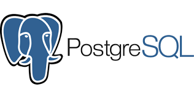
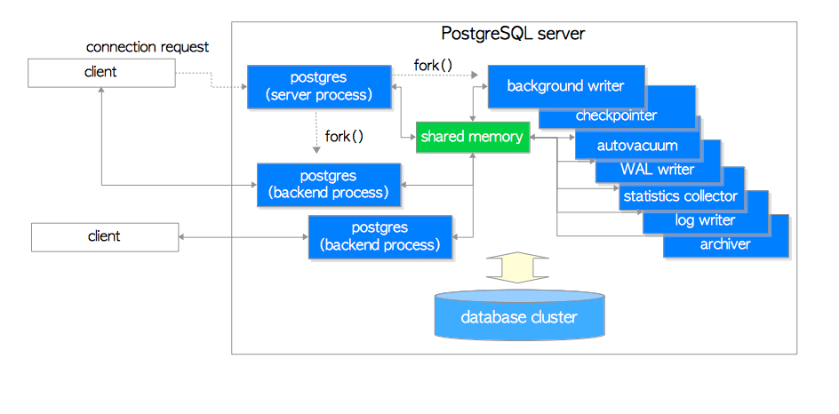
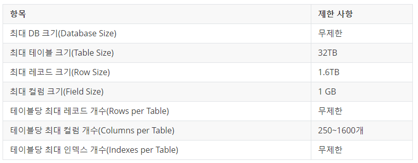
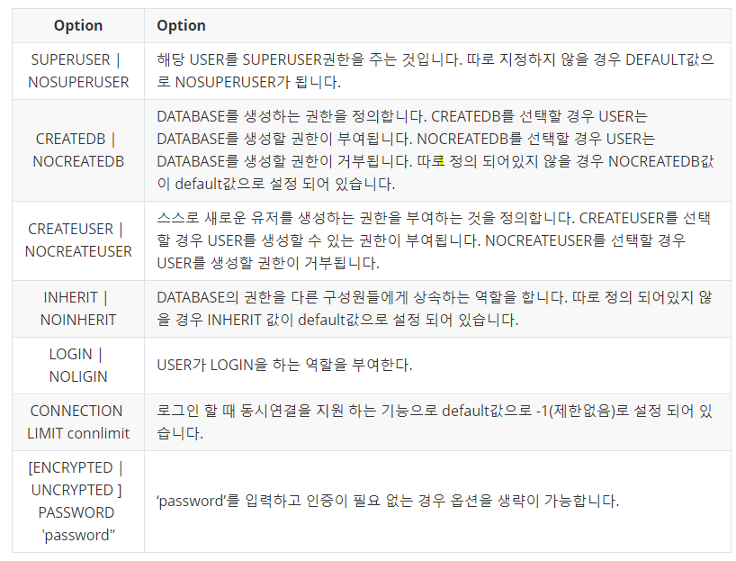

# 1. Postgres 개요

> **TL;DR**: PostgreSQL은 안정적인 트랜잭션 처리와 높은 확장성을 제공하는 오픈소스 객체-관계형 데이터베이스다. 표준 SQL뿐 아니라 다양한 자료형과 인덱스, 사용자 정의 기능, MVCC, 복제와 복구 기능을 지원한다.

## 1.1 이 글을 쓰는 이유

프로젝트에서 PostgreSQL을 계속 사용해 왔지만, 필요한 쿼리를 작성하고 설정값을 찾아 쓰는 데 그쳤을 뿐 제대로 공부해 본 적은 없었다.

이 시리즈에서는 PostgreSQL이 데이터를 어떻게 저장하고 여러 트랜잭션을 어떻게 처리하는지 차근차근 살펴보려고 한다. 다른 데이터베이스와 비교했을 때 PostgreSQL이 어떤 특징을 가지고 있는지, 프로젝트에서 사용한 기능이 내부적으로 어떻게 동작하는지도 함께 정리한다.

첫 장에서는 PostgreSQL의 전체적인 특징과 구조를 살펴보고, PostgreSQL을 이해할 때 중요한 Template 데이터베이스, MVCC, Vacuum의 개념까지 알아본다.

## 1.2 PostgreSQL이란?

PostgreSQL은 오픈소스로 개발되는 객체-관계형 데이터베이스 관리 시스템(Object-Relational Database Management System, ORDBMS)이다. 정식 명칭은 PostgreSQL이며, 줄여서 Postgres라고도 부른다.



*PostgreSQL 로고 · 출처: [MangKyu's Diary](https://mangkyu.tistory.com/71)*

일반적인 관계형 데이터베이스처럼 데이터를 테이블에 저장하고 SQL로 다룬다. 여기에 자료형, 함수, 연산자, 형 변환, 인덱스 방식과 같은 데이터베이스 객체를 사용자가 정의할 수 있는 확장성을 더했다.

PostgreSQL에서 확장할 수 있는 대표적인 요소는 다음과 같다.

- 자료형
- 함수와 집계 함수
- 연산자
- 형 변환
- 인덱스 방식
- 프로시저 언어
- 확장 모듈

따라서 PostgreSQL은 단순히 데이터를 저장하고 조회하는 도구를 넘어, 애플리케이션의 요구사항에 맞게 데이터베이스 기능을 확장할 수 있는 플랫폼에 가깝다.

PostgreSQL은 ACID 트랜잭션, MVCC, 다양한 인덱스, 백업과 복구, 복제, 파티셔닝 등 실제 서비스를 운영하는 데 필요한 기능도 폭넓게 제공한다.

## 1.3 PostgreSQL의 기본 구조

PostgreSQL은 클라이언트와 서버가 역할을 나누는 클라이언트/서버 모델을 사용한다.

```text
클라이언트 애플리케이션
        │
        │ SQL 요청
        ▼
PostgreSQL 서버
        │
        ├── SQL 분석
        ├── 실행 계획 생성
        ├── 데이터 조회 및 변경
        └── 트랜잭션 처리
        │
        ▼
  데이터베이스 파일
```

서버 프로세스인 `postgres`는 데이터베이스 파일을 관리하고, 클라이언트의 연결을 받아 SQL과 트랜잭션을 처리한 뒤 결과를 반환한다.

클라이언트는 `psql`과 같은 명령행 도구일 수도 있고, 웹 애플리케이션이나 GUI 관리 도구일 수도 있다. 클라이언트와 PostgreSQL 서버가 반드시 같은 컴퓨터에서 실행될 필요는 없으며, 서로 다른 컴퓨터에 있다면 TCP/IP 네트워크를 통해 통신한다.

PostgreSQL 서버는 여러 클라이언트의 동시 접속을 처리할 수 있다. 기본적으로 클라이언트 연결마다 별도의 백엔드 프로세스를 생성하며, 이후 클라이언트는 자신에게 할당된 프로세스와 통신한다.



*PostgreSQL의 프로세스 구조 · 출처: [MangKyu's Diary](https://mangkyu.tistory.com/71)*

```text
postgres 서버 프로세스
├── 클라이언트 A 전용 백엔드 프로세스
├── 클라이언트 B 전용 백엔드 프로세스
└── 클라이언트 C 전용 백엔드 프로세스
```

이 구조에서는 연결 수가 많아질수록 프로세스와 메모리 사용량도 증가한다. 그래서 연결이 매우 많은 서비스에서는 PgBouncer와 같은 커넥션 풀러를 앞에 두기도 한다.

## 1.4 PostgreSQL의 주요 특징

PostgreSQL은 큰 데이터베이스와 테이블을 다룰 수 있지만, 모든 항목이 무제한인 것은 아니다. 아래 이미지는 원문에서 정리한 PostgreSQL의 대표적인 물리적 제한이다.



*PostgreSQL의 대표적인 크기 제한 · 출처: [MangKyu's Diary](https://mangkyu.tistory.com/71)*

표에 표시된 값은 기본 블록 크기와 자료형 등 구성에 따라 달라질 수 있다. 실제 설계에서는 사용 중인 PostgreSQL 버전의 [공식 제한 사항](https://www.postgresql.org/docs/current/limits.html)을 다시 확인해야 한다.

### 1.4.1 안정적인 트랜잭션

PostgreSQL은 트랜잭션의 핵심 속성인 ACID를 지원한다.

| 속성 | 의미 |
| --- | --- |
| Atomicity, 원자성 | 트랜잭션의 작업은 모두 성공하거나 모두 취소된다. |
| Consistency, 일관성 | 트랜잭션 전후에도 데이터의 규칙과 제약 조건이 유지된다. |
| Isolation, 격리성 | 동시에 실행되는 트랜잭션이 서로에게 미치는 영향을 제어한다. |
| Durability, 지속성 | 커밋된 데이터는 장애가 발생해도 보존되어야 한다. |

Savepoint를 사용하면 트랜잭션 전체가 아니라 특정 지점까지만 작업을 되돌릴 수도 있다.

```sql
BEGIN;

INSERT INTO members (name) VALUES ('kim');

SAVEPOINT member_created;

INSERT INTO orders (member_id, amount)
VALUES (1, 10000);

ROLLBACK TO member_created;

COMMIT;
```

### 1.4.2 다양한 자료형

PostgreSQL은 숫자와 문자열 같은 기본 타입 외에도 다양한 자료형을 제공한다.

- `INTEGER`, `BIGINT`, `NUMERIC`
- `CHAR`, `VARCHAR`, `TEXT`
- `DATE`, `TIME`, `TIMESTAMP`, `INTERVAL`
- `BOOLEAN`
- `UUID`
- `JSON`, `JSONB`
- `ARRAY`
- 네트워크 주소 및 범위 타입

특히 `JSONB`를 사용하면 JSON 데이터를 저장하면서 인덱스를 이용해 검색할 수 있다. 정형 데이터는 관계형 모델로 관리하고, 구조가 자주 달라지는 일부 데이터는 JSON으로 표현하는 방식을 함께 사용할 수 있다.

### 1.4.3 다양한 인덱스

PostgreSQL은 데이터와 검색 조건의 특성에 따라 여러 인덱스 방식을 선택할 수 있다.

- B-tree
- Hash
- GiST
- SP-GiST
- GIN
- BRIN

일반적인 동등 비교, 정렬과 범위 검색에는 B-tree가 주로 사용된다. 전문 검색이나 배열, `JSONB` 검색에는 GIN이 유용하며, 물리적인 저장 순서와 값의 순서가 비슷한 대용량 테이블에는 BRIN을 고려할 수 있다.

인덱스는 많다고 항상 좋은 것이 아니다. 조회 속도를 높이는 대신 저장 공간을 사용하고, `INSERT`, `UPDATE`, `DELETE` 시 인덱스도 함께 갱신해야 한다. 데이터와 쿼리 패턴에 맞는 인덱스를 선택해야 한다.

### 1.4.4 확장 기능

PostgreSQL은 필요한 기능을 확장 모듈로 추가할 수 있다.

대표적인 확장은 다음과 같다.

- PostGIS: 공간 및 지리 데이터 처리
- pg_trgm: 문자열 유사도 검색
- pg_stat_statements: SQL 실행 통계 수집
- 벡터 검색을 위한 확장

설치된 확장은 `CREATE EXTENSION` 명령으로 현재 데이터베이스에서 활성화한다.

```sql
CREATE EXTENSION IF NOT EXISTS pg_trgm;
```

### 1.4.5 복구와 가용성

PostgreSQL은 운영 환경에서 필요한 여러 백업 및 복구 기능을 제공한다.

- WAL 기반 장애 복구
- 특정 시점 복구(Point-in-Time Recovery)
- 논리적·물리적 백업
- 스트리밍 복제
- 동기식·비동기식 복제
- Hot Standby

WAL(Write-Ahead Logging)은 데이터 파일을 변경하기 전에 변경 내용을 로그에 먼저 기록하는 방식이다. PostgreSQL은 이 로그를 장애 복구, 복제와 특정 시점 복원 등에 활용한다.

## 1.5 Template 데이터베이스

PostgreSQL에서 `CREATE DATABASE`를 실행하면 완전히 빈 데이터베이스를 처음부터 만드는 것이 아니라 기존 데이터베이스를 복사한다.

기본 복사 대상은 `template1`이다.

```sql
CREATE DATABASE app_db;
```

위 명령은 개념적으로 `template1`을 복사해 `app_db`를 만든다. 따라서 `template1`에 확장이나 객체를 추가하면 이후 생성되는 데이터베이스에도 해당 구성이 포함될 수 있다.

PostgreSQL은 초기 상태를 보존하는 `template0`도 제공한다. 사용자 정의 객체가 포함되지 않은 깨끗한 데이터베이스가 필요하거나 다른 인코딩과 로케일을 지정해야 할 때 사용할 수 있다.

```sql
CREATE DATABASE app_db
    TEMPLATE template0;
```

`template0`은 원본 상태를 유지해야 하므로 직접 수정하지 않는 것이 원칙이다.

| 데이터베이스 | 역할 |
| --- | --- |
| `template1` | `CREATE DATABASE`에서 기본으로 복사하는 템플릿 |
| `template0` | 초기 상태의 깨끗한 데이터베이스를 만들기 위한 템플릿 |
| `postgres` | 사용자와 관리 도구가 기본으로 접속할 수 있는 데이터베이스 |

## 1.6 MVCC와 Vacuum

PostgreSQL을 이해할 때 빼놓을 수 없는 개념이 MVCC와 Vacuum이다.

### 1.6.1 MVCC란?

MVCC는 Multi-Version Concurrency Control의 약자로, 하나의 행에 대해 여러 버전을 관리하는 동시성 제어 방식이다.

PostgreSQL에서 행을 수정하면 기존 데이터를 즉시 덮어쓰는 대신 새로운 행 버전을 만든다. 삭제 역시 행을 곧바로 물리적으로 제거하기보다 해당 행이 더 이상 유효하지 않다는 정보를 남긴다.

```text
UPDATE 이전: [행 버전 A]

UPDATE 이후: [사용이 끝난 행 버전 A] [새로운 행 버전 B]
```

각 트랜잭션은 자신에게 보여야 하는 행 버전만 읽는다. 덕분에 읽기와 쓰기가 동시에 수행될 때 불필요한 충돌을 줄일 수 있다.

하지만 더 이상 참조되지 않는 이전 행 버전이 계속 쌓이면 테이블이 불필요하게 커지고 성능에 영향을 줄 수 있다. 이렇게 사용이 끝난 행 버전이 차지한 공간을 다시 사용할 수 있게 정리하는 작업이 Vacuum이다.

### 1.6.2 Vacuum의 역할

`VACUUM`은 더 이상 필요하지 않은 행 버전이 차지한 공간을 재사용할 수 있도록 정리한다.

```sql
VACUUM members;
```

쿼리 플래너가 사용하는 통계도 함께 갱신하려면 `ANALYZE`를 추가한다.

```sql
VACUUM ANALYZE members;
```

일반 `VACUUM`은 확보한 공간을 테이블 내부에서 다시 사용할 수 있게 한다. 하지만 일반적으로 해당 공간을 운영체제에 즉시 반환하지는 않는다.

테이블을 새로 작성해 실제 파일 크기까지 줄이려면 `VACUUM FULL`을 사용할 수 있다.

```sql
VACUUM FULL members;
```

다만 `VACUUM FULL`은 처리 시간이 길고 대상 테이블에 `ACCESS EXCLUSIVE` 잠금을 획득한다. 서비스 운영 중에는 다른 작업을 차단할 수 있으므로 일상적인 관리 수단으로 사용해서는 안 된다.

PostgreSQL은 기본적으로 Autovacuum을 활성화해 `VACUUM`과 `ANALYZE`를 자동으로 수행한다. 대부분의 환경에서는 Autovacuum을 끄기보다 워크로드에 맞게 설정을 조정하는 편이 적절하다.

## 1.7 PostgreSQL 실행해 보기

Docker가 설치되어 있다면 다음 명령으로 로컬 PostgreSQL 서버를 실행할 수 있다.

```bash
docker run \
  --name postgres-local \
  -e POSTGRES_PASSWORD=postgres \
  -p 5432:5432 \
  -d postgres:18
```

컨테이너 내부의 `psql`로 접속한다.

```bash
docker exec -it postgres-local \
  psql -U postgres -d postgres
```

> 예제의 비밀번호는 로컬 학습용이다. 운영 환경에서는 소스 코드나 Docker 명령에 비밀번호를 직접 기록하지 않아야 한다.

### 1.7.1 사용자와 데이터베이스 생성

애플리케이션에서 사용할 사용자를 생성한다.

```sql
CREATE USER app_user
WITH PASSWORD 'change-me';
```



*PostgreSQL 사용자 생성 옵션 · 출처: [MangKyu's Diary](https://mangkyu.tistory.com/71)*

위 이미지는 원문의 작성 시점을 기준으로 정리된 옵션이다. 현재 PostgreSQL에서 다른 역할을 생성할 권한은 `CREATEUSER`가 아니라 `CREATEROLE`로 지정한다. 역할 관련 설정은 버전에 따라 달라질 수 있으므로 [CREATE USER 공식 문서](https://www.postgresql.org/docs/current/sql-createuser.html)를 기준으로 확인하는 것이 안전하다.

해당 사용자가 소유하는 데이터베이스를 생성한다.

```sql
CREATE DATABASE app_db
OWNER app_user;
```

생성한 데이터베이스로 이동한다.

```text
\c app_db
```

`psql`에서 자주 사용하는 명령은 다음과 같다.

| 명령 | 설명 |
| --- | --- |
| `\l` | 데이터베이스 목록 조회 |
| `\c app_db` | 데이터베이스 변경 |
| `\dt` | 현재 스키마의 테이블 목록 조회 |
| `\d table_name` | 테이블 구조 확인 |
| `\du` | 사용자와 역할 목록 조회 |
| `\q` | `psql` 종료 |

## 1.8 정리

PostgreSQL의 주요 특징을 정리하면 다음과 같다.

- ACID와 MVCC를 기반으로 안정적인 트랜잭션을 처리한다.
- `JSONB`, 배열, UUID 등 다양한 자료형을 제공한다.
- 여러 인덱스 방식과 확장 모듈을 지원한다.
- WAL, 복제, 백업과 특정 시점 복구 기능을 제공한다.
- Autovacuum을 통해 MVCC가 남긴 불필요한 행 버전을 관리한다.

이번 장에서는 PostgreSQL의 전체적인 구조와 특징을 살펴봤다. 다음 장부터는 프로젝트에서 PostgreSQL을 사용하며 자주 마주치는 기능을 내부 동작과 함께 자세히 정리한다.

## 참고 자료

- [MangKyu's Diary - PostgreSQL이란?](https://mangkyu.tistory.com/71)
- [PostgreSQL 공식 문서 - Getting Started](https://www.postgresql.org/docs/current/tutorial-start.html)
- [PostgreSQL 공식 문서 - Architectural Fundamentals](https://www.postgresql.org/docs/current/tutorial-arch.html)
- [PostgreSQL 공식 문서 - Template Databases](https://www.postgresql.org/docs/current/manage-ag-templatedbs.html)
- [PostgreSQL 공식 문서 - Routine Vacuuming](https://www.postgresql.org/docs/current/routine-vacuuming.html)

---

*작성 환경: PostgreSQL 18 · 작성일: 2026-07-14*
